## 5 数据库物理设计

### 5.1 表空间

通过使用表空间，管理员可以控制一个数据库安装的磁盘布局。这样有以下特点：

1. 如果初始化数据库所在的分区或者卷空间已满，又不能逻辑上扩展更多空间，可以在不同的分区上创建和使用表空间，直到系统重新配置空间。
2. 表空间允许管理员根据数据库对象的使用模式安排数据位置，从而提高性能。
3. 一个频繁使用的索引可以放在性能稳定且运算速度较快的磁盘上，比如一种固态设备。
4. 一个存储归档的数据，很少使用的或者对性能要求不高的表可以存储在一个运算速度较慢的磁盘上。
5. 管理员通过表空间可以设置占用的磁盘空间。用以在和其他数据共用分区的时候，防止表空间占用相同分区上的其他空间。
6. 表空间可以控制数据库数据占用的磁盘空间，当表空间所在磁盘的使用率达到 90% 时，数据库将被设置为只读模式，当磁盘使用率降到 90% 以下时，数据库将恢复到读写模式。
7. 建议用户使用数据库时，通过后台监控程序或者 Database Manager 进行磁盘空间使用率监控，以免出现数据库只读情况。
8. 表空间对应于一个文件系统目录，比如：`数据库节点数据目录/pg_location/tablespace/tablespace_1` 是用户拥有读写权限的空目录。
9. 使用表空间配额管理会使性能有 30% 左右的影响，MAXSIZE 指定每个数据库节点的配额大小，误差范围在 500MB 以内。请根据实际的情况确认是否需要设置表空间的最大值。

#### 5.1.1 创建表空间

创建用户 jack:

```shell
omm=# CREATE USER jack IDENTIFIED BY 'openeuler12345!';
NOTICE:  The encrypted password contains MD5 ciphertext, which is not secure.
CREATE ROLE
```

创建表空间：

```shell
omm=# CREATE TABLESPACE fastspace RELATIVE LOCATION 'tablespace/tablespace_1';
CREATE TABLESPACE
```

其中 “fastspace” 为新创建的表空间，`/var/lib/opengauss/data/pg_location/tablespace/tablespace_1` 是用户拥有读写权限的空目录。

数据库系统管理员（本例中，为 omm 用户）执行如下命令将“fastspace”表空间的访问权限赋予数据用户 jack：

```shell
omm=# GRANT CREATE ON TABLESPACE fastspace TO jack;
GRANT
```

以此类推，创建多个表空间：

```shell
omm=# CREATE TABLESPACE example2 RELATIVE LOCATION 'tablespace/tablespace_2';
CREATE TABLESPACE
omm=# CREATE TABLESPACE example3 RELATIVE LOCATION 'tablespace/tablespace_3';
CREATE TABLESPACE
omm=# CREATE TABLESPACE example4 RELATIVE LOCATION 'tablespace/tablespace_4';
CREATE TABLESPACE
```

#### 5.1.2 在表空间上创建对象

如果用户拥有表空间的 CREATE 权限，就可以在表空间上创建数据库对象。操作系统管理员（omm 用户）具 有以上表空间的 CREATE 权限，并且 jack 用户拥有 fastspace 表空间的 CREATE 权限。 在指定的表空间上创建表 (创建其他的对象方法类似)：

```shell
omm=# CREATE TABLE table_1(i int) TABLESPACE fastspace;
CREATE TABLE
omm=# CREATE TABLE table_2(i int) TABLESPACE example2;
CREATE TABLE
```

**在默认表空间上创建表：**

首先设置默认表空间：

```shell
omm=# SET default_tablespace = 'example3';
SET
```

再创建表，这样无需指定表空间，表创建在默认表空间：

```shell
omm=# CREATE TABLE table_3(i int);
CREATE TABLE
```

#### 5.1.3 管理表空间

##### 5.1.3.1 查询表空间

方式 1：检查 pg_tablespace 系统表。如下命令可查到系统和用户定义的全部表空间。

```postgresql
SELECT spcname FROM pg_tablespace;
```

```shell
omm=# SELECT spcname FROM pg_tablespace;
  spcname   
------------
 pg_default
 pg_global
 fastspace
 example2
 example3
 example4
(6 rows)
```

方式2：使用 gsql 程序的元命令查询表空间：

```shell
omm=# \db
             List of tablespaces
    Name    | Owner |        Location         
------------+-------+-------------------------
 example2   | omm   | tablespace/tablespace_2
 example3   | omm   | tablespace/tablespace_3
 example4   | omm   | tablespace/tablespace_4
 fastspace  | omm   | tablespace/tablespace_1
 pg_default | omm   | 
 pg_global  | omm   | 
(6 rows)
```

##### 5.1.3.2 查询表空间当前使用情况

```shell
omm=# SELECT PG_TABLESPACE_SIZE('fastspace');
 pg_tablespace_size 
--------------------
               8192
(1 row)
```

其中 8192 表示表空间的大小，单位为字节。

##### 5.1.3.3 重命名表空间

执行如下命令对表空间 fastspace 重命名为 example：

```shell
omm=# ALTER TABLESPACE fastspace RENAME TO example;
ALTER TABLESPACE
omm=# \db
             List of tablespaces
    Name    | Owner |        Location         
------------+-------+-------------------------
 example    | omm   | tablespace/tablespace_1
 example2   | omm   | tablespace/tablespace_2
 example3   | omm   | tablespace/tablespace_3
 example4   | omm   | tablespace/tablespace_4
 pg_default | omm   | 
 pg_global  | omm   | 
(6 rows)
```

##### 5.1.3.4 删除表空间

用户必须是表空间的 owner 或者系统管理员才能删除表空间。

```shell
omm=# DROP TABLESPACE example;
ERROR:  tablespace "example" is not empty
```

删除失败，表空间不为空的情况下无法删除表空间 (避免误删里面的重要数据)。

先清空表空间：

```shell
omm=# DROP TABLE table_1;
DROP TABLE
```

然后再删除表空间：

```shell
omm=# DROP TABLESPACE example;
DROP TABLESPACE
```

删除成功：

```shell
omm=# \db
             List of tablespaces
    Name    | Owner |        Location         
------------+-------+-------------------------
 example2   | omm   | tablespace/tablespace_2
 example3   | omm   | tablespace/tablespace_3
 example4   | omm   | tablespace/tablespace_4
 pg_default | omm   | 
 pg_global  | omm   | 
(5 rows)
```

### 5.2 分区表

分区表和普通表相比具有以下优点：

- 改善查询性能：对分区对象的查询可以仅搜索自己关心的分区，提高检索效率。
- 增强可用性：如果分区表的某个分区出现故障，表在其他分区的数据仍然可用。
- 方便维护：如果分区表的某个分区出现故障，需要修复数据，只修复该分区即可。
- 均衡 I/O：可以把不同的分区映射到不同的磁盘以平衡 I/O，改善整个系统性能。
- 普通表若要转成分区表，需要新建分区表，然后把普通表中的数据导入到新建的分区表中。因此在初始设计表时，请根据业务提前规划是否使用分区表。

openGauss分区表限制和特点：

1. 主键约束或唯一约束必须要包含分区字段
2. 分区表表名只能在 `pg_partition` 视图中查看，在 `pg_tables` 和 `pg_stat_all_tables` 中无法查到
3. 分区表索引在 opengauss 里分 local 和 global，默认是 global
4. 分区个数不能超过 327675
5. 选择分区使用 `PARTITION FOR()`，括号里指定值个数应该与定义分区时使用的列个数相同，并且一一对应。
6. Value 分区表不支持相应的 `Alter Partition` 操作
7. 列存分区表不支持切割分区
8. 间隔分区表不支持添加分区

#### 5.2.1 创建分区表

##### 5.2.1.1 方法一：`VALUES LESS THAN`

语法：`PARTITION BY RANGE(partition_key)` 从句是 `VALUES LESS THAN` 的语法格式，范围分区策略的分区键最多支持 4 列。

```postgresql
PARTITION partition_name VALUES LESS THAN ( { partition_value | MAXVALUE } )
```

- 每个分区都需要指定一个上边界。
- 分区上边界的类型应当和分区键的类型一致。
- 分区列表是按照分区上边界升序排列的，值较小的分区位于值较大的分区之前。

实例：`task1.sql`

```postgresql
create table partition_orders_1(
o_orderkey integer,
o_custkey integer,
o_orderstatus char(1),
o_totalprice decimal(15,2),
o_orderdate date,
o_orderpriority char(15),
o_clerk char(15),
o_shippriority integer,
o_comment varchar(79),
PRIMARY KEY (o_orderkey)
)
partition by range(o_orderkey)
(
partition p1 values less than(100),
partition p2 values less than(200),
partition p3 values less than(300),
partition p4 values less than(maxvalue)
);
```

此分区表分区键为 id，分了 4 个区，分别是 p1<100, 100<=p2<200, 200<=p3<300, 300<=p4。

文件保存在 `/home/omm` 下，执行 `gsql -f task1.sql`：

```shell
[omm@cfde74516988 ~]$ gsql -f task1.sql
gsql:task1.sql:19: NOTICE:  CREATE TABLE / PRIMARY KEY will create implicit index "partition_orders_1_pkey" for table "partition_orders_1"
CREATE TABLE
total time: 24  ms
```

数据库中执行 `\d+` 命令显示该分区表的详细信息：

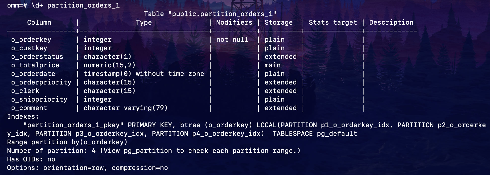

**表基本信息**

- **Table**: 表名是 public.partition_orders_1，属于 public 模式。

**索引**

- 索引定义部分：
  - **PRIMARY KEY**: 主键是 o_orderkey，使用的是 B-tree 索引。
  - **LOCAL 索引**:
    - 每个分区都有独立的索引：
      - p1_o_orderkey_idx 对应分区 p1。
      - p2_o_orderkey_idx 对应分区 p2。
      - p3_o_orderkey_idx 对应分区 p3。
      - p4_o_orderkey_idx 对应分区 p4。
  - 索引的表空间是 pg_default（数据库默认表空间）。

**分区定义**

- **Range partition by(o_orderkey)**:
  - 表按照 o_orderkey 进行范围分区。
  - 范围分区将数据根据范围划分到不同的子表中。

- **Number of partition: 4**: 表明分区表有 4 个分区。
  - 可以通过 pg_partition 表查看每个分区的范围和元数据。

**其他信息**

- **Has OIDs**: 表中没有启用 OIDs（对象标识符）。
- **Options**:
  - **orientation=row**: 表以行存储（Row-Oriented）。
  - **compression=no**: 表未启用压缩。

通过 select 命令列出各分区情况：

```shell
omm=# select relname,parttype,parentid,boundaries from pg_partition where parentid in(select oid from pg_class where relname='partition_orders_1');
      relname       | parttype | parentid | boundaries 
--------------------+----------+----------+------------
 partition_orders_1 | r        |    16728 | 
 p1                 | p        |    16728 | {100}
 p2                 | p        |    16728 | {200}
 p3                 | p        |    16728 | {300}
 p4                 | p        |    16728 | {NULL}
(5 rows)
```

其中 parttype 为 r (Root) 表示根分区，即分区表本身（对应主表）；为 p (Partition) 表示子分区或具体的分区表。

##### 5.2.1.2 方法二：`START END`

语法：`PARTITION BY RANGE(partition_key)` 从句是 `START END` 的语法格式，范围分区策略的分区键仅支持 1 列。

```postgresql
PARTITION partition_name {START(partition_value) END(partition_value) EVERY(interval_value)} | {START(partition_value) END(partition_value | MAXVALUE)} | {START(partition_value)} | {END(partition_value | MAXVALUE)}
```

- 在创建分区表若第一个分区定义含 START 值，则范围（MINVALUE，START）将自动作为实际的第一个分 区。
- 每个 partition_start_end_item 中的 START 值（如果有的话，下同）必须小于其 END 值；
- 相邻的两个 partition_start_end_item，第一个的 END 值必须等于第二个的 START 值； 
- 每个 partition_start_end_item 中的 EVERY 值必须是正向递增的，且必须小于（END-START）值；
- 每个分区包含起始值，不包含终点值，即形如：[起始值，终点值)，起始值是 MINVALUE 时则不包含；
- 一个 partition_start_end_item 创建的每个分区所属的 TABLESPACE 一样；
- partition_name 作为分区名称前缀时，其长度不要超过 57 字节，超过时自动截断；
- 在创建、修改分区表时请注意分区表的分区总数不可超过最大限制（32767）；
- 在创建分区表时 START END 与 LESS THAN 语法不可混合使用。
- 即使创建分区表时使用 START END 语法，备份（gs_dump）出的 SQL 语句也是 VALUES LESS THAN · 单一 start 分区不能紧挨着单一 end 分区，否则会报错

实例：`task2.sql`

```postgresql
create table partition_orders_2(
o_orderkey integer,
o_custkey integer,
o_orderstatus char(1),
o_totalprice decimal(15,2),
o_orderdate date,
o_orderpriority char(15),
o_clerk char(15),
o_shippriority integer,
o_comment varchar(79),
PRIMARY KEY (o_orderkey)
)
partition by range(o_orderkey)
(
partition p1 start(2) end(100) every(10),
partition p2 end(200),
partition p3 end(300),
partition p4 start(300),
partition p5 start(400),
partition p6 start(500) end(600)
);
```

此实例第一个分区定义含 start，则范围（minvalue，2）自动作为第一个分区 p1_0，p1_0<2

由于 every（10），则 p1 分区进行间隔分区，间隔为 10

即 p1_1 [2,12)，p1_2 [12,22)，p1_3 [22,32)，p1_ [32,42)，p1_5 [42,52)，p1_6 [52,62)，p1_7 [62,72)，p1_8 [72,82)，p1_9 [82,92)，p1_10 [92,100)

之后 5 个分区，p2 [100,200)，p3 [200,300)，p4 [300,400)，p5 [400,500)，p6 [500,600)

文件保存在 `/home/omm` 下，执行 `gsql -f task2.sql`：

```shell
gsql:task2.sql:21: NOTICE:  CREATE TABLE / PRIMARY KEY will create implicit index "partition_orders_2_pkey" for table "partition_orders_2"
CREATE TABLE
total time: 24  ms
```

数据库中执行 `\d+` 命令显示该分区表的详细信息：

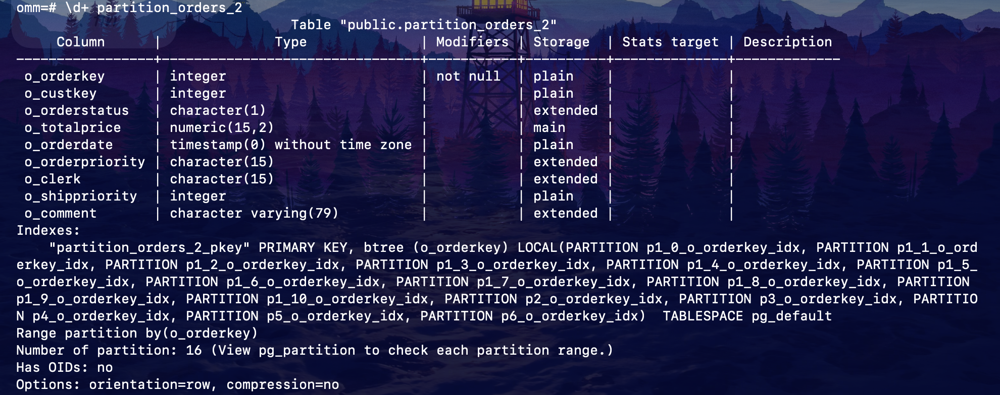

**表基本信息**

- **Table**: 表名是 public.partition_orders_2，属于 public 模式。

**索引**

- 索引定义部分：
  - **PRIMARY KEY**: 主键是 o_orderkey，使用的是 B-tree 索引。
  - **LOCAL 索引**:
    - 每个分区都有独立的索引，每个索引的名称以分区名称为前缀：
      - p1_0_o_orderkey_idx 到 p1_10_o_orderkey_idx：这些索引对应分区 p1 的子分区。
      - p2_o_orderkey_idx：对应分区 p2。
      - p3_o_orderkey_idx 到 p6_o_orderkey_idx：对应分区 p3 到 p6。
    - 每个分区及其子分区都有各自的局部索引（LOCAL），便于查询优化。
  - 索引的表空间是 pg_default（数据库默认表空间）。

**分区定义**

- **Range partition by(o_orderkey)**:
  - 表按照 o_orderkey 进行范围分区。
  - 范围分区将数据根据范围划分到不同的子表中。

- **Number of partition: 16**: 表明分区表有 16 个分区。
  - 可以通过 pg_partition 表查看每个分区的范围和元数据。

**其他信息**

- **Has OIDs**: 表中没有启用 OIDs（对象标识符）。
- **Options**:
  - **orientation=row**: 表以行存储（Row-Oriented）。
  - **compression=no**: 表未启用压缩。

通过 select 命令列出各分区情况：

```shell
omm=# SELECT relname, parttype, boundaries 
FROM pg_partition 
WHERE parentid = (SELECT oid FROM pg_class WHERE relname = 'partition_orders_2');omm-# omm-# 
      relname       | parttype | boundaries 
--------------------+----------+------------
 partition_orders_2 | r        | 
 p1_0               | p        | {2}
 p1_1               | p        | {12}
 p1_2               | p        | {22}
 p1_3               | p        | {32}
 p1_4               | p        | {42}
 p1_5               | p        | {52}
 p1_6               | p        | {62}
 p1_7               | p        | {72}
 p1_8               | p        | {82}
 p1_9               | p        | {92}
 p1_10              | p        | {100}
 p2                 | p        | {200}
 p3                 | p        | {300}
 p4                 | p        | {400}
 p5                 | p        | {500}
 p6                 | p        | {600}
(17 rows)
```

##### 5.2.1.3 方法三：`INTERVAL`

语法：从句指定了 `INTERVAL` 子句的语法格式，范围分区策略的分区键仅支持 1 列。

```postgresql
INTERVAL ('interval_expr') [ STORE IN (tablespace_name [, ... ] ) ]
```


- 列存表不支持间隔分区
- interval_expr：自动创建分区的间隔，例如：1 day、1 month。
- STORE IN (tablespace_name [, ... ] )：指定存放自动创建分区的表空间列表，如果有指定，则自动创建的分区 从表空间列表中循环选择使用，否则使用分区表默认的表空间。

实例：`task3.sql`

```postgresql
create table partition_orders_3(
o_orderkey integer,
o_custkey integer,
o_orderstatus char(1),
o_totalprice decimal(15,2),
o_orderdate date,
o_orderpriority char(15),
o_clerk char(15),
o_shippriority integer,
o_comment varchar(79),
PRIMARY KEY (o_orderkey)
)
partition by range(o_orderdate)
interval('1 day')
(
partition p1 values less than('2021-03-08 00:00:00'),
partition p2 values less than('2021-03-09 00:00:00')
);
```

直接执行此段代码 ，出现如下报错：

```shell
[omm@cfde74516988 ~]$ gsql -f task3.sql
gsql:task3.sql:18: ERROR:  Invalid PRIMARY KEY/UNIQUE constraint for partitioned table
DETAIL:  Columns of PRIMARY KEY/UNIQUE constraint Must contain PARTITION KEY
total time: 0  ms
```

错误原因为分区键非主键，原因为组成约束的单个索引只能直接在它们自己的分区内强制执行唯一性，因此分区结构本身必须保证在不同分区中不存在重复项（分区表唯一约束），解决方法为设置联合主键：

```postgresql
create table partition_orders_3(
o_orderkey integer,
o_custkey integer,
o_orderstatus char(1),
o_totalprice decimal(15,2),
o_orderdate date,
o_orderpriority char(15),
o_clerk char(15),
o_shippriority integer,
o_comment varchar(79),
PRIMARY KEY (o_orderkey, o_orderdate)
)
partition by range(o_orderdate)
interval('1 day')
(
partition p1 values less than('2021-03-08 00:00:00'),
partition p2 values less than('2021-03-09 00:00:00')
);
```

执行结果：

```shell
[omm@cfde74516988 ~]$ gsql -f task3.sql
gsql:task3.sql:18: NOTICE:  CREATE TABLE / PRIMARY KEY will create implicit index "partition_orders_3_pkey" for table "partition_orders_3"
CREATE TABLE
total time: 8  ms
```

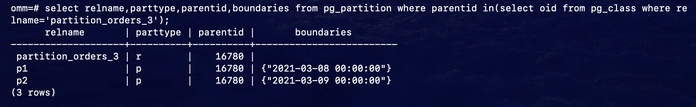

此分区表，一开始创建的分区只有 p1,p2。但如果向表中插入键值不在已有分区范围内的元组，比如（1， '2021-03-11 00:00:00'），则会自动创建一个分区，其上界与插入的元组间隔 1 day，该元组存入该分区。

插入元组（1，'2021-03-11 00:00:00'），再次通过 select 命令列出各分区情况（由于版本变化，插入语句略有不同）：

```shell
omm=# insert into partition_orders_3 (o_orderkey, o_orderdate) values (1, '2021-03-11 00:00:00');
INSERT 0 1
```

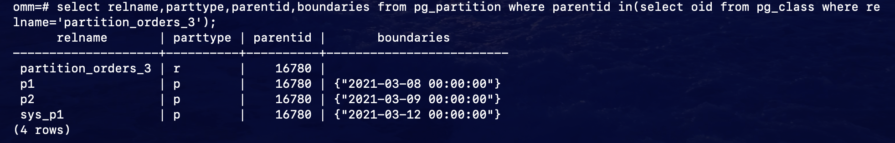

可见，自动生成了 1 个新的分区，上界为‘2021-03-12 00:00:00’，与插入元组间隔为 1 day。

##### 5.2.1.4 设置分区所在的表空间

在创建分区表时，可以把分区表的不同分区设置在不同的表空间，从而提升整个系统的性能 通过在 partition 语句后面加上 tablespace 来指定创建的分区所在的表空间。

实例：`task4.sql`

```postgresql
create table partition_orders_4(
o_orderkey integer,
o_custkey integer,
o_orderstatus char(1),
o_totalprice decimal(15,2),
o_orderdate date,
o_orderpriority char(15),
o_clerk char(15),
o_shippriority integer,
o_comment varchar(79),
PRIMARY KEY (o_orderkey)
)
tablespace example2
partition by range(o_orderkey)
(
partition p1 values less than(100),
partition p2 values less than(200) tablespace example4,
partition p3 values less than(300),
partition p4 values less than(maxvalue)
);
```

创建成功：

```shell
[omm@cfde74516988 ~]$ gsql -f task4.sql
gsql:task4.sql:20: NOTICE:  CREATE TABLE / PRIMARY KEY will create implicit index "partition_orders_4_pkey" for table "partition_orders_4"
CREATE TABLE
total time: 8  ms
```

此分区表，分区 p1，p3，p4 都在表空间 example2 中，而分区 p2 在表空间 example4 中。

#### 5.2.2 管理分区表

##### 5.2.2.1 删除、添加、重命名分区

删除分区 p4

```shell
omm=# ALTER TABLE partition_orders_4 DROP PARTITION p4;
ALTER TABLE
```

添加分区 p_4

```shell
omm=# ALTER TABLE partition_orders_4 ADD PARTITION p_4 VALUES LESS THAN(MAXVALUE);
ALTER TABLE
```

重命名分区 p3

```shell
omm=# ALTER TABLE partition_orders_4 RENAME PARTITION p3 TO p_3;
ALTER TABLE
```

修改后分区显示如下：

```shell
omm=# select relname,parttype,parentid,boundaries from pg_partition where parentid in(select oid from pg_class where relname='partition_orders_4');
      relname       | parttype | parentid | boundaries 
--------------------+----------+----------+------------
 partition_orders_4 | r        |    16793 | 
 p1                 | p        |    16793 | {100}
 p2                 | p        |    16793 | {200}
 p_4                | p        |    16793 | {NULL}
 p_3                | p        |    16793 | {300}
(5 rows)
```

##### 5.2.2.2 修改分区的表空间

将分区 p1 由原来所在的表空间 example2 移动到 example4：

```shell
omm=# ALTER TABLE partition_orders_4 MOVE PARTITION p1 TABLESPACE example4;
ALTER TABLE
omm=# select relname,parttype,parentid,boundaries from pg_partition where parentid in(select oid from pg_class where relname='partition_orders_4');
      relname       | parttype | parentid | boundaries 
--------------------+----------+----------+------------
 partition_orders_4 | r        |    16793 | 
 p2                 | p        |    16793 | {200}
 p_4                | p        |    16793 | {NULL}
 p_3                | p        |    16793 | {300}
 p1                 | p        |    16793 | {100}
(5 rows)
```

为显示分区所在表空间，可采用如下方法：

```shell
omm=# SELECT 
    p.relname AS partition_name,
    p.parttype AS partition_type,
    t.spcname AS tablespace_name,
    p.boundaries
FROM 
    pg_partition p
LEFT JOIN 
    pg_tablespace t 
ON 
    p.reltablespace = t.oid
WHERE 
    p.parentid IN (SELECT oid FROM pg_class WHERE relname = 'partition_orders_4');omm-# omm-# omm-# omm-# omm-# omm-# omm-# omm-# omm-# omm-# omm-# omm-# 
   partition_name   | partition_type | tablespace_name | boundaries 
--------------------+----------------+-----------------+------------
 partition_orders_4 | r              | example2        | 
 p2                 | p              | example4        | {200}
 p_4                | p              | example2        | {NULL}
 p_3                | p              | example2        | {300}
 p1                 | p              | example4        | {100}
(5 rows)
```

##### 5.2.2.3 查询分区

查询分区表的分区情况：

```postgresql
select relname,parttype,parentid,boundaries from pg_partition where parentid in(select oid from pg_class where relname=$分区表名称);
```

查询单独分区内的数据：

```postgresql
SELECT * FROM partition_orders_4 PARTITION(p2);
SELECT * FROM partition_orders_4 PARTITION FOR(150);
...
```

选择分区有两种方法，一是 partition（分区名称），二是 partition for（数值），此括号内的数值为所选分区范围内的任意值，如果定义分区时分区键不只一个，那么此括号内的数值个数应该与定义分区时使用的分区键个数相同，并且一一对应。

##### 5.2.2.4 数据转移

进行交换的普通表和分区必须满足如下条件：

-  普通表和分区的列数目相同，对应列的信息严格一致，包括：列名、列的数据类型、列约束、列的 Collation 信息、列的存储参数、列的压缩信息等。
- 普通表和分区的表压缩信息严格一致。
- 普通表和分区的分布列信息严格一致。
- 普通表和分区的索引个数相同，且对应索引的信息严格一致。
- 普通表和分区的表约束个数相同，且对应表约束的信息严格一致。
- 普通表不可以是临时表。

实例：

查看 orders 表中的数据量：

```shell
omm=# select count(*) from orders
omm-# ;
 count  
--------
 300001
(1 row)
```

将 orders 表中的数据转移到分区表 partition_orders_4 中：

```shell
omm=# insert into partition_orders_4 select * from orders;
INSERT 0 300001
```

查看整个分区表情况，以及各分区情况:

```shell
omm=# select count(*) from partition_orders_4;
 count  
--------
 300001
(1 row)
```

```postgresql
select * from partition_orders_4;
```


```shell
omm=# select count(*) from partition_orders_4 partition(p2);
 count 
-------
    28
(1 row)
```

```postgresql
select * from partition_orders_4 partition(p2);
```

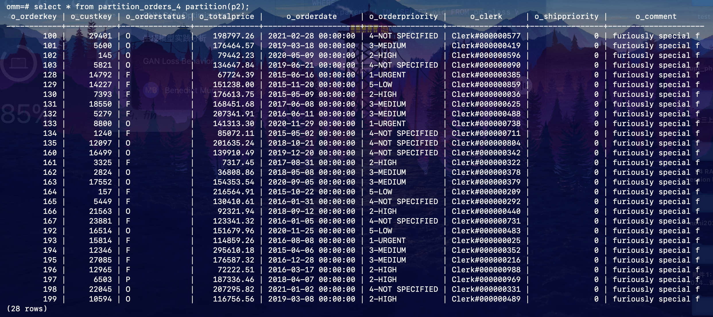

### 5.3 索引

索引可以提高数据的访问速度，但同时也增加了插入、更新和删除操作的处理时间。所以是否要为表增加 索引，索引建立在哪些字段上，是创建索引前必须要考虑的问题。需要分析应用程序的业务处理、数据使用、经常被用作查询的条件或者被要求排序的字段来确定是否建立索引。

**索引经常建立在数据库表中的以下列上：**

- 在经常需要搜索查询的列上创建索引，可以加快搜索的速度。
- 在作为主键的列上创建索引，强制该列的唯一性和组织表中数据的排列结构。
- 在经常需要根据范围进行搜索的列上创建索引，因为索引已经排序，其指定的范围是连续的。
- 在经常需要排序的列上创建索引，因为索引已经排序，这样查询可以利用索引的排序，加快排序查询时间。
- 在经常使用 WHERE 子句的列上创建索引，加快条件的判断速度。
- 为经常出现在关键字 ORDER BY、GROUP BY、DISTINCT 后面的字段建立索引。

**索引方式：**

1. 唯一索引：可用于约束索引属性值的唯一性，或者属性组合值的唯一性。如果一个表声明了唯一约束或 者主键，则 openGauss 自动在组成主键或唯一约束的字段上创建唯一索引（可能是多字段索引），以实现这些约束。目前，openGauss 只有 B-Tree 可以创建唯一索引。
2. 多字段索引：一个索引可以定义在表中的多个属性上。目前，openGauss 中的 B-Tree 支持多字段索引，且最多可在 32 个字段上创建索引（全局分区索引最多支持 31 个字段）。
3. 部分索引：建立在一个表的子集上的索引，这种索引方式只包含满足条件表达式的元组。
4. 表达式索引：索引建立在一个函数或者从表中一个或多个属性计算出来的表达式上。表达式索引只有在查询时使用与创建时相同的表达式才会起作用。

**注意：**

- 索引创建成功后，系统会自动判断何时引用索引。当系统认为使用索引比顺序扫描更快时，就会使用索引。

- 索引创建成功后，必须和表保持同步以保证能够准确地找到新数据，这样就增加了数据操作的负荷。因此需定期删除无用的索引。

#### 5.3.1 普通表上创建管理索引

##### 5.3.1.1 创建索引

**步骤1：**创建 orders 表的备份 orderscopy2，并将数据导入

```postgresql
create table orderscopy2(
o_orderkey integer,
o_custkey integer,
o_orderstatus char(1),
o_totalprice decimal(15,2),
o_orderdate date,
o_orderpriority char(15),
o_clerk char(15),
o_shippriority integer,
o_comment varchar(79),
PRIMARY KEY (o_orderkey)
)
tablespace example2;

INSERT INTO orderscopy2
SELECT * FROM orders;
```

```shell
[omm@cfde74516988 ~]$ gsql -f task5.sql
gsql:task5.sql:13: NOTICE:  CREATE TABLE / PRIMARY KEY will create implicit index "orderscopy2_pkey" for table "orderscopy2"
CREATE TABLE
INSERT 0 300001
total time: 501  ms
```

**步骤2：**创建普通索引

如果对于 orderscopy2 表，需要经常进行以下查询：

```postgresql
SELECT * FROM orderscopy2 WHERE o_totalprice>10000;
```

使用以下命令创建索引：

```shell
omm=# CREATE INDEX orderscopy2_index_totalprice ON orderscopy2(o_totalprice);
CREATE INDEX
```

**步骤3：**创建多字段索引

假如用户需要经常查询表 orderscopy2 中 `o_orderstatus` 是 ’O’，且 `o_totalprice` 小于 10000 的记录，使用以下命令进行查询：

```postgresql
SELECT * FROM orderscopy2 WHERE o_orderstatus='O' AND o_totalprice<10000;
```

使用以下命令在字段 `o_orderstatus` 和 `o_totalprice` 上定义一个多字段索引：

```shell
omm=# CREATE INDEX orderscopy2_index_more_column ON orderscopy2(o_orderstatus, o_totalprice);
CREATE INDEX
```

**步骤4：**创建部分索引

如果只需要查询 `o_orderstatus` 为 ’O’ 的记录：

```postgresql
SELECT * FROM orderscopy2 WHERE o_orderstatus=’O’;
```

可以创建部分索引来提升查询效率：

```shell
omm=# CREATE INDEX orderscopy2_part_index ON orderscopy2(o_orderstatus) WHERE o_orderstatus='O';
CREATE INDEX
```

**步骤5：**创建表达式索引

假如经常需要查询代号以 8 结尾的收银员的信息，执行如下命令进行查询：

```postgresql
SELECT * FROM orderscopy2 WHERE o_clerk like '%8';
```

可以为上面的查询创建表达式索引：

```shell
omm=# CREATE INDEX orderscopy2_para_index ON orderscopy2(reverse(o_clerk) varchar_pattern_ops);
CREATE INDEX
```

##### 5.3.1.2 管理索引

**步骤1：**查询索引

执行如下命令查询系统和用户定义的所有索引：

```shell
omm=# SELECT RELNAME FROM PG_CLASS WHERE RELKIND='i';
                    relname                    
-----------------------------------------------
 region_pkey
 nation_pkey
 part_pkey
 supplier_pkey
 partsupp_pkey
 customer_pkey
 lineitem_pkey
 orders_pkey
 lineitemcopy1_pkey
 pg_toast_2619_index
 pg_toast_3220_index
 pg_toast_1255_index
 lineitemcopy2_pk
 lineitemcopy2_uk
 customercopy1_pkey
 orderscopy2_pkey
 orderscopy2_index_totalprice
 orderscopy2_index_more_column
 orderscopy1_pkey
 orderscopy2_part_index
 orderscopy2_para_index
 ...
```

可看到上述创建的索引。

\di+ 可以查询用户定义的所有索引：

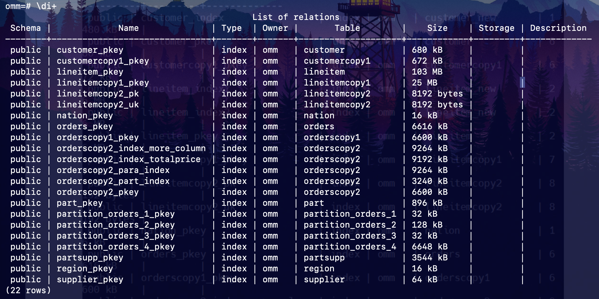

查询指定索引的信息：


**步骤2：**重命名索引

执行如下命令对索引 orderscopy2_index_more_column 重命名为 orderscopy2_index_orderstatus_totalprice：

```shell
omm=# ALTER INDEX orderscopy2_index_more_column RENAME TO orderscopy2_index_orderstatus_totalprice;
ALTER INDEX
```

用 \di+ 查看，索引重命名成功：

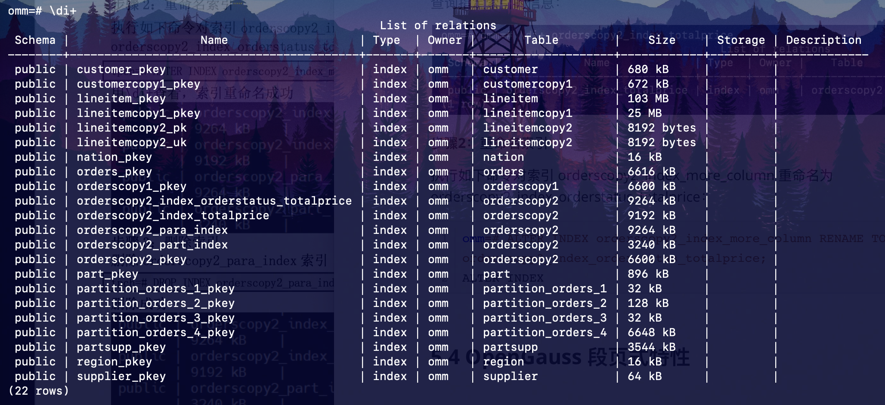

**步骤3：**删除索引

删除 orderscopy2_para_index 索引：

```shell
omm=# DROP INDEX orderscopy2_para_index;
DROP INDEX
```

可看到删除成功：

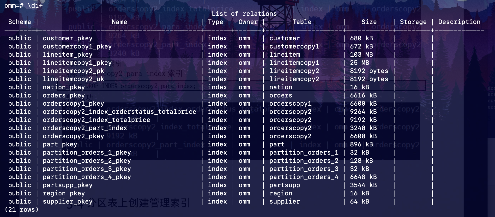

#### 5.3.2 分区表上创建管理索引

##### 5.3.2.1 创建索引

分区表索引分为 LOCAL 索引与 GLOBAL 索引，一个 LOCAL 索引对应一个具体分区(有多少个分区就有多少个索引文件)，而 GLOBAL 索引则对应整个分区表（只有一个索引文件）。

**步骤1：**以 orders 表为例创建一个分区表

```postgresql
create table partition_orders_0(
o_orderkey integer,
o_custkey integer,
o_orderstatus char(1),
o_totalprice decimal(15,2),
o_orderdate date,
o_orderpriority char(15),
o_clerk char(15),
o_shippriority integer,
o_comment varchar(79),
PRIMARY KEY (o_orderkey)
)
tablespace example2
partition by range(o_orderkey)
(
partition p1 values less than(100),
partition p2 values less than(200),
partition p3 values less than(300),
partition p4 values less than(maxvalue)
);
```

```shell
[omm@cfde74516988 ~]$ gsql -f task6.sql
gsql:task6.sql:20: NOTICE:  CREATE TABLE / PRIMARY KEY will create implicit index "partition_orders_0_pkey" for table "partition_orders_0"
CREATE TABLE
total time: 13  ms
```

**步骤2：**创建 GLOBAL 索引

在 o_custkey 上创建分区表 GLOBAL 索引，存储在表空间 example2 上：

```shell
omm=# create index global_index_custkey on partition_orders_0(o_custkey) global tablespace example2;
CREATE INDEX
```

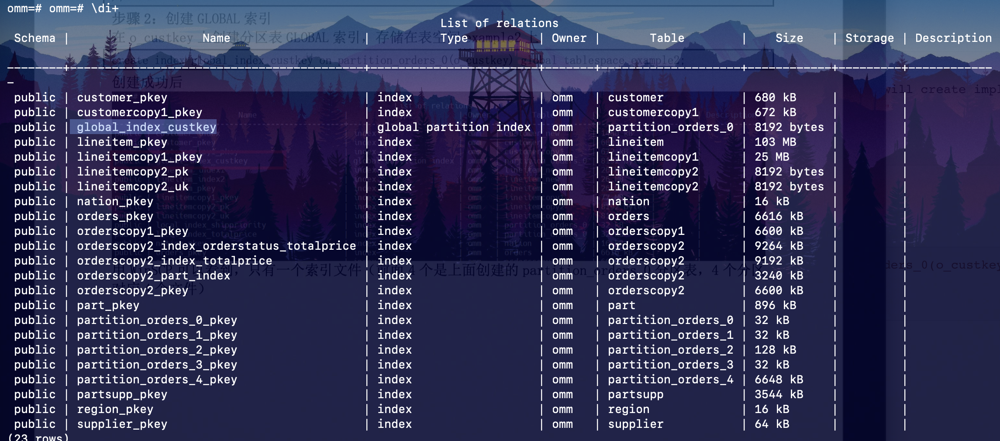

在容器内 `/var/lib/opengauss/data/pg_location/tablespace/tablespace_2/16384` 路径下可看到：

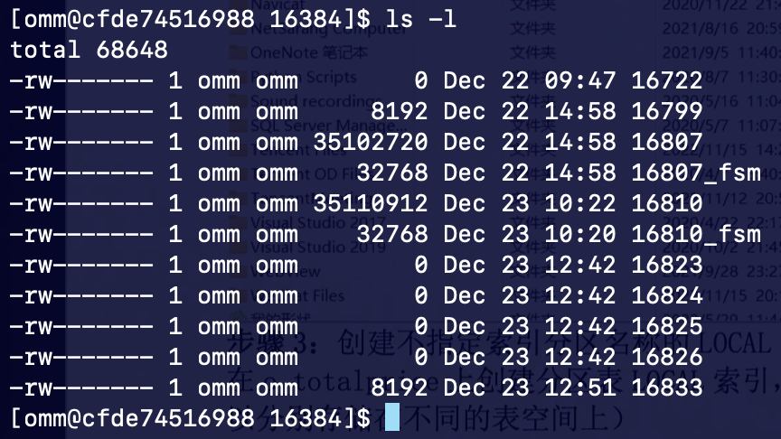

只有一个索引文件（前面 4 个是上面创建的 partition_orders_0 分区表，4 个分区对应 4 个文件）。

**步骤3：**创建不指定索引分区名称的 LOCAL 索引

在 o_totalprice 上创建分区表 LOCAL 索引，不指定索引分区的名称，存储在 example3 上（原表与索引可以分别存储在不同的表空间上）

```shell
omm=# create index local_index_totalprice on partition_orders_0(o_totalprice) local tablespace example3;
CREATE INDEX
omm=# \q
[omm@cfde74516988 16384]$ cd ../../../tablespace_3
[omm@cfde74516988 tablespace_3]$ cd PG_9.2_201611171_gaussdb/
[omm@cfde74516988 PG_9.2_201611171_gaussdb]$ cd 16384/
[omm@cfde74516988 16384]$ ls -l
total 32
-rw------- 1 omm omm    0 Dec 22 09:50 16725
-rw------- 1 omm omm 8192 Dec 23 13:23 16841
-rw------- 1 omm omm 8192 Dec 23 13:23 16842
-rw------- 1 omm omm 8192 Dec 23 13:23 16843
-rw------- 1 omm omm 8192 Dec 23 13:23 16844
```

有 4 个索引文件（因为有 4 个分区）。

**步骤4：**创建指定索引分区名称的 LOCAL 索引

在 o_shippriority 上创建分区表 LOCAL 索引，指定索引分区的名称，p1, p2 分区索引存储在 example3 上， p3, p4f 分区索引存储在 example4 上（不同分区的索引可以分别存储在不同的表空间上）：

```shell
omm=# create index local_index_shippriority on partition_orders_0(o_shippriority) local
(
partition p1_index,
partition p2_index,
partition p3_index tablespace example4,
partition p4_index tablespace example4
) tablespace example3;omm-# omm-# omm(# omm(# omm(# omm(# omm(# omm(# omm(# omm(# omm(# omm(# 
CREATE INDEX
```

创建成功后查看：

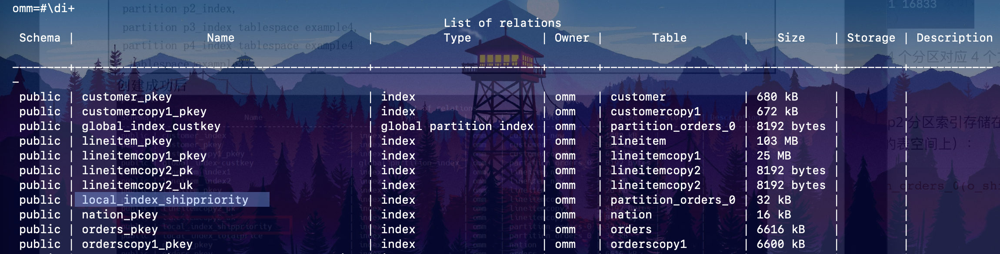

```shell
[omm@cfde74516988 tablespace]$ ls
tablespace_1  tablespace_2  tablespace_3  tablespace_4
[omm@cfde74516988 tablespace]$ cd tablespace_3
[omm@cfde74516988 tablespace_3]$ cd PG_9.2_201611171_gaussdb/
[omm@cfde74516988 PG_9.2_201611171_gaussdb]$ cd 16384/
[omm@cfde74516988 16384]$ ls -l
total 16
-rw------- 1 omm omm    0 Dec 22 09:50 16725
-rw------- 1 omm omm 8192 Dec 23 13:07 16835
-rw------- 1 omm omm 8192 Dec 23 13:07 16836
[omm@cfde74516988 16384]$ cd ../../../tablespace_4
[omm@cfde74516988 tablespace_4]$ cd PG_9.2_201611171_gaussdb/
[omm@cfde74516988 PG_9.2_201611171_gaussdb]$ cd 16384/
[omm@cfde74516988 16384]$ ls -l
total 32
-rw------- 1 omm omm 8192 Dec 22 14:58 16798
-rw------- 1 omm omm 8192 Dec 22 14:58 16809
-rw------- 1 omm omm 8192 Dec 23 13:07 16837
-rw------- 1 omm omm 8192 Dec 23 13:07 16838
```

分别在 example3 有 2 个索引文件和 example4 有 2 个索引文件。

##### 5.3.2.2 管理索引

**步骤1：**修改索引分区所在的表空间

将分区索引 p1_index 从 example3 移到 example2：

```shell
omm=# ALTER INDEX local_index_shippriority MOVE PARTITION p1_index TABLESPACE example2;
ALTER INDEX
```

**步骤2：**重命名索引分区

将分区索引 p2_index 重命名为 p2_index_new：

```shell
omm=# ALTER INDEX local_index_shippriority RENAME PARTITION p2_index TO p2_index_new;
ALTER INDEX
```

**步骤3：**删除索引

要删除索引只能删除整个索引，不能删除单独的分区索引：

```shell
omm=# drop index global_index_custkey;
DROP INDEX
omm=# drop index local_index_totalprice;
DROP INDEX
omm=# drop index local_index_shippriority;
DROP INDEX
```

### 5.4 OpenGauss 段页式特性

由于段页式特性在 OpenGauss 3.1.0 及以上才能使用，故本部分实验在某其他组的 OpenGauss 5.0.3 容器进行。

openGauss 通用的普通表，每个数据表对应一个逻辑逻辑上的大文件（最大 32T），该逻辑文件又按照固定的大小划分多个实际文件存在对应的数据库目录下面。所以，每张数据表随着数据量的增多，底层的数据存储所需文件数量会逐渐增多。同时，openGauss 对外提供 hashbucket 表、大分区表等特性，每张数据表会被拆分为若干个子表，底层所需文件数量更是成倍增长。由此，这种存储管理模式存在以下问题：

1. 对文件系统依赖大，无法进行细粒度的控制提升可维护性；

2. 大数据量下文件句柄过多，目前只能依赖虚拟句柄来解决，影响系统性能；

3. 小文件数量过多会导致全量 build、全量备份等场景下的随机 IO 问题，影响性能；

为了解决以上问题，openGauss 引入段页式存储管理机制，类似于操作系统的段页式内存管理，但是在实现机制上区别很大。

本实验通过在 TPC-H 测试基准的 orders 表的备份表上应用段页式存储的相关函数操作，观察应用段页式存储后的效果。

#### 5.4.1 使用指导

用户在用 SQL 语句 create table 建表时可以通过指定参数 segment=on，使得行存表可以使用段页式的方式存储数据。目前段页式存储不支持列存表。段页式表空间是自动创建的，不需要用户有额外的命令。

1. **以订单表 orders 为例，指定参数 segment=on，创建段页式普通表**

`zzy.sql`

```postgresql
CREATE TABLE orderszzy(
o_orderkey integer,
o_custkey integer,
o_orderstatus char(1),
o_totalprice decimal(15,2),
o_orderdate date,
o_orderpriority char(15),
o_clerk char(15),
o_shippriority integer,
o_comment varchar(79),
PRIMARY KEY (o_orderkey)
)
with(segment=on);
```

```shell
omm@opengauss:~/openGauss$ gsql -d homework -f zzy.sql
gsql:zzy.sql:13: NOTICE:  CREATE TABLE / PRIMARY KEY will create implicit index "orderszzy_pkey" for table "orderszzy"
CREATE TABLE
total time: 12  ms
```

**创建成功后，导入 orders 表数据。**

```shell
homework=# insert into orderszzy select * from orders;
INSERT 0 300001
```

为了让用户更好使用段页式功能，openGauss 提供了两个 built in 的系统函数，显示 extent 的使用情况。用户可以使用这两个视图，决定是否回收和回收哪一部分的数据。

- 

```postgresql
local_segment_space_info(tablespacename TEXT, databasename TEXT)
```

描述：输出为该表空间下所有 ExtentGroup 的使用信息。

| 名称             | 描述                                                         |
| ---------------- | :----------------------------------------------------------- |
| node_name        | 节点名称                                                     |
| extent_size      | 该 ExtentGroup 的 extent 规格，单位是 block 数               |
| forknum          | Fork 号                                                      |
| total_blocks     | 物理文件总 extent 数目                                       |
| meta_data_blocks | 表空间管理的 metadata 占用的 block 数，只包括 space header、map page 等，不包括 segment head |
| used_data_blocks | 存数据占用的 extent 数目。包括 segment head                  |
| utilization      | 使用的 block 数占总 block 数的百分比，即 (used_data_blocks + meta_data_block) / total_blocks |
| high_water_mark  | 高水位线，被分配出去的 extent，最大的物理页号。超过高水位线的 block 都没有被使用，可以被直接回收 |

以新建 orderszzy 表所在表空间和数据库为例，查看 local_segment_space_info() 函数的输出结果：

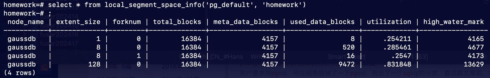

- 

```postgresql
pg_stat_segment_extent_usage(int4 tablespace oid, int4 database oid, int4 extent_type, int4 forknum)
```

描述：每次返回一个 ExtentGroup 中，每个被分配出去的 extent 的使用情况。extent_type 表示 ExtentGroup 的类型，合理取值为 [1,5] 的 int 值。在此范围外的会报 error。forknum 表示 fork 号，合法取值为 [0,4] 的 int 值，目前只有三种值有效，数据文件为 0，FSM 文件为 1，visibility map 文件为 2。

| 名称          | 描述                                                         |
| :------------ | ------------------------------------------------------------ |
| start_block   | Extent 的起始物理页号                                        |
| extent_size   | Extent 的大小                                                |
| usage_type    | Extent 的使用类型，比如 segment head、data extent 等         |
| ower_location | 有指针指向该 extent 的对象的位置。比如 data extent 的 owner 就是它所属的 segment 的 head 位置 |
| special_data  | 该 extent 在它 owner 中的位置。该字段的数据与使用类型有关。比如 data extent 的 special data 就是它在所属 segment 中的 extent id |

查找 orderszzy 表所在表空间和数据库的 oid，查看 pg_stat_segment_extent_usage() 函数的输出结果：

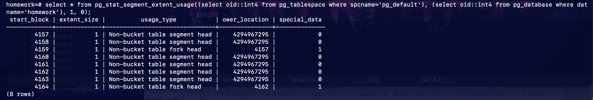

select * from pg_stat_segment_extent_usage((select oid::int4 from pg_tablespace where spcname='pg_default'), (select oid::int4 from pg_database where datname='homework'), 2, 0);


- 

```postgresql
gs_space_shrink(int4 tablespace, int4 database, int4 extent_type, int4 forknum)
```

描述：当前节点上对指定段页式空间做物理空间收缩。注意，目前只支持对当前连接的 database 做 shrink。（对指定段页式空间做物理空间收缩），传入的参数是 tablespace 和 database 的 oid，extent_type 为 [2,5] 的 int 值。注意：extent_type = 1 表示段页式元数据，目前不支持对元数据所在的物理文件做收缩。该函数仅限工具使用，不建议用户直接使用。
