# 数据库课程实验（七）：数据库事务管理


## 单事务/串行事务执行原子性保障机制验证

建立用于实验的表的拷贝（对于前两句语句，建立完表`partsupp_1`后，将`partsupp_1`改为`partsupp_2`建立另一个表）：

```mysql
CREATE TABLE partsupp_1(
    PS_PARTKEY integer NOT NULL,
    PS_SUPPKEY integer NOT NULL,
    PS_AVAILQTY integer NOT NULL,
    PS_SUPPLYCOST decimal(15, 2) NOT NULL,
    PS_COMMENT varchar(199) NOT NULL
);

## 插入数据
insert into partsupp_1
select *
from partsupp;

## 添加约束(用于实验)
alter table partsupp_1 add constraint partsupp_chk_1 check(PS_SUPPKEY >= 0);
alter table partsupp_2 add constraint partsupp_chk_2 check(PS_SUPPKEY >= 0);
```

查看实验操作前表中的数据：

```mysql
select count(*)
from partsupp_1
where PS_SUPPKEY < 10;
```

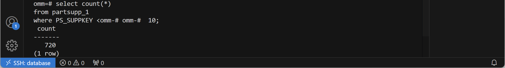

```mysql
select count(*)
from partsupp_2
where PS_SUPPKEY < 10;
```


### 单一事务执行`update`操作

在单一事务里运行一条语句：

```mysql
START TRANSACTION;

update partsupp_2
set PS_SUPPKEY = PS_SUPPKEY - 10;

END;
```

该更新将导致部分元组属性`PS_SUPPKEY`的值小于`0`，不满足约束，运行后事务回滚：

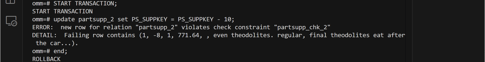

经过尝试，即使将最后一句`END`更换为`COMMIT`，最终事务也会回滚.

若更新满足约束，则事务可以正常提交：

```mysql
START TRANSACTION;

update partsupp_2
set PS_SUPPKEY = PS_SUPPKEY + 5;

COMMIT;
```


### 事务内部单条语句失败对事务的整体影响

**不将指令放在一个事务里顺序执行：**这样其实是串行地执行了两个事务.

指令1：

```mysql
update partsupp_1
set PS_SUPPKEY = PS_SUPPKEY - 10;
```

不满足约束，报错：

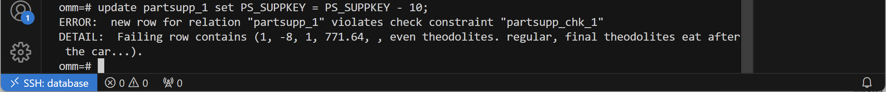

指令2：

```mysql
update partsupp_1
set PS_SUPPKEY = PS_SUPPKEY + 5;
```

执行成功.

运行后查询：

```mysql
select count(*)
from partsupp_1
where PS_SUPPKEY < 10;
```

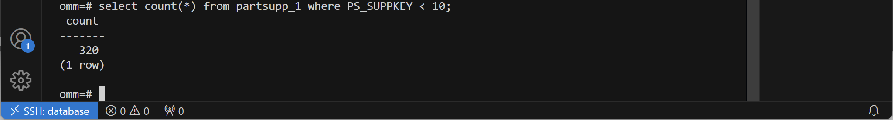

满足查询条件的元组数量发生变化，说明在上面的语句运行失败的情况下，下面的语句正常执行（两者相互独立）.

**将指令放在同一个事务里执行：**

```mysql
START TRANSACTION;

update partsupp_2
set PS_SUPPKEY = PS_SUPPKEY - 10;

update partsupp_2
set PS_SUPPKEY = PS_SUPPKEY + 5;

END;
```

第二句语句不满足约束，事务结束后自动回滚：

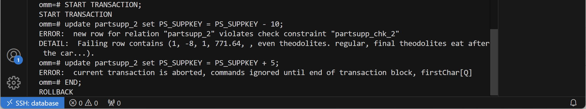

运行后查询：

```mysql
select count(*)
from partsupp_2
where PS_SUPPKEY < 10;
```

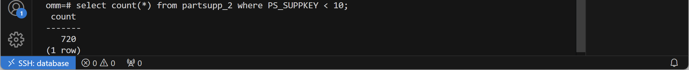

满足查询条件的元组数量没有变化，说明事务中的两句语句都没有执行，这保证了事务的原子性，即事务内的操作要么完全运行，要么完全不运行.

### 利用保存点回滚事务

`openGauss`中的保存点类似在事务内的检查点，使用保存点可以实现事务回滚到保存点位置，而非直接回滚整个事务.

以下代码在保存点前插入一条元组，又在保存点后将这条元组删除，运行回滚到保存点的语句后提交事务：

```mysql
START TRANSACTION;

INSERT INTO partsupp_1
values(2022, 2022, 7, 0, 'comment');

savepoint sp;

delete from partsupp_1
where PS_PARTKEY = '2022' and PS_SUPPKEY = '2022';

rollback to sp;

COMMIT;
```

运行前查询：

```mysql
select count(*)
from partsupp_1;
```


在将要运行的事务代码中插入查询语句，观察表的变化：

```mysql
START TRANSACTION;

INSERT INTO partsupp_1
values(2022, 2022, 7, 0, 'comment');

savepoint sp;

select count(*)
from partsupp_1;
```

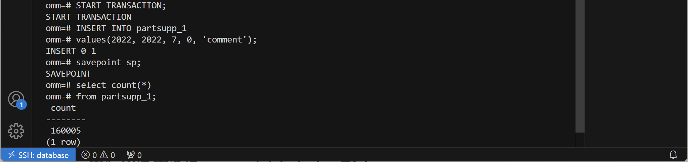

这说明新的元组插入成功.

```mysql
delete from partsupp_1
where PS_PARTKEY = '2022' and PS_SUPPKEY = '2022';

select count(*)
from partsupp_1;
```

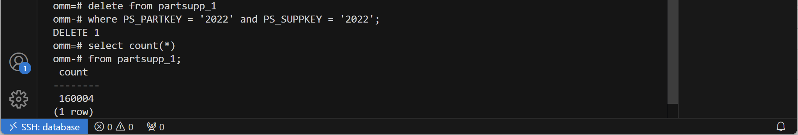

这说明在事务内将新插入的元组删除成功.

```mysql
rollback to sp;

COMMIT;

select count(*)
from partsupp_1;
```

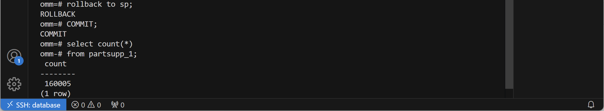

这说明使用保存点实现了事务的部分回滚，撤销了删除操作，没有撤销插入操作.


## 事务并发执行时的独立性保障机制验证

打开两个终端，连接相同的数据库.

实验前查询用于实验的元组的值：

```mysql
select PS_PARTKEY, PS_SUPPKEY, PS_AVAILQTY
from partsupp_1
where PS_PARTKEY = '2022' and PS_SUPPKEY = '2022';
```

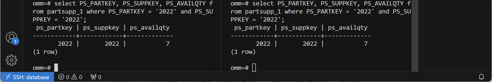

两终端显示相同查询结果.

### `read committed`隔离级别下的脏读、不可重复读、幻读

分别在两个窗口创建`read committed`隔离级别下的事务`T1`和`T2`：

```mysql
START TRANSACTION ISOLATION LEVEL read committed;
```

在事务`T1`中将上述元组的`PS_AVAILQTY`值修改为`1`，但不提交，在事务`T2`中查询上述元组的值：

```mysql
# T1
update partsupp_1
set PS_AVAILQTY = 1
where PS_PARTKEY = '2022' and PS_SUPPKEY = '2022';
```

```mysql
# T2
select PS_AVAILQTY
from partsupp_1
where PS_PARTKEY = '2022' and PS_SUPPKEY = '2022';
```

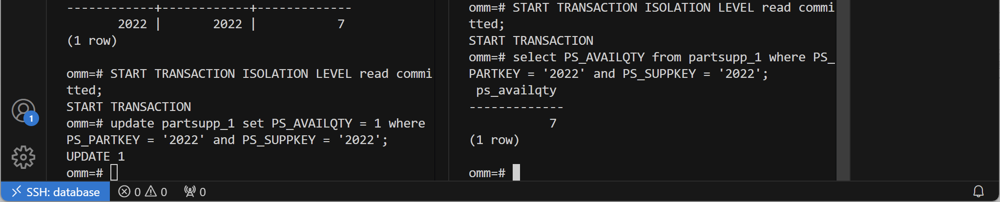

事务`T2`读取到的不是事务`T1`未提交的值，这说明在`read committed`隔离级别下，`T2`没有读取到脏数据.

将事务`T1`提交，再在事务`T2`中查询上述元组的值：

```mysql
# T1
COMMIT;
```

```mysql
# T2
select PS_AVAILQTY
from partsupp_1
where PS_PARTKEY = '2022' and PS_SUPPKEY = '2022';
```

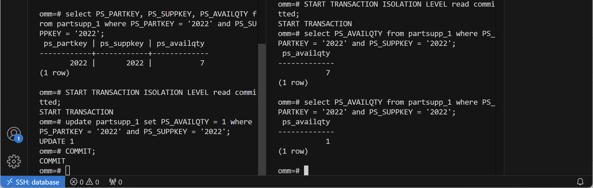

事务`T2`中出现了连续两次相同查询结果不同的现象，这说明在`read committed`隔离级别下可能出现不可重复读.

在第一个窗口再次创建`read committed`隔离级别下的事务`T3`，在`T3`中删除上述元组并提交，在事务`T2`中查询上述元组的值：

```mysql
# T3
delete from partsupp_1
where PS_PARTKEY = '2022' and PS_SUPPKEY = '2022';
```

```mysql
# T2
select PS_AVAILQTY
from partsupp_1
where PS_PARTKEY = '2022' and PS_SUPPKEY = '2022';
```

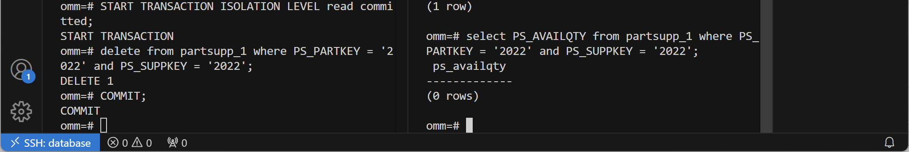

事务`T2`此时查不到原有的元组了，这说明在`read committed`隔离级别下可能出现幻读.

### `repeatable read`隔离级别下的脏读、不可重复读、幻读

为方便对比，将上面删去的元组重新插入表中，这次设置隔离级别为`repeatable read`：

```mysql
# T1, T2
START TRANSACTION ISOLATION LEVEL repeatable read;
```

之后重复相同的步骤：

```mysql
# T1
update partsupp_1
set PS_AVAILQTY = 1
where PS_PARTKEY = '2022' and PS_SUPPKEY = '2022';
```

```mysql
# T2
select PS_AVAILQTY
from partsupp_1
where PS_PARTKEY = '2022' and PS_SUPPKEY = '2022';
```

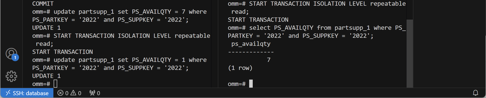

仍然不会出现脏读.

```mysql
# T1
COMMIT;
```

```mysql
# T2
select PS_AVAILQTY
from partsupp_1
where PS_PARTKEY = '2022' and PS_SUPPKEY = '2022';
```

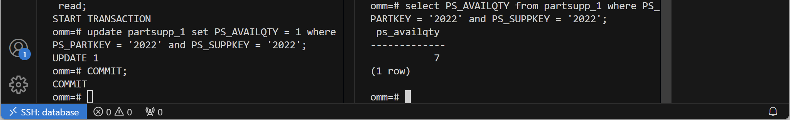

这次没有出现不可重复读.

```mysql
# T3
delete from partsupp_1
where PS_PARTKEY = '2022' and PS_SUPPKEY = '2022';
```

```mysql
# T2
select PS_AVAILQTY
from partsupp_1
where PS_PARTKEY = '2022' and PS_SUPPKEY = '2022';
```

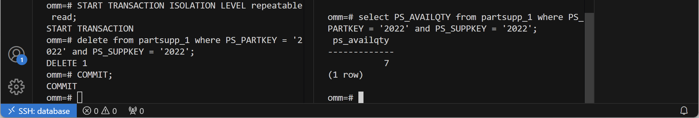

也没有出现幻读.

在`repeatable read`隔离级别下，事务内的查询操作看到的是它开始时的表的快照，这样，事务查询到的数据只受到它开始前执行的操作的影响；而在`read committed`隔离级别下，事务查询到的数据受到它开始后执行的操作的影响，如果两次查询之间有其它事务对查询的数据进行了更改，两次查询的结果就会不一致，造成不可重复读和幻读.

