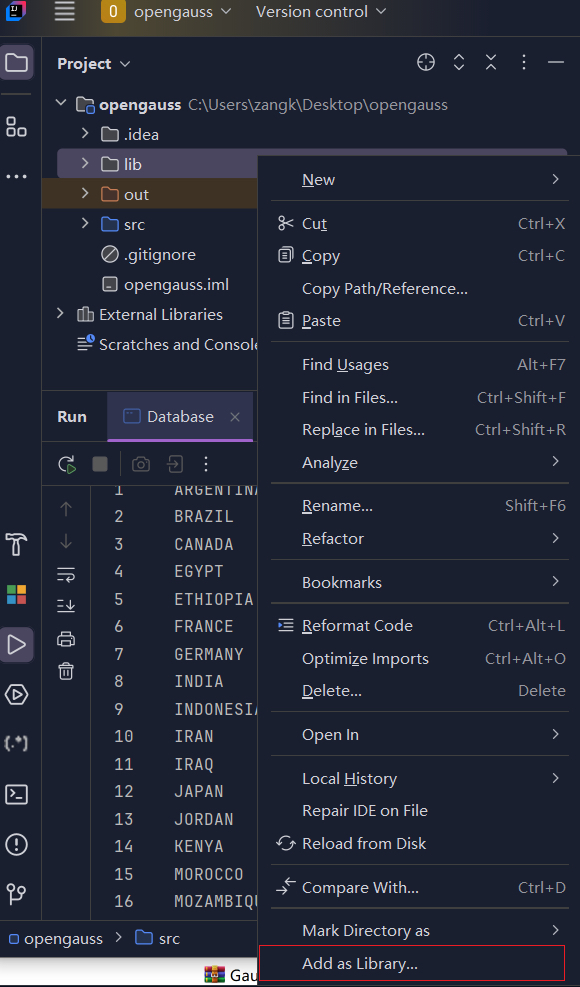
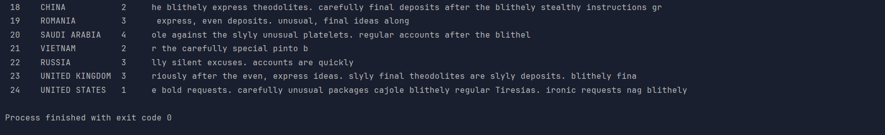

<div class="cover" style="page-break-after:always;font-family:方正公文仿宋;width:100%;height:100%;border:none;margin: 0 auto;text-align:center;">
    <div style="width:60%;margin: 0 auto;height:0;padding-bottom:10%;">
        </br>
        
    </div>
    </br></br></br></br></br>
    <div style="width:60%;margin: 0 auto;height:0;padding-bottom:40%;">
        
	</div>
    </br></br></br></br></br></br></br></br>
    <span style="font-family:华文黑体Bold;text-align:center;font-size:20pt;margin: 10pt auto;line-height:30pt;">数据库实验报告</span>
</br>
 		<span style="font-family:华文黑体Bold;text-align:center;font-size:16pt;margin: 10pt auto;line-height:30pt;">openGauss</span>
    </br>
    </br>
    <table style="border:none;text-align:center;width:72%;font-family:仿宋;font-size:14px; margin: 0 auto;">
    <tbody style="font-family:方正公文仿宋;font-size:12pt;">
    	<tr style="font-weight:normal;"> 
    		<td style="width:20%;text-align:right;">上课时间</td>
    		<td style="width:2%">：</td> 
    		<td style="width:40%;font-weight:normal;border-bottom: 1px solid;text-align:center;font-family:华文仿宋"> 周五3~5节</td>     </tr>
    	<tr style="font-weight:normal;"> 
    		<td style="width:20%;text-align:right;">授课教师</td>
    		<td style="width:2%">：</td> 
    		<td style="width:40%;font-weight:normal;border-bottom: 1px solid;text-align:center;font-family:华文仿宋">梁美玉</td>     </tr>
    	<tr style="font-weight:normal;"> 
    		<td style="width:20%;text-align:right;">姓　　名</td>
    		<td style="width:2%">：</td> 
    		<td style="width:40%;font-weight:normal;border-bottom: 1px solid;text-align:center;font-family:华文仿宋"> 臧泽元   蔡景旭   庄卜荣</td>     </tr>
    	<tr style="font-weight:normal;"> 
    		<td style="width:20%;text-align:right;">学　　号</td>
    		<td style="width:2%">：</td> 
    		<td style="width:40%;font-weight:normal;border-bottom: 1px solid;text-align:center;font-family:华文仿宋"> 2022210085 2022210053 2022210324</td>     </tr>
    	<tr style="font-weight:normal;"> 
    		<td style="width:20%;text-align:right;">班　　级</td>
    		<td style="width:%">：</td> 
    		<td style="width:40%;font-weight:normal;border-bottom: 1px solid;text-align:center;font-family:华文仿宋"> 2022217804 2022217803 2022217801</td>     </tr>
    	<tr style="font-weight:normal;"> 
    		<td style="width:20%;text-align:right;">日　　期</td>
    		<td style="width:2%">：</td> 
    		<td style="width:40%;font-weight:normal;border-bottom: 1px solid;text-align:center;font-family:华文仿宋">2024.11.30</td>     </tr>
    </tbody>              
    </table>
</div>


> 成员分工：
>
> - 臧泽元：环境搭建、任务1、任务4、任务5
> - 蔡景旭：任务3、任务7
> - 庄卜荣：任务2、任务6

## 0 环境搭建

实验 1-3 所用数据库部署于本地 docker 容器中，基于 [enmotech/enmotech-docker-opengauss: Ennotech openGauss Docker Image](https://github.com/enmotech/enmotech-docker-opengauss) 中给出的 openGauss 1.1.0 x86 镜像进行配置，容器内系统为 CentOS 7.6。拉取镜像创建容器的指令如下：

```shell
$ docker run --name opengauss --privileged=true -d -e GS_PASSWORD=Enmo@123 enmotech/opengauss:1.1.0
```

后续进入容器（`docker exec`）时，将容器的 22 端口映射到主机的 22222 端口以便 ssh 远程连接。

## 1 数据库建表及数据导入

### 1.1 创建关系表

#### 1.1.1 订单表 `ORDERS`

终端显示：

```shell
omm=# CREATE TABLE ORDERS ( O_ORDERKEY    INTEGER NOT NULL,
omm(# O_CUSTKEY    INTEGER NOT NULL,
omm(# O_ORDERSTATUS    CHAR(1) NOT NULL,
omm(# O_TOTALPRICE    DECIMAL(15,2) NOT NULL,
omm(# O_ORDERDATE    DATE NOT NULL,
omm(# O_ORDERPRIORITY    CHAR(15) NOT NULL,
omm(# O_CLERK    CHAR(15) NOT NULL,
omm(# O_SHIPPRIORITY    INTEGER NOT NULL,
omm(# O_COMMENT    VARCHAR(79) NOT NULL);
CREATE TABLE
```

末尾显示 `CREATE TABLE` 表示建表成功。

#### 1.1.2 区域表 `REGION`

```shell
omm=# CREATE TABLE REGION ( R_REGIONKEY    INTEGER NOT NULL,
omm(# R_NAME    CHAR(25) NOT NULL,
omm(# R_COMMENT    VARCHAR(152));
CREATE TABLE
```

#### 1.1.3 国家表 `NATION`

```shell
omm=# CREATE TABLE NATION ( N_NATIONKEY    INTEGER NOT NULL,
omm(# N_NAME    CHAR(25) NOT NULL,
omm(# N_REGIONKEY    INTEGER NOT NULL,
omm(# N_COMMENT    VARCHAR(152));
CREATE TABLE
```

#### 1.1.4 供应商表 `SUPPLIER`

```shell
omm=# CREATE TABLE SUPPLIER ( S_SUPPKEY    INTEGER NOT NULL,
omm(# S_NAME    CHAR(25) NOT NULL,
omm(# S_ADDRESS    VARCHAR(40) NOT NULL,
omm(# S_NATIONKEY    INTEGER NOT NULL,
omm(# S_PHONE    CHAR(15) NOT NULL,
omm(# S_ACCTBAL    DECIMAL(15,2) NOT NULL,
omm(# S_COMMENT    VARCHAR(101) NOT NULL);
CREATE TABLE
```

#### 1.1.5 零部件表 `PART`

```shell
omm=# CREATE TABLE PART ( P_PARTKEY    INTEGER NOT NULL,
omm(# P_NAME    VARCHAR(55) NOT NULL,
omm(# P_MFGR    CHAR(25) NOT NULL,
omm(# P_BRAND    CHAR(10) NOT NULL,
omm(# P_TYPE    VARCHAR(25) NOT NULL,
omm(# P_SIZE    INTEGER NOT NULL,
omm(# P_CONTAINER    CHAR(10) NOT NULL,
omm(# P_RETAILPRICE    DECIMAL(15,2) NOT NULL,
omm(# P_COMMENT    VARCHAR(23) NOT NULL);
CREATE TABLE
```

#### 1.3.6 零部件供应表 `PARTSUPP`

```shell
omm=# CREATE TABLE PARTSUPP ( PS_PARTKEY    INTEGER NOT NULL,
omm(# PS_SUPPKEY    INTEGER NOT NULL,
omm(# PS_AVAILQTY    INTEGER NOT NULL,
omm(# PS_SUPPLYCOST    DECIMAL(15,2) NOT NULL,
omm(# PS_COMMENT    VARCHAR(199) NOT NULL);
CREATE TABLE
```

#### 1.3.7 客户表 `CUSTOMER`

```shell
omm=# CREATE TABLE CUSTOMER ( C_CUSTKEY    INTEGER NOT NULL,
omm(# C_NAME    VARCHAR(25) NOT NULL,
omm(# C_ADDRESS    VARCHAR(40) NOT NULL,
omm(# C_NATIONKEY    INTEGER NOT NULL,
omm(# C_PHONE    CHAR(15) NOT NULL,
omm(# C_ACCTBAL    DECIMAL(15,2) NOT NULL,
omm(# C_MKTSEGMENT    CHAR(10) NOT NULL,
omm(# C_COMMENT    VARCHAR(117) NOT NULL);
CREATE TABLE
```

#### 1.3.8 订单明细表 `LINEITEM`

```shell
omm=# CREATE TABLE LINEITEM ( L_ORDERKEY    INTEGER NOT NULL,
omm(# L_PARTKEY    INTEGER NOT NULL,
omm(# L_SUPPKEY    INTEGER NOT NULL,
omm(# L_LINENUMBER    INTEGER NOT NULL,
omm(# L_QUANTITY    DECIMAL(15,2) NOT NULL,
omm(# L_EXTENDEDPRICE    DECIMAL(15,2) NOT NULL,
omm(# L_DISCOUNT    DECIMAL(15,2) NOT NULL,
omm(# L_TAX    DECIMAL(15,2) NOT NULL,
omm(# L_RETURNFLAG    CHAR(1) NOT NULL,
omm(# L_LINESTATUS    CHAR(1) NOT NULL,
omm(# L_SHIPDATE    DATE NOT NULL,
omm(# L_COMMITDATE    DATE NOT NULL,
omm(# L_RECEIPTDATE    DATE NOT NULL,
omm(# L_SHIPINSTRUCT    CHAR(25) NOT NULL,
omm(# L_SHIPMODE    CHAR(10) NOT NULL,
omm(# L_COMMENT    VARCHAR(44) NOT NULL);
CREATE TABLE
```

通过 `\d+` 命令可看到创建完的 8 个表：


### 1.2 数据导入

#### 1.2.1 上传文件

将 tpc-h 的 txt 格式数据文件用 SCP 上传到 openGauss 所在的容器上，首先在容器 `omm` 用户下创建目录 `tpc-h/data` 并授予全部权限：

```shell
[omm@cfde74516988 ~]$ pwd   
/home/omm
[omm@cfde74516988 ~]$ mkdir tpc-h   
[omm@cfde74516988 ~]$ cd tpc-h
[omm@cfde74516988 tpc-h]$ mkdir data
```

```shell
[root@cfde74516988 ~]# cd /home/omm
[root@cfde74516988 omm]# chmod 777 tpc-h
[root@cfde74516988 omm]# cd tpc-h
[root@cfde74516988 tpc-h]# chmod 777 data
```

然后退出 omm 用户回到 root，将 txt 格式的数据文件移到该文件夹里（第一次远程连接需要设置密钥）：


最后授予文件全部权限：

```shell
[root@cfde74516988 ~]# cd /home/omm/tpc-h/data
[root@cfde74516988 data]# chmod 777 *
[root@cfde74516988 data]# ls -l
total 208992
-rwxrwxrwx 1 root root   4835158 Nov 25 10:19 customer.txt
-rwxrwxrwx 1 root root 155651209 Nov 25 10:19 lineitem.txt
-rwxrwxrwx 1 root root      2356 Nov 25 10:19 nation.txt
-rwxrwxrwx 1 root root  25118002 Nov 25 10:19 orders.txt
-rwxrwxrwx 1 root root  23143960 Nov 25 10:19 partsupp.txt
-rwxrwxrwx 1 root root   4982186 Nov 25 10:19 part.txt
-rwxrwxrwx 1 root root       199 Nov 25 10:19 region.txt
-rwxrwxrwx 1 root root    250820 Nov 25 10:19 supplier.txt
```

#### 1.2.2 导入数据

以 omm 用户登录数据库主节点，并连接数据库，然后使用 `\copy` 命令导入数据：

```shell
omm=# copy region FROM '/home/omm/tpc-h/data/region.txt' with delimiter as '|';
COPY 5
omm=# copy nation FROM 'home/omm/tpc-h/data/nation.txt' with delimiter as '|';
ERROR:  could not open file "home/omm/tpc-h/data/nation.txt" for reading: No such file or directory
omm=# copy nation FROM '/home/omm/tpc-h/data/nation.txt' with delimiter as '|';
COPY 25
omm=# copy part FROM '/home/omm/tpc-h/data/part.txt' with delimiter as '|';
COPY 40000
omm=# copy supplier FROM '/home/omm/tpc-h/data/supplier.txt' with delimiter as '|';
COPY 2000
omm=# copy customer FROM '/home/omm/tpc-h/data/customer.txt' with delimiter as '|';
COPY 30000
omm=# copy lineitem FROM '/home/omm/tpc-h/data/lineitem.txt' with delimiter as '|'; 
COPY 1199969
omm=# copy partsupp FROM '/home/omm/tpc-h/data/partsupp.txt' with delimiter as '|';
COPY 160000
omm=# copy orders FROM '/home/omm/tpc-h/data/orders.txt' with delimiter as '|';
COPY 300000
```

通过 `\d+` 命令可看到表的大小有更新：


导入后为关系表添加约束：

```shell
omm=# ALTER TABLE REGION
omm-# ADD PRIMARY KEY (R_REGIONKEY);
NOTICE:  ALTER TABLE / ADD PRIMARY KEY will create implicit index "region_pkey" for table "region"
ALTER TABLE

omm=# ALTER TABLE NATION
omm-# ADD PRIMARY KEY (N_NATIONKEY);
NOTICE:  ALTER TABLE / ADD PRIMARY KEY will create implicit index "nation_pkey" for table "nation"
ALTER TABLE

omm=# ALTER TABLE NATION 
omm-# ADD FOREIGN KEY (N_REGIONKEY) references REGION;
ALTER TABLE

omm=# ALTER TABLE PART
omm-# ADD PRIMARY KEY (P_PARTKEY);
NOTICE:  ALTER TABLE / ADD PRIMARY KEY will create implicit index "part_pkey" for table "part"
ALTER TABLE

omm=# ALTER TABLE SUPPLIER
omm-# ADD PRIMARY KEY (S_SUPPKEY);
NOTICE:  ALTER TABLE / ADD PRIMARY KEY will create implicit index "supplier_pkey" for table "supplier"
ALTER TABLE

omm=# ALTER TABLE SUPPLIER
omm-# ADD FOREIGN KEY (S_NATIONKEY) references NATION;
ALTER TABLE

omm=# ALTER TABLE PARTSUPP
omm-# ADD PRIMARY KEY (PS_PARTKEY,PS_SUPPKEY);
NOTICE:  ALTER TABLE / ADD PRIMARY KEY will create implicit index "partsupp_pkey" for table "partsupp"
ALTER TABLE

omm=# ALTER TABLE CUSTOMER
omm-# ADD PRIMARY KEY (C_CUSTKEY);
NOTICE:  ALTER TABLE / ADD PRIMARY KEY will create implicit index "customer_pkey" for table "customer"
ALTER TABLE

omm=# ALTER TABLE CUSTOMER
omm-# ADD FOREIGN KEY (C_NATIONKEY) references NATION;
ALTER TABLE

omm=# ALTER TABLE LINEITEM
omm-# ADD PRIMARY KEY (L_ORDERKEY,L_LINENUMBER);
NOTICE:  ALTER TABLE / ADD PRIMARY KEY will create implicit index "lineitem_pkey" for table "lineitem"
ALTER TABLE

omm=# ALTER TABLE ORDERS
omm-# ADD PRIMARY KEY (O_ORDERKEY);
NOTICE:  ALTER TABLE / ADD PRIMARY KEY will create implicit index "orders_pkey" for table "orders"
ALTER TABLE

omm=# ALTER TABLE PARTSUPP
omm-# ADD FOREIGN KEY (PS_SUPPKEY) references SUPPLIER;
ALTER TABLE

omm=# ALTER TABLE PARTSUPP
omm-# ADD FOREIGN KEY (PS_PARTKEY) references PART;
ALTER TABLE

omm=# ALTER TABLE ORDERS
omm-# ADD FOREIGN KEY (O_CUSTKEY) references CUSTOMER;
ALTER TABLE

omm=# ALTER TABLE LINEITEM
omm-# ADD FOREIGN KEY (L_ORDERKEY) references ORDERS;
ALTER TABLE

omm=# ALTER TABLE LINEITEM
omm-# ADD FOREIGN KEY (L_PARTKEY,L_SUPPKEY) references PARTSUPP;
ALTER TABLE
```

用 `select` 语句查看关系表可以显示刚刚导入进来的数据：


## 2 数据查询与修改

### 2.1 单表查询

**查询1**：

从订单表 `ORDERS` 中，找出由收银员 `Clerk#000000951` 处理的满足下列条件的所有订单 `O_ORDERKEY`：

（1）订单总价位于 `[起始价格 5000, 结束价格 100000]`

（2）下单日期在 `开始日期 2019-01-02 00:00:00` 至 `结束日期 2020-08-31 00:00:00` 之间，

（3）订单状态 `O_ORDERSTATUS` 不为空

列出这些订单的订单 `key`（`O_ORDERKEY`）、客户 `key`、订单状态、订单总价、下单日期（重命名为 `O_DATE`）、订单优先级和发货优先级；

要求：对查询结果，按照订单优先级从高到低、发货优先级从高到低排序。

```sql
-- 查询订单信息
SELECT 
    O_ORDERKEY, 
    O_CUSTKEY, 
    O_ORDERSTATUS, 
    O_TOTALPRICE, 
    O_ORDERDATE AS O_DATE, 
    O_ORDERPRIORITY, 
    O_SHIPPRIORITY
FROM 
    ORDERS
WHERE 
    O_CLERK = 'Clerk#000000951'
    AND O_TOTALPRICE BETWEEN 5000 AND 100000
    AND O_ORDERDATE BETWEEN '2019-01-02' AND '2020-08-31'
    AND O_ORDERSTATUS IS NOT NULL
ORDER BY 
    O_ORDERPRIORITY DESC, 
    O_SHIPPRIORITY DESC;
```

```sql
omm=# SELECT O_ORDERKEY, O_CUSTKEY, O_ORDERSTATUS, O_TOTALPRICE, O_ORDERDATE AS O_DATE, O_ORDERPRIORITY, O_SHIPPRIORITY
FROM ORDERS
WHERE O_CLERK = 'Clerk#000000951';omm-# omm-#
 o_orderkey | o_custkey | o_orderstatus | o_totalprice |       o_date        | o_orderpriority | o_shippriority
------------+-----------+---------------+--------------+---------------------+-----------------+----------------
          1 |      7381 | O             |    181585.13 | 2019-01-02 00:00:00 | 5-LOW           |              0
        839 |      5578 | O             |    104005.14 | 2018-08-08 00:00:00 | 1-URGENT        |              0
       2338 |     27874 | O             |     22264.72 | 2020-09-15 00:00:00 | 2-HIGH          |              0
       4579 |     20828 | O             |    147919.32 | 2018-12-01 00:00:00 | 2-HIGH          |              0
       8452 |     27832 | F             |    147102.45 | 2015-07-31 00:00:00 | 4-NOT SPECIFIED |              0
       9185 |      2893 | F             |     92840.21 | 2017-06-16 00:00:00 | 2-HIGH          |              0
      12163 |      1733 | O             |    183726.95 | 2020-07-20 00:00:00 | 5-LOW           |              0
      13508 |     16033 | O             |     42756.76 | 2020-04-17 00:00:00 | 4-NOT SPECIFIED |              0
      14277 |     18920 | O             |    133599.91 | 2021-02-14 00:00:00 | 4-NOT SPECIFIED |              0
      15073 |      1468 | F             |    138584.35 | 2015-01-26 00:00:00 | 3-MEDIUM        |              0
      17636 |     15205 | F             |    137295.03 | 2017-02-05 00:00:00 | 5-LOW           |              0
      19200 |       854 | O             |    144151.90 | 2020-07-27 00:00:00 | 4-NOT SPECIFIED |              0
      19205 |     11662 | F             |    327627.84 | 2016-07-27 00:00:00 | 3-MEDIUM        |              0
      20547 |     16147 | F             |     38376.91 | 2016-08-27 00:00:00 | 2-HIGH          |              0
      21312 |      5638 | O             |     55741.75 | 2019-02-01 00:00:00 | 1-URGENT        |              0
      25639 |     25135 | F             |     46746.31 | 2017-10-12 00:00:00 | 3-MEDIUM        |              0
      26885 |     25732 | O             |    226010.66 | 2020-05-11 00:00:00 | 3-MEDIUM        |              0
      27364 |      4489 | O             |    201233.85 | 2018-05-21 00:00:00 | 3-MEDIUM        |              0
      40932 |     23078 | O             |    176808.89 | 2021-05-12 00:00:00 | 3-MEDIUM        |              0
      42817 |     21661 | O             |     44438.99 | 2020-08-31 00:00:00 | 5-LOW           |              0
      47142 |     19433 | O             |     73866.30 | 2019-03-24 00:00:00 | 1-URGENT        |              0
      60419 |     21305 | F             |    114536.40 | 2015-06-20 00:00:00 | 4-NOT SPECIFIED |              0
      60867 |     22738 | O             |     92114.35 | 2020-07-27 00:00:00 | 3-MEDIUM        |              0
      64612 |     20027 | F             |    307272.91 | 2016-12-26 00:00:00 | 4-NOT SPECIFIED |              0
      66470 |      1373 | F             |     68381.45 | 2016-05-10 00:00:00 | 3-MEDIUM        |              0
      66531 |     23941 | F             |    101155.27 | 2015-10-20 00:00:00 | 3-MEDIUM        |              0
      84197 |     28901 | O             |     79241.84 | 2019-05-22 00:00:00 | 5-LOW           |              0
      95623 |     20209 | O             |     99889.91 | 2020-12-10 00:00:00 | 2-HIGH          |              0
      96870 |     13928 | F             |    117595.25 | 2015-01-07 00:00:00 | 1-URGENT        |              0
     100611 |      6268 | O             |    119354.28 | 2019-02-14 00:00:00 | 5-LOW           |              0
     105920 |      4939 | F             |    113306.11 | 2016-06-20 00:00:00 | 2-HIGH          |              0
     112965 |       472 | F             |     15036.22 | 2016-08-11 00:00:00 | 3-MEDIUM        |              0
     114599 |     28057 | F             |     61960.06 | 2015-04-24 00:00:00 | 4-NOT SPECIFIED |              0
```

**查询2**：

从订单明细表 `LINEITEM` 中，找出满足下列条件的所有订单 `L_ORDERKEY`：

（1）数量位于 `[起始数量 30, 结束数量 50]`，

（2）退货标志为 `'N'` 的订单中，价格不小于 `最低价格 20000`

列出这些订单的 `L_ORDERKEY`、`L_SUPPKEY`、`L_EXTENDEDPRICE`；要求：对查询结果，按照价格从高到低排序，并且对查询结果使用 `DISTINCT` 去重。

比较对查询结果去重和不去重，在查询时间和查询结果上的差异。

```sql
-- 去重查询
EXPLAIN ANALYZE
SELECT DISTINCT L_ORDERKEY, L_SUPPKEY, L_EXTENDEDPRICE
FROM LINEITEM
WHERE L_QUANTITY BETWEEN 30 AND 50
  AND L_RETURNFLAG = 'N'
  AND L_EXTENDEDPRICE >= 96000
ORDER BY L_EXTENDEDPRICE DESC;

-- 不去重查询
EXPLAIN ANALYZE
SELECT L_ORDERKEY, L_SUPPKEY, L_EXTENDEDPRICE
FROM LINEITEM
WHERE L_QUANTITY BETWEEN 30 AND 50
  AND L_RETURNFLAG = 'N'
  AND L_EXTENDEDPRICE >= 96000
ORDER BY L_EXTENDEDPRICE DESC;
```

**去重**

**查询结果**

```sql
omm=# SELECT DISTINCT L_ORDERKEY, L_SUPPKEY, L_EXTENDEDPRICE
FROM LINEITEM
WHERE L_QUANTITY BETWEEN 30 AND 50
  AND L_RETURNFLAG = 'N'
  AND L_EXTENDEDPRICE >= 96000
ORDER BY L_EXTENDEDPRICE DESC;omm-# omm-# omm-# omm-# omm-#
 l_orderkey | l_suppkey | l_extendedprice
------------+-----------+-----------------
     549057 |      2000 |        96949.50
     272229 |       557 |        96899.50
     705441 |      1999 |        96899.50
     719041 |      1519 |        96899.50
    1028352 |      1036 |        96849.50
     814209 |      1999 |        96799.50
    1114084 |       517 |        96799.50
     111329 |      1553 |        96749.50
     456194 |        35 |        96749.50
     747776 |      1552 |        96749.50
     163712 |       516 |        96699.50
     323143 |      1516 |        96699.50
      10308 |       999 |        96649.50
     330503 |      1032 |        96649.50
     916000 |      1998 |        96649.50
     ........
          244676 |       506 |        96149.00
     428514 |      1984 |        96149.00
     868550 |      1538 |        96149.00
    1101380 |        23 |        96149.00
     293607 |       537 |        96099.50
     400421 |      1509 |        96099.50
     787011 |       537 |        96099.50
    1096550 |       533 |        96099.50
     265669 |      1538 |        96099.00
     368230 |       540 |        96099.00
     787937 |       505 |        96099.00
     892805 |       984 |        96099.00
     933921 |      1021 |        96099.00
     603969 |       991 |        96049.50
     177411 |       505 |        96049.00
     334182 |      1535 |        96049.00
     591331 |      1020 |        96049.00
     591716 |      1537 |        96049.00
     610368 |       502 |        96049.00
(70 rows)
     
```

**查询时间：223.757 ms**

```sql
omm=# EXPLAIN ANALYZE
SELECT DISTINCT L_ORDERKEY, L_SUPPKEY, L_EXTENDEDPRICE
FROM LINEITEM
WHERE L_QUANTITY BETWEEN 30 AND 50
  AND L_RETURNFLAG = 'N'
  AND L_EXTENDEDPRICE >= 96000
ORDER BY L_EXTENDEDPRICE DESC;omm-# omm-# omm-# omm-# omm-# omm-#
                                                                          QUERY PLAN
--------------------------------------------------------------------------------------------------------------------------------------------------------------
 Unique  (cost=48915.99..48916.25 rows=26 width=16) (actual time=223.653..223.662 rows=70 loops=1)
   ->  Sort  (cost=48915.99..48916.06 rows=26 width=16) (actual time=223.652..223.655 rows=70 loops=1)
         Sort Key: l_extendedprice DESC, l_orderkey, l_suppkey
         Sort Method: quicksort  Memory: 29kB
         ->  Seq Scan on lineitem  (cost=0.00..48915.38 rows=26 width=16) (actual time=5.454..223.591 rows=70 loops=1)
               Filter: ((l_quantity >= 30::numeric) AND (l_quantity <= 50::numeric) AND (l_extendedprice >= 96000::numeric) AND (l_returnflag = 'N'::bpchar))
               Rows Removed by Filter: 1199899
 Total runtime: 223.757 ms
```

**不去重**

**查询结果**

```sql
omm=# SELECT L_ORDERKEY, L_SUPPKEY, L_EXTENDEDPRICE
FROM LINEITEM
WHERE L_QUANTITY BETWEEN 30 AND 50
  AND L_RETURNFLAG = 'N'
  AND L_EXTENDEDPRICE >= 96000
ORDER BY L_EXTENDEDPRICE DESC;omm-# omm-# omm-# omm-# omm-#
 l_orderkey | l_suppkey | l_extendedprice
------------+-----------+-----------------
     549057 |      2000 |        96949.50
     272229 |       557 |        96899.50
     719041 |      1519 |        96899.50
     705441 |      1999 |        96899.50
    1028352 |      1036 |        96849.50
     814209 |      1999 |        96799.50
    1114084 |       517 |        96799.50
     456194 |        35 |        96749.50
     747776 |      1552 |        96749.50
     111329 |      1553 |        96749.50
     323143 |      1516 |        96699.50
  ........
       578660 |      1509 |        96199.50
       8134 |       988 |        96199.00
     809378 |      1022 |        96149.50
     965285 |      1535 |        96149.50
    1075681 |      1510 |        96149.50
    1101380 |        23 |        96149.00
     868550 |      1538 |        96149.00
     244676 |       506 |        96149.00
     428514 |      1984 |        96149.00
     400421 |      1509 |        96099.50
     787011 |       537 |        96099.50
     293607 |       537 |        96099.50
    1096550 |       533 |        96099.50
     933921 |      1021 |        96099.00
     892805 |       984 |        96099.00
     787937 |       505 |        96099.00
     265669 |      1538 |        96099.00
     368230 |       540 |        96099.00
     603969 |       991 |        96049.50
     610368 |       502 |        96049.00
     591716 |      1537 |        96049.00
     591331 |      1020 |        96049.00
     334182 |      1535 |        96049.00
     177411 |       505 |        96049.00
(70 rows)
```

**查询时间：223.187 ms**

```sql
omm=# EXPLAIN ANALYZE
SELECT L_ORDERKEY, L_SUPPKEY, L_EXTENDEDPRICE
FROM LINEITEM
WHERE L_QUANTITY BETWEEN 30 AND 50
  AND L_RETURNFLAG = 'N'
  AND L_EXTENDEDPRICE >= 96000
ORDER BY L_EXTENDEDPRICE DESC;omm-# omm-# omm-# omm-# omm-# omm-#
                                                                       QUERY PLAN
--------------------------------------------------------------------------------------------------------------------------------------------------------
 Sort  (cost=48915.99..48916.06 rows=26 width=16) (actual time=223.107..223.110 rows=70 loops=1)
   Sort Key: l_extendedprice DESC
   Sort Method: quicksort  Memory: 29kB
   ->  Seq Scan on lineitem  (cost=0.00..48915.38 rows=26 width=16) (actual time=5.467..223.043 rows=70 loops=1)
         Filter: ((l_quantity >= 30::numeric) AND (l_quantity <= 50::numeric) AND (l_extendedprice >= 96000::numeric) AND (l_returnflag = 'N'::bpchar))
         Rows Removed by Filter: 1199899
 Total runtime: 223.187 ms
(7 rows)
```

### 2.2 字符串操作

**查询3**：

从客户表 `CUSTOMER` 中，找出满足下列条件的客户：

（1）客户电话开头部分包含 `'10'`，或者客户市场领域中包含 `'BUILDING'`，并且

（2）客户电话结尾不为 `'8'`

```sql
SELECT C_CUSTKEY, C_NAME
FROM CUSTOMER
WHERE (C_PHONE LIKE '10%' OR C_MKTSEGMENT LIKE '%BUILDING%')
  AND C_PHONE NOT LIKE '%8';
```

**实验结果**

```sql
 c_custkey |       c_name
-----------+--------------------
         2 | Customer#000000002
         3 | Customer#000000003
         4 | Customer#000000004
         5 | Customer#000000005
         6 | Customer#000000006
         7 | Customer#000000007
         8 | Customer#000000008
         9 | Customer#000000009
        10 | Customer#000000010
.......
      1955 | Customer#000001955
      1956 | Customer#000001956
      1958 | Customer#000001958
      1959 | Customer#000001959
      1960 | Customer#000001960
      1962 | Customer#000001962
      1963 | Customer#000001963
      1964 | Customer#000001964
      1965 | Customer#000001965
      1966 | Customer#000001966
      1967 | Customer#000001967
.......
```

**查询4**：

从客户表 `CUSTOMER` 中，找出满足下列条件的客户姓名：

（1）客户 `key` 由 2 个字符组成

（2）客户地址至少包括 18 个字符，即地址字符串的长度不小于 18。

```sql
SELECT C_NAME
FROM CUSTOMER
WHERE C_CUSTKEY::TEXT LIKE '__'  -- 假设C_CUSTKEY为整数，需要转换为文本比较
  AND LENGTH(C_ADDRESS) >= 18;
```

**实验结果**

```sql
       c_name
--------------------
 Customer#000000010
 Customer#000000012
 Customer#000000013
 Customer#000000014
 Customer#000000015
 Customer#000000017
 Customer#000000018
 Customer#000000019
 Customer#000000020
 Customer#000000022
 Customer#000000023
 Customer#000000024
 .......
 Customer#000000084
 Customer#000000085
 Customer#000000087
 Customer#000000088
 Customer#000000089
 Customer#000000091
 Customer#000000092
 Customer#000000093
 Customer#000000094
 Customer#000000095
 Customer#000000096
 Customer#000000097
 Customer#000000098
 Customer#000000099
(64 rows)
```

### 2.3 集合操作

**查询5**：

使用集合并操作 `UNION`、`UNION ALL`，从订单明细表 `LINEITEM` 查询满足下列条件的订单 `L_ORDERKEY`：

（1）订单发货日期早于 `'2016-01-01'`，或者

（2）订单数量大于 `100`

对比 `UNION ALL`、`UNION` 操作在查询结果、执行时间上的差异。

```sql
-- 使用 UNION ALL
EXPLAIN ANALYZE
SELECT L_ORDERKEY
FROM LINEITEM
WHERE L_SHIPDATE < '2016-01-01'::DATE

UNION ALL

SELECT L_ORDERKEY
FROM LINEITEM
WHERE L_QUANTITY > 100;

-- 使用 UNION
EXPLAIN ANALYZE
SELECT L_ORDERKEY
FROM LINEITEM
WHERE L_SHIPDATE < '2016-01-01'::DATE

UNION

SELECT L_ORDERKEY
FROM LINEITEM
WHERE L_QUANTITY > 100;
```

**使用 UNION ALL**

**实验结果**

```sql
 l_orderkey
------------
          6
         37
         37
         37
        128
        129
        129
...........
       1504
       1504
       1505
       1505
       1506
       1506
       1506
       1506
       1506
       1537
       1537
...........
       5218
       5220
       5254
       5254
       5254
       5254
       5254
       5254
...........
```

**执行时间: 365.901 ms**

```sql
                                                          QUERY PLAN
------------------------------------------------------------------------------------------------------------------------------
 Result  (cost=0.00..81345.32 rows=151409 width=4) (actual time=0.057..361.636 rows=151587 loops=1)
   ->  Append  (cost=0.00..81345.32 rows=151409 width=4) (actual time=0.056..352.949 rows=151587 loops=1)
         ->  Seq Scan on lineitem  (cost=0.00..39915.61 rows=151408 width=4) (actual time=0.055..167.003 rows=151587 loops=1)
               Filter: (l_shipdate < '2016-01-01 00:00:00'::timestamp(0) without time zone)
               Rows Removed by Filter: 1048382
         ->  Seq Scan on lineitem  (cost=0.00..39915.61 rows=1 width=4) (actual time=178.241..178.241 rows=0 loops=1)
               Filter: (l_quantity > 100::numeric)
               Rows Removed by Filter: 1199969
 Total runtime: 365.901 ms
(9 rows)
```

**使用 UNION**

**实验结果**

```sql
 l_orderkey
------------
     865029
     370596
     310753
     363111
    1096454
     728802
...........
     834023
     733601
     344993
     970624
     104033
     738276
     821126
    1147808
     551749
    1083878
     361732
...........
```

**执行时间: 364.971 ms**

```sql
omm=# EXPLAIN ANALYZE
SELECT L_ORDERKEY
FROM LINEITEM
WHERE L_SHIPDATE < '2016-01-01'::DATE

UNION

SELECT L_ORDERKEY
FROM LINEITEM
WHERE L_QUANTITY > 100;omm-# omm-# omm-# omm-# omm-# omm-# omm-# omm-# omm-#
                                                          QUERY PLAN
------------------------------------------------------------------------------------------------------------------------------
 HashAggregate  (cost=81723.84..83237.93 rows=151409 width=4) (actual time=359.014..363.225 rows=41621 loops=1)
   Group By Key: public.lineitem.l_orderkey
   ->  Append  (cost=0.00..81345.32 rows=151409 width=4) (actual time=0.069..337.867 rows=151587 loops=1)
         ->  Seq Scan on lineitem  (cost=0.00..39915.61 rows=151408 width=4) (actual time=0.066..155.120 rows=151587 loops=1)
               Filter: (l_shipdate < '2016-01-01 00:00:00'::timestamp(0) without time zone)
               Rows Removed by Filter: 1048382
         ->  Seq Scan on lineitem  (cost=0.00..39915.61 rows=1 width=4) (actual time=174.747..174.747 rows=0 loops=1)
               Filter: (l_quantity > 100::numeric)
               Rows Removed by Filter: 1199969
 Total runtime: 364.971 ms
(10 rows)
```

**查询6**：

结合教材 3.4.1 节元组变量样例，使用集合操作 `EXCEPT`、`EXCEPT ALL`，从供应商表 `SUPPLIER` 中，查询账户余额最大的供应商。

对比使用 `EXCEPT`、`EXCEPT ALL`、聚集函数 `MAX`，完成此查询在执行时间、查询结果上的异同。

```sql
-- 更新统计信息
ANALYZE supplier;

-- 使用 EXCEPT
EXPLAIN ANALYZE
SELECT s_suppkey, s_name
FROM supplier
EXCEPT
(
    SELECT t1.s_suppkey, t1.s_name
    FROM supplier t1
    JOIN supplier t2 ON t1.s_acctbal < t2.s_acctbal
);

-- 使用 EXCEPT ALL
EXPLAIN ANALYZE
SELECT s_suppkey, s_name
FROM supplier
EXCEPT ALL
(
    SELECT t1.s_suppkey, t1.s_name
    FROM supplier t1
    JOIN supplier t2 ON t1.s_acctbal < t2.s_acctbal
);

-- 使用 MAX 聚集函数
EXPLAIN ANALYZE
SELECT s_suppkey, s_name
FROM supplier
WHERE s_acctbal = (
    SELECT MAX(s_acctbal)
    FROM supplier
);
```

**使用 EXCEPT**

**实验结果**

```sql
 s_suppkey |          s_name
-----------+---------------------------
       892 | Supplier#000000892
(1 row)
```

**执行时间: 1001.204 ms**

```sql
                                                                QUERY PLAN
------------------------------------------------------------------------------------------------------------------------------------------
 HashSetOp Except  (cost=0.00..80220.99 rows=2000 width=30) (actual time=1001.026..1001.039 rows=1 loops=1)
   ->  Append  (cost=0.00..73544.33 rows=1335333 width=30) (actual time=0.018..788.066 rows=2000997 loops=1)
         ->  Subquery Scan on "*SELECT* 1"  (cost=0.00..82.00 rows=2000 width=30) (actual time=0.017..1.341 rows=2000 loops=1)
               ->  Seq Scan on supplier  (cost=0.00..62.00 rows=2000 width=30) (actual time=0.014..0.802 rows=2000 loops=1)
         ->  Subquery Scan on "*SELECT* 2"  (cost=0.00..73462.33 rows=1333333 width=30) (actual time=0.034..700.892 rows=1998997 loops=1)
               ->  Nested Loop  (cost=0.00..60129.00 rows=1333333 width=30) (actual time=0.033..586.081 rows=1998997 loops=1)
                     Join Filter: (t1.s_acctbal < t2.s_acctbal)
                     Rows Removed by Join Filter: 2001003
                     ->  Seq Scan on supplier t1  (cost=0.00..62.00 rows=2000 width=36) (actual time=0.004..0.151 rows=2000 loops=1)
                     ->  Materialize  (cost=0.00..72.00 rows=2000 width=6) (actual time=0.065..111.885 rows=4000000 loops=2000)
                           ->  Seq Scan on supplier t2  (cost=0.00..62.00 rows=2000 width=6) (actual time=0.004..0.636 rows=2000 loops=1)
 Total runtime: 1001.204 ms
(12 rows)
```

**使用 EXCEPT ALL**

**实验结果**

```sql
 s_suppkey |          s_name
-----------+---------------------------
       892 | Supplier#000000892
(1 row)
```

**执行时间: 995.772 ms**

```sql
                                                                QUERY PLAN
------------------------------------------------------------------------------------------------------------------------------------------
 HashSetOp Except All  (cost=0.00..80220.99 rows=2000 width=30) (actual time=995.580..995.594 rows=1 loops=1)
   ->  Append  (cost=0.00..73544.33 rows=1335333 width=30) (actual time=0.020..783.643 rows=2000997 loops=1)
         ->  Subquery Scan on "*SELECT* 1"  (cost=0.00..82.00 rows=2000 width=30) (actual time=0.020..1.236 rows=2000 loops=1)
               ->  Seq Scan on supplier  (cost=0.00..62.00 rows=2000 width=30) (actual time=0.017..0.711 rows=2000 loops=1)
         ->  Subquery Scan on "*SELECT* 2"  (cost=0.00..73462.33 rows=1333333 width=30) (actual time=0.032..697.765 rows=1998997 loops=1)
               ->  Nested Loop  (cost=0.00..60129.00 rows=1333333 width=30) (actual time=0.032..583.712 rows=1998997 loops=1)
                     Join Filter: (t1.s_acctbal < t2.s_acctbal)
                     Rows Removed by Join Filter: 2001003
                     ->  Seq Scan on supplier t1  (cost=0.00..62.00 rows=2000 width=36) (actual time=0.004..0.189 rows=2000 loops=1)
                     ->  Materialize  (cost=0.00..72.00 rows=2000 width=6) (actual time=0.061..110.777 rows=4000000 loops=2000)
                           ->  Seq Scan on supplier t2  (cost=0.00..62.00 rows=2000 width=6) (actual time=0.004..0.594 rows=2000 loops=1)
 Total runtime: 995.772 ms
(12 rows)
```

**使用 MAX 聚集函数**

**实验结果**

```sql
 s_suppkey |          s_name
-----------+---------------------------
       892 | Supplier#000000892
(1 row)
```

**执行时间: 2.550 ms**

```sql
                                                      QUERY PLAN
-----------------------------------------------------------------------------------------------------------------------
 Seq Scan on supplier  (cost=67.01..134.01 rows=1 width=30) (actual time=1.894..2.413 rows=1 loops=1)
   Filter: (s_acctbal = $0)
   Rows Removed by Filter: 1999
   InitPlan 1 (returns $0)
     ->  Aggregate  (cost=67.00..67.01 rows=1 width=38) (actual time=1.416..1.416 rows=1 loops=1)
           ->  Seq Scan on supplier  (cost=0.00..62.00 rows=2000 width=6) (actual time=0.005..0.556 rows=2000 loops=1)
 Total runtime: 2.550 ms
(7 rows)
```

### 2.4 多表查询

**查询7**：

选取两张数据量比较小的表 `T1` 和 `T2`（如 `REGION`、`NATION`、`SUPPLIER`），执行如下无连接条件的笛卡尔积操作，观察数据库系统的反应和查询结果：****

```sql
SELECT *
FROM REGION, NATION;
```

**实验结果**

```sql
r_regionkey |          r_name           |          r_comment           | n_nationkey |          n_name           | n_regionkey |                                                     n_comment
-------------+---------------------------+------------------------------+-------------+---------------------------+-------------+--------------------------------------------------------------------------------------------------------------------
           0 | AFRICA                    | furiously special foxes hagg |           0 | ALGERIA                   |           0 | posits use carefully pending accounts. special deposits haggle. ironic, silent accounts are furio
           1 | AMERICA                   | furiously special foxes hagg |           0 | ALGERIA                   |           0 | posits use carefully pending accounts. special deposits haggle. ironic, silent accounts are furio
           2 | ASIA                      | furiously special foxes hagg |           0 | ALGERIA                   |           0 | posits use carefully pending accounts. special deposits haggle. ironic, silent accounts are furio
           3 | EUROPE                    | furiously special foxes hagg |           0 | ALGERIA                   |           0 | posits use carefully pending accounts. special deposits haggle. ironic, silent accounts are furio
           4 | MIDDLE EAST               | furiously special foxes hagg |           0 | ALGERIA                   |           0 | posits use carefully pending accounts. special deposits haggle. ironic, silent accounts are furio
           0 | AFRICA                    | furiously special foxes hagg |           1 | ARGENTINA                 |           1 | ly bold instructions haggle quickly across the blithely close dep
           1 | AMERICA                   | furiously special foxes hagg |           1 | ARGENTINA                 |           1 | ly bold instructions haggle quickly across the blithely close dep
           2 | ASIA                      | furiously special foxes hagg |           1 | ARGENTINA                 |           1 | ly bold instructions haggle quickly across the blithely close dep
           3 | EUROPE                    | furiously special foxes hagg |           1 | ARGENTINA                 |           1 | ly bold instructions haggle quickly across the blithely close dep
           4 | MIDDLE EAST               | furiously special foxes hagg |           1 | ARGENTINA                 |           1 | ly bold instructions haggle quickly across the blithely close dep
           ........
           3 | EUROPE                    | furiously special foxes hagg |          10 | IRAN                      |           4 | equests. packages are ironic, regular theodolites. carefully regular ideas sleep slyly final, ex
           4 | MIDDLE EAST               | furiously special foxes hagg |          10 | IRAN                      |           4 | equests. packages are ironic, regular theodolites. carefully regular ideas sleep slyly final, ex
           0 | AFRICA                    | furiously special foxes hagg |          11 | IRAQ                      |           4 | cording to the quickly regular platelets. carefully ironic pinto beans against the slyly unusual theodolites d
           1 | AMERICA                   | furiously special foxes hagg |          11 | IRAQ                      |           4 | cording to the quickly regular platelets. carefully ironic pinto beans against the slyly unusual theodolites d
           2 | ASIA                      | furiously special foxes hagg |          11 | IRAQ                      |           4 | cording to the quickly regular platelets. carefully ironic pinto beans against the slyly unusual theodolites d
           3 | EUROPE                    | furiously special foxes hagg |          11 | IRAQ                      |           4 | cording to the quickly regular platelets. carefully ironic pinto beans against the slyly unusual theodolites d
           ........
(125 row)
```

**查询8**：

使用多表连接操作，从订单表 `ORDERS`、供应商表 `SUPPLIER`、订单明细表 `LINEITEM` 中，查询实际到达日期小于预计到达日期的订单，列出这些订单的订单 `key`、订单总价、下单日期以及该供应商的姓名、地址和手机号。

```sql
SELECT O.O_ORDERKEY, O.O_TOTALPRICE, O.O_ORDERDATE, S.S_NAME, S.S_ADDRESS, S.S_PHONE
FROM ORDERS O
JOIN LINEITEM L ON O.O_ORDERKEY = L.L_ORDERKEY
JOIN SUPPLIER S ON L.L_SUPPKEY = S.S_SUPPKEY
WHERE L.L_RECEIPTDATE < L.L_COMMITDATE;
```

**实验结果**

```sql
 o_orderkey | o_totalprice |     o_orderdate     |          s_name           | s_address  |     s_phone
------------+--------------+---------------------+---------------------------+------------+-----------------
      59108 |    268538.27 | 2018-10-08 00:00:00 | Supplier#000001022        | 0000000000 | 24-859-889-7512
      66787 |    233043.61 | 2015-12-12 00:00:00 | Supplier#000001512        | 0000000000 | 33-670-389-3311
      85475 |    217043.30 | 2017-05-24 00:00:00 | Supplier#000000994        | 0000000000 | 14-183-331-6019
      96772 |    255936.60 | 2017-03-04 00:00:00 | Supplier#000001303        | 0000000000 | 22-688-457-2776
      98022 |    331558.89 | 2017-06-07 00:00:00 | Supplier#000001321        | 0000000000 | 32-708-579-1992
      ...........
(56424 row)
```

**查询9**：

使用多表连接操作，从供应商表 `SUPPLIER`、零部件表 `PART`、零部件供应表 `PARTSUPP` 中，查询供应零件品牌为 `'Brand#13'` 的供应商信息，列出零件供应数量与成本，以及供应商的姓名与手机号。

```sql
SELECT PS.PS_AVAILQTY, PS.PS_SUPPLYCOST, S.S_NAME, S.S_PHONE
FROM PARTSUPP PS
JOIN SUPPLIER S ON PS.PS_SUPPKEY = S.S_SUPPKEY
JOIN PART P ON PS.PS_PARTKEY = P.P_PARTKEY
WHERE P.P_BRAND = 'Brand#13';
```

**实验结果**

```sql
 ps_availqty | ps_supplycost |          s_name           |     s_phone
-------------+---------------+---------------------------+-----------------
           1 |        771.64 | Supplier#000000002        | 15-679-861-2259
           1 |        993.49 | Supplier#000000502        | 14-678-262-5636
           1 |        337.09 | Supplier#000001002        | 32-102-374-6308
           1 |        357.84 | Supplier#000001502        | 12-226-454-8297
           1 |        378.49 | Supplier#000000003        | 11-383-516-1199
           1 |        915.27 | Supplier#000000503        | 30-263-152-1630
           1 |        438.37 | Supplier#000001003        | 20-763-167-9528
           .........
(6424 row)
```

**查询10**：

利用订单明细表 `LINEITEM`，使用元组变量方式，查询所有比流水号为 `'1'`，订单号为 `'1'` 的折扣高的订单 `key` 和流水号，列出这些订单的零件、折扣，结果按照折扣的降序排列。

```sql
SELECT L1.L_ORDERKEY, L1.L_LINENUMBER, L1.L_PARTKEY, L1.L_DISCOUNT
FROM LINEITEM L1
WHERE L1.L_DISCOUNT > (
    SELECT L2.L_DISCOUNT
    FROM LINEITEM L2
    WHERE L2.L_ORDERKEY = '1' AND L2.L_LINENUMBER = '1'
)
ORDER BY L1.L_DISCOUNT DESC;
```

**实验结果**

```sql
l_orderkey | l_linenumber | l_partkey | l_discount
------------+--------------+-----------+------------
     940324 |            1 |     29535 |        .10
    1114981 |            1 |       914 |        .10
     831842 |            3 |     34597 |        .10
     172641 |            3 |      9552 |        .10
     411648 |            2 |      8455 |        .10
     179014 |            4 |     18310 |        .10
     683425 |            7 |     15672 |        .10
    1109477 |            4 |     31501 |        .10
    1109476 |            4 |      1137 |        .10
    .........
(493904 row)
```

### 2.5 聚集函数

**查询11**：

从订单明细表 `LINEITEM`、订单表 `ORDERS`、客户表 `CUSTOMER`、国家表 `NATION`，查询客户来自 `ALGERIA`，下单日期为 `'2015-01-01'` 到 `'2015-02-02'` 的订单下列信息：

（1）满足条件订单的最大数量、最小数量和平均数量。

（2）具有最大数量且满足上述条件的订单，列出该订单的发货日期、下单日期。

```sql
-- (1)
SELECT MAX(L.L_QUANTITY) AS MAX_QTY, MIN(L.L_QUANTITY) AS MIN_QTY, AVG(L.L_QUANTITY) AS AVG_QTY
FROM LINEITEM L
JOIN ORDERS O ON L.L_ORDERKEY = O.O_ORDERKEY
JOIN CUSTOMER C ON O.O_CUSTKEY = C.C_CUSTKEY
JOIN NATION N ON C.C_NATIONKEY = N.N_NATIONKEY
WHERE N.N_NAME = 'ALGERIA'
  AND O.O_ORDERDATE BETWEEN '2015-01-01'::DATE AND '2015-02-02'::DATE;

-- (2)
SELECT L.L_QUANTITY, L.L_SHIPDATE, O.O_ORDERDATE
FROM LINEITEM L
JOIN ORDERS O ON L.L_ORDERKEY = O.O_ORDERKEY
JOIN CUSTOMER C ON O.O_CUSTKEY = C.C_CUSTKEY
JOIN NATION N ON C.C_NATIONKEY = N.N_NATIONKEY
WHERE N.N_NAME = 'ALGERIA'
  AND O.O_ORDERDATE BETWEEN '2015-01-01'::DATE AND '2015-02-02'::DATE
ORDER BY L.L_QUANTITY DESC
LIMIT 1;
```

**实验结果-- (1)**

```sql
 max_qty | min_qty |       avg_qty
---------+---------+---------------------
   50.00 |    1.00 | 25.5653962492437992
(1 row)
```

**实验结果-- (2)**

```sql
 l_quantity |     l_shipdate      |     o_orderdate
------------+---------------------+---------------------
      50.00 | 2015-02-02 00:00:00 | 2015-01-05 00:00:00
(1 row)
```

**查询12**：

根据零部件表 `PART` 和零部件供应表 `PARTSUPP` 及供应商表 `SUPPLIER`，查询有多少零件厂商提供了品牌为 `Brand#13` 的零件，给出这些零件的类型、零售价和供应商数量，并将查询结果按照零售价降序排列。

```sql
SELECT P.P_TYPE, P.P_RETAILPRICE, COUNT(DISTINCT S.S_SUPPKEY) AS SUPPLIER_COUNT
FROM PART P
JOIN PARTSUPP PS ON P.P_PARTKEY = PS.PS_PARTKEY
JOIN SUPPLIER S ON PS.PS_SUPPKEY = S.S_SUPPKEY
WHERE P.P_BRAND = 'Brand#13'
GROUP BY P.P_TYPE, P.P_RETAILPRICE
ORDER BY P.P_RETAILPRICE DESC
```

**实验结果**

```sql
        p_type         | p_retailprice | supplier_count
-----------------------+---------------+----------------
 STANDARD ANODIZED TIN |       1932.99 |              8
 STANDARD ANODIZED TIN |       1930.99 |              4
 STANDARD ANODIZED TIN |       1929.99 |              4
 STANDARD ANODIZED TIN |       1923.99 |              8
 ............
 (1349 row)
```

**查询13**：

从零部件表 `PART` 和零部件供应表 `PARTSUPP` 中，查询所有零件大小在 `[7,14]` 之间的零件的平均零售价，给出零件 `key`，供应成本，平均零售价，结果按照零售价降序排列。

```sql
SELECT P.P_PARTKEY, PS.PS_SUPPLYCOST, AVG(P.P_RETAILPRICE) AS AVG_RETAILPRICE
FROM PART P
JOIN PARTSUPP PS ON P.P_PARTKEY = PS.PS_PARTKEY
WHERE P.P_SIZE BETWEEN 7 AND 14
GROUP BY P.P_PARTKEY, PS.PS_SUPPLYCOST
ORDER BY AVG_RETAILPRICE DESC;
```

**实验结果**

```sql
 p_partkey | ps_supplycost |    avg_retailprice
-----------+---------------+-----------------------
     39998 |        254.68 | 1937.9900000000000000
     39998 |        711.23 | 1937.9900000000000000
     39998 |        755.19 | 1937.9900000000000000
     39998 |        880.04 | 1937.9900000000000000
     35999 |        215.76 | 1934.9900000000000000
     35999 |        154.96 | 1934.9900000000000000
 ............
     22998 |        455.36 | 1920.9900000000000000
     24996 |        698.30 | 1920.9900000000000000
     21999 |         71.50 | 1920.9900000000000000
     22998 |        916.71 | 1920.9900000000000000
     22998 |         11.62 | 1920.9900000000000000
     24996 |        152.65 | 1920.9900000000000000
 ............
(26084 row)
```

### 2.6 嵌套查询

**查询14**：

从订单明细表 `LINEITEM`、订单表 `ORDERS`、客户表 `CUSTOMER` 中，使用 `IN` 运算符，查询明细折扣小于 `0.01` 的订单，列出这些订单的 `key` 和采购订单的客户姓名。

对比使用多表连接、非嵌套的查询在执行时间、查询结果上的异同。

```sql
-- 使用嵌套查询
EXPLAIN ANALYZE
SELECT O.O_ORDERKEY, C.C_NAME
FROM ORDERS O
JOIN CUSTOMER C ON O.O_CUSTKEY = C.C_CUSTKEY
WHERE O.O_ORDERKEY IN (
    SELECT L.L_ORDERKEY
    FROM LINEITEM L
    WHERE L.L_DISCOUNT < 0.01
);

-- 使用多表连接
EXPLAIN ANALYZE
SELECT DISTINCT O.O_ORDERKEY, C.C_NAME
FROM ORDERS O
JOIN CUSTOMER C ON O.O_CUSTKEY = C.C_CUSTKEY
JOIN LINEITEM L ON O.O_ORDERKEY = L.L_ORDERKEY
WHERE L.L_DISCOUNT < 0.01;
```

**使用嵌套查询**

**实验结果**

```sql
 o_orderkey |       c_name
------------+--------------------
          2 | Customer#000015601
         34 | Customer#000012202
         65 | Customer#000003251
         71 | Customer#000000676
         98 | Customer#000020896
        100 | Customer#000029401
        101 | Customer#000005600
        133 | Customer#000008800
        .......
       2215 | Customer#000007738
       2241 | Customer#000020257
       2273 | Customer#000026851
       2304 | Customer#000008986
       2305 | Customer#000008395
       2306 | Customer#000005342
        .......
       4994 | Customer#000008488
       4995 | Customer#000007742
       4996 | Customer#000026572
       4997 | Customer#000009260
       5025 | Customer#000023927
       5027 | Customer#000029248
       5029 | Customer#000002077
        .......
```

**执行时间: 403.720 ms**

```sql
                                                                QUERY PLAN
------------------------------------------------------------------------------------------------------------------------------------------
 Hash Join  (cost=99251.34..108238.79 rows=62217 width=23) (actual time=328.351..401.525 rows=70400 loops=1)
   Hash Cond: (o.o_custkey = c.c_custkey)
   ->  Hash Join  (cost=97857.34..105989.30 rows=62217 width=8) (actual time=316.412..376.821 rows=70400 loops=1)
         Hash Cond: (o.o_orderkey = l.l_orderkey)
         ->  Seq Scan on orders o  (cost=0.00..7286.00 rows=300000 width=8) (actual time=0.004..25.497 rows=300001 loops=1)
         ->  Hash  (cost=97737.39..97737.39 rows=9596 width=4) (actual time=316.189..316.189 rows=70400 loops=1)
                Buckets: 32768  Batches: 1  Memory Usage: 2475kB
               ->  HashAggregate  (cost=97641.43..97737.39 rows=9596 width=4) (actual time=303.742..310.659 rows=70400 loops=1)
                     Group By Key: l.l_orderkey
                     ->  Seq Scan on lineitem l  (cost=0.00..97408.30 rows=93252 width=4) (actual time=0.063..287.357 rows=81498 loops=1)
                           Filter: (l_discount < .01)
                           Rows Removed by Filter: 822355
   ->  Hash  (cost=1019.00..1019.00 rows=30000 width=23) (actual time=11.747..11.747 rows=30000 loops=1)
          Buckets: 32768  Batches: 1  Memory Usage: 1641kB
         ->  Seq Scan on customer c  (cost=0.00..1019.00 rows=30000 width=23) (actual time=0.010..6.179 rows=30000 loops=1)
 Total runtime: 403.720 ms
(16 rows)
```

**使用多表连接**

**实验结果**

```sql
 o_orderkey |       c_name
------------+--------------------
     674469 | Customer#000002546
     835143 | Customer#000003364
     964549 | Customer#000026950
    1049190 | Customer#000003877
     223141 | Customer#000025421
     ........
      49056 | Customer#000013006
     526529 | Customer#000022004
     599013 | Customer#000022811
     255523 | Customer#000009337
     703137 | Customer#000007178
     822976 | Customer#000026330
     ........
     393604 | Customer#000012704
     289568 | Customer#000015125
     231591 | Customer#000023413
    1067269 | Customer#000004435
     680103 | Customer#000025159
```

**执行时间: 452.057 ms**

```sql
                                                               QUERY PLAN
----------------------------------------------------------------------------------------------------------------------------------------
 HashAggregate  (cost=112868.99..113801.51 rows=93252 width=23) (actual time=440.946..448.941 rows=70400 loops=1)
   Group By Key: o.o_orderkey, c.c_name
   ->  Hash Join  (cost=12430.00..112402.73 rows=93252 width=23) (actual time=80.918..421.119 rows=81498 loops=1)
         Hash Cond: (o.o_custkey = c.c_custkey)
         ->  Hash Join  (cost=11036.00..109726.52 rows=93252 width=8) (actual time=69.279..390.006 rows=81498 loops=1)
               Hash Cond: (l.l_orderkey = o.o_orderkey)
               ->  Seq Scan on lineitem l  (cost=0.00..97408.30 rows=93252 width=4) (actual time=0.037..294.453 rows=81498 loops=1)
                     Filter: (l_discount < .01)
                     Rows Removed by Filter: 822355
               ->  Hash  (cost=7286.00..7286.00 rows=300000 width=8) (actual time=67.846..67.846 rows=300001 loops=1)
                      Buckets: 524288  Batches: 1  Memory Usage: 11719kB
                     ->  Seq Scan on orders o  (cost=0.00..7286.00 rows=300000 width=8) (actual time=0.008..37.125 rows=300001 loops=1)
         ->  Hash  (cost=1019.00..1019.00 rows=30000 width=23) (actual time=11.364..11.364 rows=30000 loops=1)
                Buckets: 32768  Batches: 1  Memory Usage: 1641kB
               ->  Seq Scan on customer c  (cost=0.00..1019.00 rows=30000 width=23) (actual time=0.011..6.277 rows=30000 loops=1)
 Total runtime: 452.057 ms
(16 rows)
```

**查询15-1**：

从订单明细表 `LINEITEM`，使用 `SOME` 运算符，查询满足下列条件的订单：该订单的数量大于发货日期在 `[开始日期 2018-10-10, 结束日期 2021-10-10]` 之间的部分（至少一个）订单的数量，列出这些订单的流水号、`key` 和税。

```sql
SELECT L_ORDERKEY, L_LINENUMBER, L_TAX
FROM LINEITEM
WHERE L_QUANTITY > SOME (
    SELECT L_QUANTITY
    FROM LINEITEM
    WHERE L_SHIPDATE BETWEEN '2021-1-9'::DATE AND '2021-1-10'::DATE
);
```

**实验结果**

```sql
 l_orderkey | l_linenumber | l_tax
------------+--------------+-------
     126017 |            3 |   .03
     126017 |            4 |   .06
     126017 |            5 |  0.00
     126017 |            6 |   .05
     126018 |            1 |   .07
     126049 |            1 |  0.00
     126080 |            1 |   .02
     ........
     126884 |            4 |   .07
     126884 |            5 |   .05
     126885 |            1 |   .08
     126914 |            1 |  0.00
     126914 |            2 |   .01
     ........
     127524 |            1 |   .04
     127524 |            2 |   .02
     127524 |            3 |   .08
     127524 |            4 |   .03
     127524 |            5 |   .03
     ........
```

**查询15-2**：

从订单表 `ORDERS`，使用 `SOME` 运算符，查询满足下列条件的订单：订单状态为 `'O'`，订单总价大于部分在 `2020` 年之后下单的订单。列出这些订单的 `key`、客户 `key`、收银员。

```sql
SELECT O_ORDERKEY, O_CUSTKEY, O_CLERK
FROM ORDERS
WHERE O_ORDERSTATUS = 'O'
  AND O_TOTALPRICE > SOME (
    SELECT O_TOTALPRICE
    FROM ORDERS
    WHERE O_ORDERDATE >= '2020-01-01'::DATE
  );
SELECT count(*)
FROM ORDERS
WHERE O_ORDERSTATUS = 'O'
  AND O_TOTALPRICE > SOME (
    SELECT O_TOTALPRICE
    FROM ORDERS
    WHERE O_ORDERDATE >= '2020-01-01'::DATE
  );
```

**实验结果**

```sql
 o_orderkey | o_custkey |     o_clerk
------------+-----------+-----------------
          1 |      7381 | Clerk#000000951
          2 |     15601 | Clerk#000000880
          4 |     27356 | Clerk#000000124
          7 |      7828 | Clerk#000000470
         32 |     26012 | Clerk#000000616
         34 |     12202 | Clerk#000000223
        .......
(146319 row)
```

**查询16-1**：

从订单明细表 `LINEITEM` 中，使用 `>= ALL` 运算符，查询满足下列条件的供应商：该供应商在 `2019` 年出货量大于等于同时段其他供应商的出货量，即 `2019` 年该供应商的出货量最高。

```sql
SELECT L.L_SUPPKEY
FROM LINEITEM L
WHERE L.L_SHIPDATE BETWEEN '2019-01-01'::DATE AND '2019-12-31'::DATE
GROUP BY L.L_SUPPKEY
HAVING SUM(L.L_QUANTITY) >= ALL (
    SELECT SUM(L2.L_QUANTITY)
    FROM LINEITEM L2
    WHERE L2.L_SHIPDATE BETWEEN '2019-01-01'::DATE AND '2019-12-31'::DATE
    GROUP BY L2.L_SUPPKEY
);
```

**实验结果**

```sql
 l_suppkey
-----------
       370
(1 row)
```

**查询16-2**：

供应商表 `SUPPLIER`，使用 `ALL` 运算符，查询账户余额大于等于其他供应商的供应商。列出该供应商的姓名、`key`、手机号。

```sql
SELECT S_SUPPKEY, S_NAME, S_PHONE
FROM SUPPLIER
WHERE S_ACCTBAL >= ALL (
    SELECT S_ACCTBAL
    FROM SUPPLIER
);
```

**实验结果**

```sql
 s_suppkey |          s_name           |     s_phone
-----------+---------------------------+-----------------
       892 | Supplier#000000892        | 18-893-665-3629
(1 row)
```

**查询17-1**：

从供应商表 `SUPPLIER`、国家表 `NATION`，使用 `EXISTS` 运算符，查询国家为日本，账户余额大于 `5000` 的供应商。

```sql
SELECT S.S_SUPPKEY, S.S_NAME, S.S_ACCTBAL
FROM SUPPLIER S
WHERE S.S_NATIONKEY = (
    SELECT N.N_NATIONKEY
    FROM NATION N
    WHERE N.N_NAME = 'JAPAN'
)
  AND S.S_ACCTBAL > 5000;
```

**实验结果**

```sql
 s_suppkey |          s_name           | s_acctbal
-----------+---------------------------+-----------
        43 | Supplier#000000043        |   7773.41
       143 | Supplier#000000143        |   9658.99
       163 | Supplier#000000163        |   7999.27
       173 | Supplier#000000173        |   9583.11
       175 | Supplier#000000175        |   9845.98
       215 | Supplier#000000215        |   6125.89
       .......
      1568 | Supplier#000001568        |   7834.92
      1570 | Supplier#000001570        |   7963.33
      1614 | Supplier#000001614        |   9896.02
      1631 | Supplier#000001631        |   7687.91
      1638 | Supplier#000001638        |   8611.17
      1661 | Supplier#000001661        |   6817.13
      1681 | Supplier#000001681        |   6144.37
      1741 | Supplier#000001741        |   5050.43
      1862 | Supplier#000001862        |   6697.54
      1875 | Supplier#000001875        |   9358.58
      1886 | Supplier#000001886        |   6449.94
(42 rows)
       
```

**查询17-2**：

从客户表 `CUSTOMER`、国家表 `NATION`、订单表 `ORDERS`、订单明细表 `LINEITEM`、供应商表 `SUPPLIER` 中，使用 `NOT EXISTS EXCEPT` 运算符，查询满足下列条件的供应商：该供应商不能供应所有的零件。

```sql
SELECT S.S_SUPPKEY, S.S_NAME
FROM SUPPLIER S
WHERE NOT EXISTS (
    SELECT P.P_PARTKEY
    FROM PART P
    EXCEPT
    SELECT PS.PS_PARTKEY
    FROM PARTSUPP PS
    WHERE PS.PS_SUPPKEY = S.S_SUPPKEY
);
```

**实验结果**

```sql
 n_nationkey |          n_name
-------------+---------------------------
           0 | ALGERIA
(1 row)
```

**查询18**：

从国家表 `NATION`、客户表 `CUSTOMER` 中，使用 `COUNT`，查询满足下列条件的国家：至少有 `3` 个客户来自这个国家，并列出该国家的国家 `key` 和国家名。

```sql
SELECT N.N_NATIONKEY, N.N_NAME
FROM NATION N
JOIN CUSTOMER C ON N.N_NATIONKEY = C.C_NATIONKEY
GROUP BY N.N_NATIONKEY, N.N_NAME
HAVING COUNT(C.C_CUSTKEY) >= 3;
```

**实验结果**

```sql
 n_nationkey |          n_name
-------------+---------------------------
           0 | ALGERIA
(1 row)
```

**查询19**：

从零部件表 `PART` 和零部件供应表 `PARTSUPP` 中，使用 `FROM` 子句中的子查询，查询满足下列条件的零件：零件由 `2` 个以上的供应商供应，且零件大小在 `20` 以上。

```sql
SELECT T.PS_PARTKEY
FROM (
    SELECT PS.PS_PARTKEY, P.P_SIZE, COUNT(DISTINCT PS.PS_SUPPKEY) AS SUPP_COUNT
    FROM PART P
    JOIN PARTSUPP PS ON P.P_PARTKEY = PS.PS_PARTKEY
    GROUP BY PS.PS_PARTKEY, P.P_SIZE
    HAVING COUNT(DISTINCT PS.PS_SUPPKEY) > 2
) T
WHERE T.P_SIZE >= 20;
```

**实验结果**

```sql
 ps_partkey
------------
          3
          7
          8
         10
         11
         12
.......
        24593
```

### 2.7 WITH 临时视图查询

**查询20**：

用 `WITH` 临时视图方式，实现查询19中的查询要求。

```sql
WITH TEMP AS (
    SELECT PS.PS_PARTKEY, P.P_SIZE, COUNT(DISTINCT PS.PS_SUPPKEY) AS SUPP_COUNT
    FROM PART P
    JOIN PARTSUPP PS ON P.P_PARTKEY = PS.PS_PARTKEY
    GROUP BY PS.PS_PARTKEY, P.P_SIZE
    HAVING COUNT(DISTINCT PS.PS_SUPPKEY) > 2
)
SELECT T.PS_PARTKEY
FROM TEMP T
WHERE T.P_SIZE >= 20;
```

**实验结果**

```sql
ps_partkey
------------
          3
          7
          8
         10
         11
         12
         14
.......
        211
        212
        214
        216
        217
        218
        219
.......
        24593
```

**查询21**：

从零部件供应表 `PARTSUPP` 中，用 `WITH` 临时视图方式，查询零件供应数量最多的供应商 `key` 和其供应的数量。

```sql
WITH SUP_MAX AS (
    SELECT PS.PS_SUPPKEY, SUM(PS.PS_AVAILQTY) AS TOTAL_QTY
    FROM PARTSUPP PS
    GROUP BY PS.PS_SUPPKEY
)
SELECT S.PS_SUPPKEY, S.TOTAL_QTY
FROM SUP_MAX S
WHERE S.TOTAL_QTY = (
    SELECT MAX(TOTAL_QTY)
    FROM SUP_MAX
);
```

**实验结果**

```sql
 ps_suppkey | total_qty
------------+-----------
         33 |        81
       1033 |        81
        533 |        81
       1533 |        81
(4 rows)
```

### 2.8 键/函数依赖分析

**查询22**：

在订单明细表 `LINEITEM` 中，检查订单 `key`、零件 `key`、供应商 `key`、流水号是否组成超键。

```sql
SELECT L_ORDERKEY, L_PARTKEY, L_SUPPKEY, L_LINENUMBER, COUNT(*) AS COUNT
FROM LINEITEM
GROUP BY L_ORDERKEY, L_PARTKEY, L_SUPPKEY, L_LINENUMBER
HAVING COUNT(*) > 1;
```

如果查询结果为空，说明上述字段组合能唯一标识一条记录，组成超键。

**实验结果**

```sql
 l_orderkey | l_partkey | l_suppkey | l_linenumber | count
------------+-----------+-----------+--------------+-------
(0 rows)
```

**查询23**：

在订单明细表 `LINEITEM` 中，利用 SQL 语句检查函数依赖 `L_PARTKEY → L_EXTENDEDPRICE` 是否成立；如果不成立，利用 SQL 语句找出导致函数依赖不成立的元组。

```sql
-- 检查函数依赖是否成立
SELECT L_PARTKEY
FROM LINEITEM
GROUP BY L_PARTKEY
HAVING COUNT(DISTINCT L_EXTENDEDPRICE) > 1;

-- 找出导致函数依赖不成立的元组(由于元组过长，使用三个属性代表元组）
SELECT All l_orderkey,l_partkey,l_suppkey
FROM LINEITEM
WHERE L_PARTKEY IN (
    SELECT L_PARTKEY
    FROM LINEITEM
    GROUP BY L_PARTKEY
    HAVING COUNT(DISTINCT L_EXTENDEDPRICE) > 1
);
```

**实验结果-- 检查函数依赖是否成立**

```sql
 l_partkey
-----------
         1
         2
         3
         4
         5
         6
         7
         8
         9
        10
        .....
        21
        22
        23
        24
        25
        26
        27
        28
        .....
```

**实验结果-- 找出导致函数依赖不成立的元组**

```sql
 l_orderkey | l_partkey | l_suppkey
------------+-----------+-----------
        896 |     15262 |       784
        967 |     14400 |       908
       1413 |      5129 |       636
       2628 |       535 |        36
       2693 |     11550 |      1551
       4419 |     31124 |      1640
       5282 |       529 |        30
      10279 |     12702 |       703
      10532 |      5928 |       933
.......
     114339 |     17364 |       381
     118784 |     17674 |      1199
     121123 |     32420 |       421
     121221 |     31825 |      1826
     122021 |      3647 |       650
     123781 |      6795 |       796
     124804 |      5180 |      1683
     124839 |     11660 |      1661
.......
     251875 |     19522 |      1523
     252865 |     25721 |       746
     254117 |      5266 |      1769
     254177 |     28791 |       334
     255299 |     34388 |       389
     255552 |     20069 |      1090
.......
```

### 2.9 关系表的插入/删除/更新

**查询24**：

向订单表 `ORDERS` 中插入一条订单数据。

```sql
-- 插入新订单
INSERT INTO ORDERS (O_ORDERKEY, O_CUSTKEY, O_ORDERSTATUS, O_TOTALPRICE, O_ORDERDATE, O_ORDERPRIORITY, O_CLERK, O_SHIPPRIORITY, O_COMMENT)
VALUES 
    ('1200001',      -- 订单号
     '20045',        -- 客户号
     'F',            -- 订单状态
     61365.24,       -- 订单总价
     '2017-03-19'::DATE, -- 下单日期
     '2-HIGH',       -- 订单优先级
     'Clerk#000000098', -- 收银员
     0,              -- 发货优先级
     'furiously special f'); -- 订单备注
```

**实验结果**

```sql
INSERT 0 1
```

**查询25**：

将零件 `32` 的全部供应商，作为零件 `20` 的供应商，加入到零部件供应表 `PARTSUPP` 中。

```sql
INSERT INTO PARTSUPP (PS_PARTKEY, PS_SUPPKEY, PS_AVAILQTY, PS_SUPPLYCOST, PS_COMMENT)
SELECT 20, PS_SUPPKEY, PS_AVAILQTY, PS_SUPPLYCOST, PS_COMMENT
FROM PARTSUPP
WHERE PS_PARTKEY = 32
  AND PS_SUPPKEY NOT IN (
    SELECT PS_SUPPKEY
    FROM PARTSUPP
    WHERE PS_PARTKEY = 20
  );
```

**实验结果**

```sql
INSERT 0 0
```

**查询26**：

在订单明细表 `LINEITEM` 中，删除已退货的订单记录（`L_RETURNFLAG = 'R'`）。

```sql
DELETE FROM LINEITEM
WHERE L_RETURNFLAG = 'R';
```

**实验结果**

```sql
DELETE 296116
```

**查询27**：

用订单明细表 `LINEITEM` 中在 `2019` 年之后交易中的预计到达日期，替换表中的实际到达日期。

```sql
UPDATE LINEITEM L
SET L_RECEIPTDATE = L_COMMITDATE
FROM ORDERS O
WHERE L.L_ORDERKEY = O.O_ORDERKEY
  AND O.O_ORDERDATE >= '2019-01-01'::DATE;
```

**实验结果**

```sql
UPDATE 470931
```

**查询28**：

针对订单明细表 `LINEITEM`、订单表 `ORDERS`，使用 `UPDATE`/`CASE` 语句做出如下修改：如果订单的订单优先级低于 `MEDIUM`，则其在订单明细表中的预计到达日期推后 `2` 天，否则推迟一天。

```sql
UPDATE LINEITEM L
SET L_COMMITDATE = L_COMMITDATE + INTERVAL '1 day' * (
    CASE
        WHEN O.O_ORDERPRIORITY < '3-MEDIUM' THEN 2
        ELSE 1
    END
)
FROM ORDERS O
WHERE L.L_ORDERKEY = O.O_ORDERKEY;
```

**实验结果**

```sql
UPDATE 1199969
```

**查询29**：

在订单表 `ORDERS` 中，利用 `RANK` 函数，按照订单总价对订单进行降序排序，并输出订单 `key` 和排名。

```sql
SELECT O_ORDERKEY, O_TOTALPRICE, RANK() OVER (ORDER BY O_TOTALPRICE DESC) AS "Rank"
FROM ORDERS;
```

**实验结果**

```sql
 o_orderkey | o_totalprice |  Rank
------------+--------------+--------
     209028 |    505770.15 |      1
     528388 |    497758.84 |      2
     993697 |    487758.42 |      3
    1111238 |    485577.76 |      4
     489319 |    484671.66 |      5
     366692 |    483521.14 |      6
     546785 |    481047.81 |      7
     326117 |    473020.26 |      8
     149509 |    471154.02 |      9
     185124 |    460604.60 |     10
     .......
    1024160 |    408809.93 |    193
      89859 |    408472.42 |    194
     135046 |    408452.16 |    195
     294343 |    408342.63 |    196
     885252 |    408223.13 |    197
     651718 |    408173.93 |    198
     189509 |    408153.63 |    199
     809125 |    408116.32 |    200
     .......
```

## 3 完整性约束实验

### 3.1 完整性约束的建立

完整性约束可以在建表的同时建立，此时使用如下的 **`create table`** 中定义完整性约束的语句；建表后运行 `select *` 语句，可查看新建的空表：

```mysql
CREATE TABLE LINEITEMcopy1( 
L_ORDERKEY integer NOT NULL, 
L_PARTKEY integer NOT NULL, 
L_SUPPKEY integer NOT NULL, 
L_LINENUMBER integer NOT NULL, 
L_QUANTITY DECIMAL(15,2) NOT NULL, 
L_EXTENDEDPRICE DECIMAL(15,2) NOT NULL, 
L_DISCOUNT DECIMAL(15,2) NOT NULL, 
L_TAX DECIMAL(15,2) NOT NULL, 
L_RETURNFLAG CHAR(1) NOT NULL, 
L_LINESTATUS CHAR(1) NOT NULL, 
L_SHIPDATE DATE NOT NULL, 
L_COMMITDATE DATE NOT NULL, 
L_RECEIPTDATE DATE NOT NULL, 
L_SHIPINSTRUCT CHAR(25) NOT NULL, 
L_SHIPMODE CHAR(10) NOT NULL, 
L_COMMENT VARCHAR(44) NOT NULL, 
PRIMARY KEY (L_ORDERKEY, L_LINENUMBER), 
FOREIGN KEY (L_PARTKEY) REFERENCES PART(P_PARTKEY), 
FOREIGN KEY (L_SUPPKEY) REFERENCES SUPPLIER(S_SUPPKEY) 
);
```


对于已经建立的表，可以使用 **`alter table`** 语句为其添加新的完整性约束；如下，先建立一个不含完整性约束的表 `LINEITEMcopy2` ：

```mysql
CREATE TABLE LINEITEMcopy2( 
L_ORDERKEY integer NOT NULL, 
L_PARTKEY integer NOT NULL, 
L_SUPPKEY integer NOT NULL, 
L_LINENUMBER integer NOT NULL, 
L_QUANTITY DECIMAL(15,2) NOT NULL, 
L_EXTENDEDPRICE DECIMAL(15,2) NOT NULL, 
L_DISCOUNT DECIMAL(15,2) NOT NULL, 
L_TAX DECIMAL(15,2) NOT NULL, 
L_RETURNFLAG CHAR(1) NOT NULL, 
L_LINESTATUS CHAR(1) NOT NULL, 
L_SHIPDATE DATE NOT NULL, 
L_COMMITDATE DATE NOT NULL, 
L_RECEIPTDATE DATE NOT NULL, 
L_SHIPINSTRUCT CHAR(25) NOT NULL, 
L_SHIPMODE CHAR(10) NOT NULL, 
L_COMMENT VARCHAR(44) NOT NULL 
); 
```


再添加完整性约束，终端返回添加成功的信息：

```mysql
alter table LINEITEMcopy2 add constraint LINEITEMcopy2_PK primary key (L_ORDERKEY, L_LINENUMBER);
alter table LINEITEMcopy2 add constraint LINEITEMcopy2_UK unique (L_ORDERKEY, L_LINENUMBER, L_PARTKEY);
alter table LINEITEMcopy2 alter column L_EXTENDEDPRICE set not null;
```


向表内加入内容，用于后续实验：

```mysql
insert into lineitemcopy1 select * from lineitem;
```


### 3.2 主键/候选键/空值/`check`/默认值约束验证

下面使用表 `lineitemcopy1` 验证主键、空值、默认值和 `check` 约束；先验证对于已经存在的数据， `(l_orderkey, l_linenumber)` 是主键，`l_quantity` 非空且大于等于 `0`，之后分别使用它们验证主键、空值和 `check` 约束；默认值约束也使用 `l_quantity` 验证，为其设置默认值 `0`.

```mysql
Select count(*) 
From lineitemcopy1 
Group by (l_orderkey, l_linenumber) 
Having count(*)>1;
```


这验证了 `(l_orderkey, l_linenumber)` 是主键.

```mysql
select l_orderkey, l_linenumber 
from lineitemcopy1 
where l_quantity is null;
```


这验证了 `l_quantity` 非空.

```
select l_orderkey, l_linenumber 
from lineitemcopy1 
where l_quantity<0;
```


这验证了 `l_quantity` 大于等于 `0`.

#### 3.2.1 主键约束的验证：

主键约束保证主键唯一和主键非空，先验证主键非空，使用 `update` 将某一存在的主键值设为空值，出现报错：

```mysql
UPDATE lineitemcopy1 
SET l_orderkey=null, l_linenumber=null 
WHERE l_orderkey=1 and l_linenumber=5; 
```


再验证主键唯一，使用 `update` 更改某一主键的值，使其与另一主键的值相等，出现报错：

```mysql
UPDATE lineitemcopy1 
SET l_linenumber=2 
WHERE l_orderkey=1 and l_linenumber=1;
```


#### 3.2.2 空值约束的验证

插入符合主键约束但 `l_quantity` 为空的元组，出现报错：

```mysql
INSERT INTO lineitemcopy1 values(999, 0, 0, 999, null, 0, 0, 0, 'a', 'b', '2020-01-01'::date, '2020-01-12'::date, '2020-01-15'::date, 'name3', 'name4', 'name5');
```


#### 3.2.3 `check` 约束的验证

为 `l_quantity` 添加 `check` 约束：

```mysql
alter table lineitemcopy1 
add constraint larger_than_zero check(l_quantity>=0);
```

之后插入满足主键约束和空值约束，但不满足 `check` 约束的元组，出现报错：

```mysql
INSERT INTO lineitemcopy1 values(999, 0, 0, 999, -1, 0, 0, 0, 'a', 'b', '2020-01-01'::date, '2020-01-12'::date, '2020-01-15'::date, 'name3', 'name4', 'name5');
```


#### 3.2.4 默认值约束的验证

为 `l_quantity` 添加默认值约束，默认取值为`0`：

```mysql
alter table lineitemcopy1 
alter l_quantity set default 0;
```

插入满足主键约束，但未说明 `l_quantity` 取值的元组（此处需指明属性顺序），从查询结果中可见，`l_quantity` 取值为 `0`（第五个属性）：

```mysql
INSERT INTO lineitemcopy1(l_orderkey, l_partkey, l_suppkey, l_linenumber, l_extendedprice, l_discount, l_tax, l_returnflag, l_linestatus,     l_shipdate, l_commitdate, l_receiptdate, l_shipinstruct, l_shipmode, l_comment) values(999, 31038, 1554, 1000, 0, 0, 0, 'a', 'b', '2020-01-01'::date, '2020-01-12'::date, '2020-01-15'::date, 'name3', 'name4', 'name5');
```


### 3.3 外键/参照完整性约束验证

使用表 `customercopy1` 和 `orderscopy1` 进行这部分实验，如下是建表过程：

```mysql
CREATE TABLE customercopy1( 
c_custkey integer, 
c_name varchar(25), 
c_address varchar(40), 
c_nationkey integer, 
c_phone char(15), 
c_acctbal decimal(15,2), 
c_mktsegment char(10), 
c_comment varchar(117), 
PRIMARY KEY (c_custkey), 
FOREIGN KEY (c_nationkey) REFERENCES nation(n_nationkey) 
);

INSERT INTO customercopy1 
SELECT * 
FROM customer;
```


```mysql
CREATE TABLE orderscopy1( 
o_orderkey integer, 
o_custkey integer, 
o_orderstatus char(1), 
o_totalprice decimal(15,2), 
o_orderdate date, 
o_orderpriority char(15), 
o_clerk char(15), 
o_shippriority integer, 
o_comment varchar(79), 
PRIMARY KEY (o_orderkey), 
);

INSERT INTO orderscopy1 
SELECT * 
FROM orders;
```


#### 3.3.1 参照完整性约束验证

先验证已存在的元组满足参照完整性约束，即证明表`orderscopy1`在属性`o_custkey`上的取值一定存在于表`customercopy1`的`c_custkey`列中：

```mysql
select count(O_CUSTKEY)
from orderscopy1
where O_CUSTKEY not in (
select C_CUSTKEY
from customercopy1
);
```


这说明没有取值不满足上述条件，即验证了参照完整性.

#### 3.3.2 级联外键关联下数据访问

使用如下语句定义级联外键关联：

```mysql
alter table orderscopy1 
add constraint FK_O_CUSTKEY 
foreign key(O_CUSTKEY) references customercopy1(C_CUSTKEY) 
on delete cascade 
on update cascade;
```

级联外键关联会在被参照关系表被改动时改动参照关系表，而改动参照关系表在两种外键关联下产生的作用相同，当参照关系表的改动满足外键关联时：

```mysql
insert into orderscopy1 values(1200002, 0, 'O', 181580, '2019-01-02'::date, '5-LOW', 'Clerk#000000406', 0, 'special f');
```


当改动不满足外键关联时：

```mysql
insert into orderscopy1 values(1200002, 25519, 'O', 181580, '2019-01-02'::date, '5-LOW', 'Clerk#000000406', 0, 'special f');
```


两种外键关联都只关心关系表中产生外键关联的属性值，当属性值没有产生外键关联（不是关联属性值，或是被参照关系表中的关联属性值，但没有被参照），它相关的改动在两种外键关联下产生的作用相同；如下是被参照关系表中新增关联属性值，因为是新增的，所以肯定没有被参照：

```mysql
insert into customercopy1 values(30001, 'Customer#000030001', 'a', 0, '10-396-325-3144', 100, 'b', 'x');
```


如下是改动被参照关系表中没有被参照的关联属性值：

```mysql
UPDATE customercopy1 
SET C_CUSTKEY=31001 
WHERE C_CUSTKEY=12;
```


如下是删除被参照关系表中没有被参照的关联属性值：

```mysql
delete from customercopy1 
where C_CUSTKEY=31001;
```


对被参照关系表中被参照的关联属性值进行改动在两种外键关联下产生的效果有所不同，先记录改动前参照关系表 `orderscopy1` 的情况：

```mysql
select * 
from orderscopy1 
where O_CUSTKEY=8890;
```


改动 `customercopy1` 中被参照的关联属性值 `C_CUSTKEY=8890`：

```mysql
UPDATE customercopy1 
SET C_CUSTKEY=30005 
WHERE C_CUSTKEY=8890;
```

这在非级联外键关联下出现报错：


在级联外键关联下，该操作合法，并造成表 `orderscopy1` 的级联改动：

```mysql
select count(*) 
from orderscopy1 
where O_CUSTKEY=8890;

select count(*) 
from orderscopy1 
where O_CUSTKEY=30005;
```


可见，表 `orderscopy1` 中外键属性值 `O_CUSTKEY=8890` 被改动为 `O_CUSTKEY=30005`.

重置两表，删除 `customercopy1` 中被参照的关联属性值 `C_CUSTKEY=8890`：

```mysql
delete from customercopy1 
where C_CUSTKEY=8890;
```

非级联外键关联下出现报错：


级联外键关联下不报错，运行以下查询：

```mysql
select count(*) 
from orderscopy1 
where O_CUSTKEY=8890;
```


可见 `O_CUSTKEY=8890` 的元组被级联删除.

### 3.4 函数依赖分析验证

验证函数依赖可使用映射基数 `l..m`，使用如下语句计算 `l` 和 `m` 的值（分别计算出 `P_BRAND` 和 `P_MFGR` 的映射基数）：

```mysql
select min(a), max(a) 
from( 
select P_BRAND, count(DISTINCT P_MFGR) as a 
from part 
group by P_BRAND 
);

select min(a), max(a)  
from( 
select P_MFGR, count(DISTINCT P_BRAND) as a 
from part 
group by P_MFGR 
);
```


这说明存在函数依赖 `P_BRAND → P_MFGR`.

### 3.5 触发器约束

选择实验3：开发一个触发器，实现：当客户账户余额小于`50`时，不允许向订单表中插入来自该客户的新订单.

使用“判断+插入”替换原有的直接插入，使用“`instead of`”触发器；OpenGauss上的触发器会调用触发函数实现功能；先定义触发函数：

```mysql
CREATE OR REPLACE FUNCTION judge_insert()
RETURNS TRIGGER AS $$
BEGIN
    IF (SELECT C_ACCTBAL FROM customercopy1 WHERE C_CUSTKEY=new.O_CUSTKEY) < 50 THEN
    	-- 如果余额小于50,则抛出错误,后续不会继续插入
        RAISE EXCEPTION 'Customer balance is below 50. Cannot place order.';
    END IF;
    -- return后会继续插入
    RETURN NEW;
END;
$$ LANGUAGE plpgsql;
```

再定义触发器：

```mysql
CREATE TRIGGER trig_judge_insert
BEFORE INSERT ON orderscopy1
FOR EACH ROW
EXECUTE FUNCTION judge_insert();
```

下面构造测试用例，搜索发现，`o_custkey=11`的客户欠了不少：


于是构造如下的测试用例，按照预期，这一行应无法插入：

```mysql
insert into orderscopy1 values (10, 11, 'F', 198603.73, '2017-07-30', '5-LOW', 'Clerk#000000925', 0, 'furiously special f');
```


与预期相符.

如果`o_custkey=10`，应该可以插入：


这也与预期相符，因此该设计可行.

## 4 数据库接口实验

由于本地容器涉及较多端口映射操作，访问不便，故任务 4 基于华为云数据库和 JDBC 接口进行实验。

DBeaver 配置及建表在此处不再赘述，数据导入时所用的 `txt` 转 `csv` python 程序如下：

```python
import csv

tables = ['customer', 'lineitem', 'nation', 'orders', 'part', 'partsupp', 'region', 'supplier']

for t in tables:
    with open(t+'.csv', 'w', newline='') as f:
        f_csv = csv.writer(f)
        for line in open(t+'.txt', 'r'):
            new_line = line.strip().split('|')
            f_csv.writerow(new_line)
    print(t+' finished!')

```

### 4.1 JDBC 配置

采用 JDK 1.8 环境以及 IDEA 作为 IDE，创建项目文件夹，层次如下：


打开[此链接](https://opengauss.obs.cn-south-1.myhuaweicloud.com/3.1.0/x86_openEuler/openGauss-3.1.0-JDBC.tar.gz)获取与 DBeaver 相同的 openGauss JDBC 驱动，解压后将 `postgresql.jar` 文件移动至上图所示 `lib` 文件夹后，右键点击选择 `Add as Library`。



### 4.2 执行 java 程序访问数据库

从 `src` 文件夹将默认生成的 `Main.java` 删除，新建文件名为 `Database.java`：

```java
import java.sql.*;
public class Database{
    static final String JDBC_DRIVER = "org.postgresql.Driver";
    static final String DB_URL = "jdbc:postgresql://110.41.123.152:8000/finance";
    // 数据库的用户名与密码，需要根据自己的设置
    static final String USER = "fuser202405";
    static final String PASS = "fuser202405@bupt";
    public static void main(String[] args) {
        System.out.println("java版本号："+ System.getProperty("java.version"));
        Connection conn = null;
        Statement stmt = null;
        try{
// 注册 JDBC 驱动
            Class.forName(JDBC_DRIVER);
// 打开链接
            System.out.println("连接数据库...");
            conn = DriverManager.getConnection(DB_URL,USER,PASS);
// 执行查询
            System.out.println(" 实例化Statement对象...");
            stmt = conn.createStatement();
            String sql;
            sql = "select * from nation";
            ResultSet rs = stmt.executeQuery(sql);
            System.out.print("nationkey name regionkey comment\n" );
// 展开结果集数据库
            while(rs.next()){
// 通过字段检索
                int nationkey = rs.getInt("n_nationkey");
                String name = rs.getString("n_name");
                int regionkey = rs.getInt("n_regionkey");
                String comment = rs.getString("n_comment");
                System.out.printf(" %-5d %-15s %-5d %s\n",nationkey ,name.trim(), regionkey, comment);
            }
// 完成后关闭
            rs.close();
            stmt.close();
            conn.close();
        }catch(SQLException se){
// 处理 JDBC 错误
            se.printStackTrace();
        }catch(Exception e){
// 处理 Class.forName 错误
            e.printStackTrace();
        }finally{
// 关闭资源
            try{
                if(stmt!=null) stmt.close();
            }catch(SQLException se2){
            }
            try{
                if(conn!=null) conn.close();
            }catch(SQLException se){
                se.printStackTrace();
            }
        }
    }
}
```

需要注意数据库名称为 `finance`。

运行程序，返回如下结果：




### 4.3 对数据库进行其他操作

**（1）增加**。添加一条 `n_nationkey` 为 25，`n_name` 为 South Korea，`n_regionkey` 为 3 的数据到数据库中。并根据 `n_nationkey` 查询是否插入成功。 

所对应 SQL 语句为：

```sql
insert into nation (n_nationkey, n_name, n_regionkey) values (25, 'South Korea', 3);
```

执行查询部分代码修改为：

```java
// 执行查询
            System.out.println(" 实例化Statement对象...");
            stmt = conn.createStatement();
            String sql;
            sql = "insert into nation (n_nationkey, n_name, n_regionkey) values (25, 'South Korea', 3)";
            stmt.execute(sql);
            sql = "select * from nation where n_nationkey = 25";
            ResultSet rs = stmt.executeQuery(sql);
            System.out.print("nationkey name regionkey comment\n" );
```

得到输出：

```shell
nationkey name regionkey comment
 25    South Korea     3     null
```

表明插入成功。

**（2）更新**，将（1）中插入的数据中的 `n_regionkey` 更新为 2。并根据 `n_nationkey` 查询是否更新成功。 

```java
// 执行查询
            System.out.println(" 实例化Statement对象...");
            stmt = conn.createStatement();
            String sql;
            sql = "update nation set n_regionkey = 2 where n_nationkey = 25";
            stmt.execute(sql);
            sql = "select * from nation where n_nationkey = 25";
            ResultSet rs = stmt.executeQuery(sql);
            System.out.print("nationkey name regionkey comment\n" );
```

得到输出：

```shell
nationkey name regionkey comment
 25    South Korea     2     null
```

表明更新成功。

**（3）删除**，删除（1）插入的信息。根据 `n_nationkey` 查询是否删除成功。 

```java
// 执行查询
            System.out.println(" 实例化Statement对象...");
            stmt = conn.createStatement();
            String sql;
            sql = "delete from nation where n_nationkey = 25";
            stmt.execute(sql);
            sql = "select * from nation where n_nationkey = 25";
            ResultSet rs = stmt.executeQuery(sql);
            System.out.print("nationkey name regionkey comment\n" );
```

得到输出：

```shell
nationkey name regionkey comment

```

表明已不存在编号为 25 的项目，删除成功。


## 5 数据库物理设计

### 5.1 表空间

通过使用表空间，管理员可以控制一个数据库安装的磁盘布局。这样有以下特点：

1. 如果初始化数据库所在的分区或者卷空间已满，又不能逻辑上扩展更多空间，可以在不同的分区上创建和使用表空间，直到系统重新配置空间。
2. 表空间允许管理员根据数据库对象的使用模式安排数据位置，从而提高性能。
3. 一个频繁使用的索引可以放在性能稳定且运算速度较快的磁盘上，比如一种固态设备。
4. 一个存储归档的数据，很少使用的或者对性能要求不高的表可以存储在一个运算速度较慢的磁盘上。
5. 管理员通过表空间可以设置占用的磁盘空间。用以在和其他数据共用分区的时候，防止表空间占用相同分区上的其他空间。
6. 表空间可以控制数据库数据占用的磁盘空间，当表空间所在磁盘的使用率达到 90% 时，数据库将被设置为只读模式，当磁盘使用率降到 90% 以下时，数据库将恢复到读写模式。
7. 建议用户使用数据库时，通过后台监控程序或者 Database Manager 进行磁盘空间使用率监控，以免出现数据库只读情况。
8. 表空间对应于一个文件系统目录，比如：`数据库节点数据目录/pg_location/tablespace/tablespace_1` 是用户拥有读写权限的空目录。
9. 使用表空间配额管理会使性能有 30% 左右的影响，MAXSIZE 指定每个数据库节点的配额大小，误差范围在 500MB 以内。请根据实际的情况确认是否需要设置表空间的最大值。

#### 5.1.1 创建表空间

创建用户 jack:

```shell
omm=# CREATE USER jack IDENTIFIED BY 'openeuler12345!';
NOTICE:  The encrypted password contains MD5 ciphertext, which is not secure.
CREATE ROLE
```

创建表空间：

```shell
omm=# CREATE TABLESPACE fastspace RELATIVE LOCATION 'tablespace/tablespace_1';
CREATE TABLESPACE
```

其中 “fastspace” 为新创建的表空间，`/var/lib/opengauss/data/pg_location/tablespace/tablespace_1` 是用户拥有读写权限的空目录。

数据库系统管理员（本例中，为 omm 用户）执行如下命令将“fastspace”表空间的访问权限赋予数据用户 jack：

```shell
omm=# GRANT CREATE ON TABLESPACE fastspace TO jack;
GRANT
```

以此类推，创建多个表空间：

```shell
omm=# CREATE TABLESPACE example2 RELATIVE LOCATION 'tablespace/tablespace_2';
CREATE TABLESPACE
omm=# CREATE TABLESPACE example3 RELATIVE LOCATION 'tablespace/tablespace_3';
CREATE TABLESPACE
omm=# CREATE TABLESPACE example4 RELATIVE LOCATION 'tablespace/tablespace_4';
CREATE TABLESPACE
```

#### 5.1.2 在表空间上创建对象

如果用户拥有表空间的 CREATE 权限，就可以在表空间上创建数据库对象。操作系统管理员（omm 用户）具 有以上表空间的 CREATE 权限，并且 jack 用户拥有 fastspace 表空间的 CREATE 权限。 在指定的表空间上创建表 (创建其他的对象方法类似)：

```shell
omm=# CREATE TABLE table_1(i int) TABLESPACE fastspace;
CREATE TABLE
omm=# CREATE TABLE table_2(i int) TABLESPACE example2;
CREATE TABLE
```

**在默认表空间上创建表：**

首先设置默认表空间：

```shell
omm=# SET default_tablespace = 'example3';
SET
```

再创建表，这样无需指定表空间，表创建在默认表空间：

```shell
omm=# CREATE TABLE table_3(i int);
CREATE TABLE
```

#### 5.1.3 管理表空间

##### 5.1.3.1 查询表空间

方式 1：检查 pg_tablespace 系统表。如下命令可查到系统和用户定义的全部表空间。

```postgresql
SELECT spcname FROM pg_tablespace;
```

```shell
omm=# SELECT spcname FROM pg_tablespace;
  spcname   
------------
 pg_default
 pg_global
 fastspace
 example2
 example3
 example4
(6 rows)
```

方式2：使用 gsql 程序的元命令查询表空间：

```shell
omm=# \db
             List of tablespaces
    Name    | Owner |        Location         
------------+-------+-------------------------
 example2   | omm   | tablespace/tablespace_2
 example3   | omm   | tablespace/tablespace_3
 example4   | omm   | tablespace/tablespace_4
 fastspace  | omm   | tablespace/tablespace_1
 pg_default | omm   | 
 pg_global  | omm   | 
(6 rows)
```

##### 5.1.3.2 查询表空间当前使用情况

```shell
omm=# SELECT PG_TABLESPACE_SIZE('fastspace');
 pg_tablespace_size 
--------------------
               8192
(1 row)
```

其中 8192 表示表空间的大小，单位为字节。

##### 5.1.3.3 重命名表空间

执行如下命令对表空间 fastspace 重命名为 example：

```shell
omm=# ALTER TABLESPACE fastspace RENAME TO example;
ALTER TABLESPACE
omm=# \db
             List of tablespaces
    Name    | Owner |        Location         
------------+-------+-------------------------
 example    | omm   | tablespace/tablespace_1
 example2   | omm   | tablespace/tablespace_2
 example3   | omm   | tablespace/tablespace_3
 example4   | omm   | tablespace/tablespace_4
 pg_default | omm   | 
 pg_global  | omm   | 
(6 rows)
```

##### 5.1.3.4 删除表空间

用户必须是表空间的 owner 或者系统管理员才能删除表空间。

```shell
omm=# DROP TABLESPACE example;
ERROR:  tablespace "example" is not empty
```

删除失败，表空间不为空的情况下无法删除表空间 (避免误删里面的重要数据)。

先清空表空间：

```shell
omm=# DROP TABLE table_1;
DROP TABLE
```

然后再删除表空间：

```shell
omm=# DROP TABLESPACE example;
DROP TABLESPACE
```

删除成功：

```shell
omm=# \db
             List of tablespaces
    Name    | Owner |        Location         
------------+-------+-------------------------
 example2   | omm   | tablespace/tablespace_2
 example3   | omm   | tablespace/tablespace_3
 example4   | omm   | tablespace/tablespace_4
 pg_default | omm   | 
 pg_global  | omm   | 
(5 rows)
```

### 5.2 分区表

分区表和普通表相比具有以下优点：

- 改善查询性能：对分区对象的查询可以仅搜索自己关心的分区，提高检索效率。
- 增强可用性：如果分区表的某个分区出现故障，表在其他分区的数据仍然可用。
- 方便维护：如果分区表的某个分区出现故障，需要修复数据，只修复该分区即可。
- 均衡 I/O：可以把不同的分区映射到不同的磁盘以平衡 I/O，改善整个系统性能。
- 普通表若要转成分区表，需要新建分区表，然后把普通表中的数据导入到新建的分区表中。因此在初始设计表时，请根据业务提前规划是否使用分区表。

openGauss分区表限制和特点：

1. 主键约束或唯一约束必须要包含分区字段
2. 分区表表名只能在 `pg_partition` 视图中查看，在 `pg_tables` 和 `pg_stat_all_tables` 中无法查到
3. 分区表索引在 opengauss 里分 local 和 global，默认是 global
4. 分区个数不能超过 327675
5. 选择分区使用 `PARTITION FOR()`，括号里指定值个数应该与定义分区时使用的列个数相同，并且一一对应。
6. Value 分区表不支持相应的 `Alter Partition` 操作
7. 列存分区表不支持切割分区
8. 间隔分区表不支持添加分区

#### 5.2.1 创建分区表

##### 5.2.1.1 方法一：`VALUES LESS THAN`

语法：`PARTITION BY RANGE(partition_key)` 从句是 `VALUES LESS THAN` 的语法格式，范围分区策略的分区键最多支持 4 列。

```postgresql
PARTITION partition_name VALUES LESS THAN ( { partition_value | MAXVALUE } )
```

- 每个分区都需要指定一个上边界。
- 分区上边界的类型应当和分区键的类型一致。
- 分区列表是按照分区上边界升序排列的，值较小的分区位于值较大的分区之前。

实例：`task1.sql`

```postgresql
create table partition_orders_1(
o_orderkey integer,
o_custkey integer,
o_orderstatus char(1),
o_totalprice decimal(15,2),
o_orderdate date,
o_orderpriority char(15),
o_clerk char(15),
o_shippriority integer,
o_comment varchar(79),
PRIMARY KEY (o_orderkey)
)
partition by range(o_orderkey)
(
partition p1 values less than(100),
partition p2 values less than(200),
partition p3 values less than(300),
partition p4 values less than(maxvalue)
);
```

此分区表分区键为 id，分了 4 个区，分别是 p1<100, 100<=p2<200, 200<=p3<300, 300<=p4。

文件保存在 `/home/omm` 下，执行 `gsql -f task1.sql`：

```shell
[omm@cfde74516988 ~]$ gsql -f task1.sql
gsql:task1.sql:19: NOTICE:  CREATE TABLE / PRIMARY KEY will create implicit index "partition_orders_1_pkey" for table "partition_orders_1"
CREATE TABLE
total time: 24  ms
```

数据库中执行 `\d+` 命令显示该分区表的详细信息：


**表基本信息**

- **Table**: 表名是 public.partition_orders_1，属于 public 模式。

**索引**

- 索引定义部分：
  - **PRIMARY KEY**: 主键是 o_orderkey，使用的是 B-tree 索引。
  - **LOCAL 索引**:
    - 每个分区都有独立的索引：
      - p1_o_orderkey_idx 对应分区 p1。
      - p2_o_orderkey_idx 对应分区 p2。
      - p3_o_orderkey_idx 对应分区 p3。
      - p4_o_orderkey_idx 对应分区 p4。
  - 索引的表空间是 pg_default（数据库默认表空间）。

**分区定义**

- **Range partition by(o_orderkey)**:
  - 表按照 o_orderkey 进行范围分区。
  - 范围分区将数据根据范围划分到不同的子表中。

- **Number of partition: 4**: 表明分区表有 4 个分区。
  - 可以通过 pg_partition 表查看每个分区的范围和元数据。

**其他信息**

- **Has OIDs**: 表中没有启用 OIDs（对象标识符）。
- **Options**:
  - **orientation=row**: 表以行存储（Row-Oriented）。
  - **compression=no**: 表未启用压缩。

通过 select 命令列出各分区情况：

```shell
omm=# select relname,parttype,parentid,boundaries from pg_partition where parentid in(select oid from pg_class where relname='partition_orders_1');
      relname       | parttype | parentid | boundaries 
--------------------+----------+----------+------------
 partition_orders_1 | r        |    16728 | 
 p1                 | p        |    16728 | {100}
 p2                 | p        |    16728 | {200}
 p3                 | p        |    16728 | {300}
 p4                 | p        |    16728 | {NULL}
(5 rows)
```

其中 parttype 为 r (Root) 表示根分区，即分区表本身（对应主表）；为 p (Partition) 表示子分区或具体的分区表。

##### 5.2.1.2 方法二：`START END`

语法：`PARTITION BY RANGE(partition_key)` 从句是 `START END` 的语法格式，范围分区策略的分区键仅支持 1 列。

```postgresql
PARTITION partition_name {START(partition_value) END(partition_value) EVERY(interval_value)} | {START(partition_value) END(partition_value | MAXVALUE)} | {START(partition_value)} | {END(partition_value | MAXVALUE)}
```

- 在创建分区表若第一个分区定义含 START 值，则范围（MINVALUE，START）将自动作为实际的第一个分 区。
- 每个 partition_start_end_item 中的 START 值（如果有的话，下同）必须小于其 END 值；
- 相邻的两个 partition_start_end_item，第一个的 END 值必须等于第二个的 START 值； 
- 每个 partition_start_end_item 中的 EVERY 值必须是正向递增的，且必须小于（END-START）值；
- 每个分区包含起始值，不包含终点值，即形如：[起始值，终点值)，起始值是 MINVALUE 时则不包含；
- 一个 partition_start_end_item 创建的每个分区所属的 TABLESPACE 一样；
- partition_name 作为分区名称前缀时，其长度不要超过 57 字节，超过时自动截断；
- 在创建、修改分区表时请注意分区表的分区总数不可超过最大限制（32767）；
- 在创建分区表时 START END 与 LESS THAN 语法不可混合使用。
- 即使创建分区表时使用 START END 语法，备份（gs_dump）出的 SQL 语句也是 VALUES LESS THAN · 单一 start 分区不能紧挨着单一 end 分区，否则会报错

实例：`task2.sql`

```postgresql
create table partition_orders_2(
o_orderkey integer,
o_custkey integer,
o_orderstatus char(1),
o_totalprice decimal(15,2),
o_orderdate date,
o_orderpriority char(15),
o_clerk char(15),
o_shippriority integer,
o_comment varchar(79),
PRIMARY KEY (o_orderkey)
)
partition by range(o_orderkey)
(
partition p1 start(2) end(100) every(10),
partition p2 end(200),
partition p3 end(300),
partition p4 start(300),
partition p5 start(400),
partition p6 start(500) end(600)
);
```

此实例第一个分区定义含 start，则范围（minvalue，2）自动作为第一个分区 p1_0，p1_0<2

由于 every（10），则 p1 分区进行间隔分区，间隔为 10

即 p1_1 [2,12)，p1_2 [12,22)，p1_3 [22,32)，p1_ [32,42)，p1_5 [42,52)，p1_6 [52,62)，p1_7 [62,72)，p1_8 [72,82)，p1_9 [82,92)，p1_10 [92,100)

之后 5 个分区，p2 [100,200)，p3 [200,300)，p4 [300,400)，p5 [400,500)，p6 [500,600)

文件保存在 `/home/omm` 下，执行 `gsql -f task2.sql`：

```shell
gsql:task2.sql:21: NOTICE:  CREATE TABLE / PRIMARY KEY will create implicit index "partition_orders_2_pkey" for table "partition_orders_2"
CREATE TABLE
total time: 24  ms
```

数据库中执行 `\d+` 命令显示该分区表的详细信息：


**表基本信息**

- **Table**: 表名是 public.partition_orders_2，属于 public 模式。

**索引**

- 索引定义部分：
  - **PRIMARY KEY**: 主键是 o_orderkey，使用的是 B-tree 索引。
  - **LOCAL 索引**:
    - 每个分区都有独立的索引，每个索引的名称以分区名称为前缀：
      - p1_0_o_orderkey_idx 到 p1_10_o_orderkey_idx：这些索引对应分区 p1 的子分区。
      - p2_o_orderkey_idx：对应分区 p2。
      - p3_o_orderkey_idx 到 p6_o_orderkey_idx：对应分区 p3 到 p6。
    - 每个分区及其子分区都有各自的局部索引（LOCAL），便于查询优化。
  - 索引的表空间是 pg_default（数据库默认表空间）。

**分区定义**

- **Range partition by(o_orderkey)**:
  - 表按照 o_orderkey 进行范围分区。
  - 范围分区将数据根据范围划分到不同的子表中。

- **Number of partition: 16**: 表明分区表有 16 个分区。
  - 可以通过 pg_partition 表查看每个分区的范围和元数据。

**其他信息**

- **Has OIDs**: 表中没有启用 OIDs（对象标识符）。
- **Options**:
  - **orientation=row**: 表以行存储（Row-Oriented）。
  - **compression=no**: 表未启用压缩。

通过 select 命令列出各分区情况：

```shell
omm=# SELECT relname, parttype, boundaries 
FROM pg_partition 
WHERE parentid = (SELECT oid FROM pg_class WHERE relname = 'partition_orders_2');omm-# omm-# 
      relname       | parttype | boundaries 
--------------------+----------+------------
 partition_orders_2 | r        | 
 p1_0               | p        | {2}
 p1_1               | p        | {12}
 p1_2               | p        | {22}
 p1_3               | p        | {32}
 p1_4               | p        | {42}
 p1_5               | p        | {52}
 p1_6               | p        | {62}
 p1_7               | p        | {72}
 p1_8               | p        | {82}
 p1_9               | p        | {92}
 p1_10              | p        | {100}
 p2                 | p        | {200}
 p3                 | p        | {300}
 p4                 | p        | {400}
 p5                 | p        | {500}
 p6                 | p        | {600}
(17 rows)
```

##### 5.2.1.3 方法三：`INTERVAL`

语法：从句指定了 `INTERVAL` 子句的语法格式，范围分区策略的分区键仅支持 1 列。

```postgresql
INTERVAL ('interval_expr') [ STORE IN (tablespace_name [, ... ] ) ]
```


- 列存表不支持间隔分区
- interval_expr：自动创建分区的间隔，例如：1 day、1 month。
- STORE IN (tablespace_name [, ... ] )：指定存放自动创建分区的表空间列表，如果有指定，则自动创建的分区 从表空间列表中循环选择使用，否则使用分区表默认的表空间。

实例：`task3.sql`

```postgresql
create table partition_orders_3(
o_orderkey integer,
o_custkey integer,
o_orderstatus char(1),
o_totalprice decimal(15,2),
o_orderdate date,
o_orderpriority char(15),
o_clerk char(15),
o_shippriority integer,
o_comment varchar(79),
PRIMARY KEY (o_orderkey)
)
partition by range(o_orderdate)
interval('1 day')
(
partition p1 values less than('2021-03-08 00:00:00'),
partition p2 values less than('2021-03-09 00:00:00')
);
```

直接执行此段代码 ，出现如下报错：

```shell
[omm@cfde74516988 ~]$ gsql -f task3.sql
gsql:task3.sql:18: ERROR:  Invalid PRIMARY KEY/UNIQUE constraint for partitioned table
DETAIL:  Columns of PRIMARY KEY/UNIQUE constraint Must contain PARTITION KEY
total time: 0  ms
```

错误原因为分区键非主键，原因为组成约束的单个索引只能直接在它们自己的分区内强制执行唯一性，因此分区结构本身必须保证在不同分区中不存在重复项（分区表唯一约束），解决方法为设置联合主键：

```postgresql
create table partition_orders_3(
o_orderkey integer,
o_custkey integer,
o_orderstatus char(1),
o_totalprice decimal(15,2),
o_orderdate date,
o_orderpriority char(15),
o_clerk char(15),
o_shippriority integer,
o_comment varchar(79),
PRIMARY KEY (o_orderkey, o_orderdate)
)
partition by range(o_orderdate)
interval('1 day')
(
partition p1 values less than('2021-03-08 00:00:00'),
partition p2 values less than('2021-03-09 00:00:00')
);
```

执行结果：

```shell
[omm@cfde74516988 ~]$ gsql -f task3.sql
gsql:task3.sql:18: NOTICE:  CREATE TABLE / PRIMARY KEY will create implicit index "partition_orders_3_pkey" for table "partition_orders_3"
CREATE TABLE
total time: 8  ms
```


此分区表，一开始创建的分区只有 p1,p2。但如果向表中插入键值不在已有分区范围内的元组，比如（1， '2021-03-11 00:00:00'），则会自动创建一个分区，其上界与插入的元组间隔 1 day，该元组存入该分区。

插入元组（1，'2021-03-11 00:00:00'），再次通过 select 命令列出各分区情况（由于版本变化，插入语句略有不同）：

```shell
omm=# insert into partition_orders_3 (o_orderkey, o_orderdate) values (1, '2021-03-11 00:00:00');
INSERT 0 1
```


可见，自动生成了 1 个新的分区，上界为‘2021-03-12 00:00:00’，与插入元组间隔为 1 day。

##### 5.2.1.4 设置分区所在的表空间

在创建分区表时，可以把分区表的不同分区设置在不同的表空间，从而提升整个系统的性能 通过在 partition 语句后面加上 tablespace 来指定创建的分区所在的表空间。

实例：`task4.sql`

```postgresql
create table partition_orders_4(
o_orderkey integer,
o_custkey integer,
o_orderstatus char(1),
o_totalprice decimal(15,2),
o_orderdate date,
o_orderpriority char(15),
o_clerk char(15),
o_shippriority integer,
o_comment varchar(79),
PRIMARY KEY (o_orderkey)
)
tablespace example2
partition by range(o_orderkey)
(
partition p1 values less than(100),
partition p2 values less than(200) tablespace example4,
partition p3 values less than(300),
partition p4 values less than(maxvalue)
);
```

创建成功：

```shell
[omm@cfde74516988 ~]$ gsql -f task4.sql
gsql:task4.sql:20: NOTICE:  CREATE TABLE / PRIMARY KEY will create implicit index "partition_orders_4_pkey" for table "partition_orders_4"
CREATE TABLE
total time: 8  ms
```

此分区表，分区 p1，p3，p4 都在表空间 example2 中，而分区 p2 在表空间 example4 中。

#### 5.2.2 管理分区表

##### 5.2.2.1 删除、添加、重命名分区

删除分区 p4

```shell
omm=# ALTER TABLE partition_orders_4 DROP PARTITION p4;
ALTER TABLE
```

添加分区 p_4

```shell
omm=# ALTER TABLE partition_orders_4 ADD PARTITION p_4 VALUES LESS THAN(MAXVALUE);
ALTER TABLE
```

重命名分区 p3

```shell
omm=# ALTER TABLE partition_orders_4 RENAME PARTITION p3 TO p_3;
ALTER TABLE
```

修改后分区显示如下：

```shell
omm=# select relname,parttype,parentid,boundaries from pg_partition where parentid in(select oid from pg_class where relname='partition_orders_4');
      relname       | parttype | parentid | boundaries 
--------------------+----------+----------+------------
 partition_orders_4 | r        |    16793 | 
 p1                 | p        |    16793 | {100}
 p2                 | p        |    16793 | {200}
 p_4                | p        |    16793 | {NULL}
 p_3                | p        |    16793 | {300}
(5 rows)
```

##### 5.2.2.2 修改分区的表空间

将分区 p1 由原来所在的表空间 example2 移动到 example4：

```shell
omm=# ALTER TABLE partition_orders_4 MOVE PARTITION p1 TABLESPACE example4;
ALTER TABLE
omm=# select relname,parttype,parentid,boundaries from pg_partition where parentid in(select oid from pg_class where relname='partition_orders_4');
      relname       | parttype | parentid | boundaries 
--------------------+----------+----------+------------
 partition_orders_4 | r        |    16793 | 
 p2                 | p        |    16793 | {200}
 p_4                | p        |    16793 | {NULL}
 p_3                | p        |    16793 | {300}
 p1                 | p        |    16793 | {100}
(5 rows)
```

为显示分区所在表空间，可采用如下方法：

```shell
omm=# SELECT 
    p.relname AS partition_name,
    p.parttype AS partition_type,
    t.spcname AS tablespace_name,
    p.boundaries
FROM 
    pg_partition p
LEFT JOIN 
    pg_tablespace t 
ON 
    p.reltablespace = t.oid
WHERE 
    p.parentid IN (SELECT oid FROM pg_class WHERE relname = 'partition_orders_4');omm-# omm-# omm-# omm-# omm-# omm-# omm-# omm-# omm-# omm-# omm-# omm-# 
   partition_name   | partition_type | tablespace_name | boundaries 
--------------------+----------------+-----------------+------------
 partition_orders_4 | r              | example2        | 
 p2                 | p              | example4        | {200}
 p_4                | p              | example2        | {NULL}
 p_3                | p              | example2        | {300}
 p1                 | p              | example4        | {100}
(5 rows)
```

##### 5.2.2.3 查询分区

查询分区表的分区情况：

```postgresql
select relname,parttype,parentid,boundaries from pg_partition where parentid in(select oid from pg_class where relname=$分区表名称);
```

查询单独分区内的数据：

```postgresql
SELECT * FROM partition_orders_4 PARTITION(p2);
SELECT * FROM partition_orders_4 PARTITION FOR(150);
...
```

选择分区有两种方法，一是 partition（分区名称），二是 partition for（数值），此括号内的数值为所选分区范围内的任意值，如果定义分区时分区键不只一个，那么此括号内的数值个数应该与定义分区时使用的分区键个数相同，并且一一对应。

##### 5.2.2.4 数据转移

进行交换的普通表和分区必须满足如下条件：

-  普通表和分区的列数目相同，对应列的信息严格一致，包括：列名、列的数据类型、列约束、列的 Collation 信息、列的存储参数、列的压缩信息等。
-  普通表和分区的表压缩信息严格一致。
-  普通表和分区的分布列信息严格一致。
-  普通表和分区的索引个数相同，且对应索引的信息严格一致。
-  普通表和分区的表约束个数相同，且对应表约束的信息严格一致。
-  普通表不可以是临时表。

实例：

查看 orders 表中的数据量：

```shell
omm=# select count(*) from orders
omm-# ;
 count  
--------
 300001
(1 row)
```

将 orders 表中的数据转移到分区表 partition_orders_4 中：

```shell
omm=# insert into partition_orders_4 select * from orders;
INSERT 0 300001
```

查看整个分区表情况，以及各分区情况:

```shell
omm=# select count(*) from partition_orders_4;
 count  
--------
 300001
(1 row)
```

```postgresql
select * from partition_orders_4;
```


```shell
omm=# select count(*) from partition_orders_4 partition(p2);
 count 
-------
    28
(1 row)
```

```postgresql
select * from partition_orders_4 partition(p2);
```


### 5.3 索引

索引可以提高数据的访问速度，但同时也增加了插入、更新和删除操作的处理时间。所以是否要为表增加 索引，索引建立在哪些字段上，是创建索引前必须要考虑的问题。需要分析应用程序的业务处理、数据使用、经常被用作查询的条件或者被要求排序的字段来确定是否建立索引。

**索引经常建立在数据库表中的以下列上：**

- 在经常需要搜索查询的列上创建索引，可以加快搜索的速度。
- 在作为主键的列上创建索引，强制该列的唯一性和组织表中数据的排列结构。
- 在经常需要根据范围进行搜索的列上创建索引，因为索引已经排序，其指定的范围是连续的。
- 在经常需要排序的列上创建索引，因为索引已经排序，这样查询可以利用索引的排序，加快排序查询时间。
- 在经常使用 WHERE 子句的列上创建索引，加快条件的判断速度。
- 为经常出现在关键字 ORDER BY、GROUP BY、DISTINCT 后面的字段建立索引。

**索引方式：**

1. 唯一索引：可用于约束索引属性值的唯一性，或者属性组合值的唯一性。如果一个表声明了唯一约束或 者主键，则 openGauss 自动在组成主键或唯一约束的字段上创建唯一索引（可能是多字段索引），以实现这些约束。目前，openGauss 只有 B-Tree 可以创建唯一索引。
2. 多字段索引：一个索引可以定义在表中的多个属性上。目前，openGauss 中的 B-Tree 支持多字段索引，且最多可在 32 个字段上创建索引（全局分区索引最多支持 31 个字段）。
3. 部分索引：建立在一个表的子集上的索引，这种索引方式只包含满足条件表达式的元组。
4. 表达式索引：索引建立在一个函数或者从表中一个或多个属性计算出来的表达式上。表达式索引只有在查询时使用与创建时相同的表达式才会起作用。

**注意：**

- 索引创建成功后，系统会自动判断何时引用索引。当系统认为使用索引比顺序扫描更快时，就会使用索引。

- 索引创建成功后，必须和表保持同步以保证能够准确地找到新数据，这样就增加了数据操作的负荷。因此需定期删除无用的索引。

#### 5.3.1 普通表上创建管理索引

##### 5.3.1.1 创建索引

**步骤1：**创建 orders 表的备份 orderscopy2，并将数据导入

```postgresql
create table orderscopy2(
o_orderkey integer,
o_custkey integer,
o_orderstatus char(1),
o_totalprice decimal(15,2),
o_orderdate date,
o_orderpriority char(15),
o_clerk char(15),
o_shippriority integer,
o_comment varchar(79),
PRIMARY KEY (o_orderkey)
)
tablespace example2;

INSERT INTO orderscopy2
SELECT * FROM orders;
```

```shell
[omm@cfde74516988 ~]$ gsql -f task5.sql
gsql:task5.sql:13: NOTICE:  CREATE TABLE / PRIMARY KEY will create implicit index "orderscopy2_pkey" for table "orderscopy2"
CREATE TABLE
INSERT 0 300001
total time: 501  ms
```

**步骤2：**创建普通索引

如果对于 orderscopy2 表，需要经常进行以下查询：

```postgresql
SELECT * FROM orderscopy2 WHERE o_totalprice>10000;
```

使用以下命令创建索引：

```shell
omm=# CREATE INDEX orderscopy2_index_totalprice ON orderscopy2(o_totalprice);
CREATE INDEX
```

**步骤3：**创建多字段索引

假如用户需要经常查询表 orderscopy2 中 `o_orderstatus` 是 ’O’，且 `o_totalprice` 小于 10000 的记录，使用以下命令进行查询：

```postgresql
SELECT * FROM orderscopy2 WHERE o_orderstatus='O' AND o_totalprice<10000;
```

使用以下命令在字段 `o_orderstatus` 和 `o_totalprice` 上定义一个多字段索引：

```shell
omm=# CREATE INDEX orderscopy2_index_more_column ON orderscopy2(o_orderstatus, o_totalprice);
CREATE INDEX
```

**步骤4：**创建部分索引

如果只需要查询 `o_orderstatus` 为 ’O’ 的记录：

```postgresql
SELECT * FROM orderscopy2 WHERE o_orderstatus=’O’;
```

可以创建部分索引来提升查询效率：

```shell
omm=# CREATE INDEX orderscopy2_part_index ON orderscopy2(o_orderstatus) WHERE o_orderstatus='O';
CREATE INDEX
```

**步骤5：**创建表达式索引

假如经常需要查询代号以 8 结尾的收银员的信息，执行如下命令进行查询：

```postgresql
SELECT * FROM orderscopy2 WHERE o_clerk like '%8';
```

可以为上面的查询创建表达式索引：

```shell
omm=# CREATE INDEX orderscopy2_para_index ON orderscopy2(reverse(o_clerk) varchar_pattern_ops);
CREATE INDEX
```

##### 5.3.1.2 管理索引

**步骤1：**查询索引

执行如下命令查询系统和用户定义的所有索引：

```shell
omm=# SELECT RELNAME FROM PG_CLASS WHERE RELKIND='i';
                    relname                    
-----------------------------------------------
 region_pkey
 nation_pkey
 part_pkey
 supplier_pkey
 partsupp_pkey
 customer_pkey
 lineitem_pkey
 orders_pkey
 lineitemcopy1_pkey
 pg_toast_2619_index
 pg_toast_3220_index
 pg_toast_1255_index
 lineitemcopy2_pk
 lineitemcopy2_uk
 customercopy1_pkey
 orderscopy2_pkey
 orderscopy2_index_totalprice
 orderscopy2_index_more_column
 orderscopy1_pkey
 orderscopy2_part_index
 orderscopy2_para_index
 ...
```

可看到上述创建的索引。

\di+ 可以查询用户定义的所有索引：


查询指定索引的信息：


**步骤2：**重命名索引

执行如下命令对索引 orderscopy2_index_more_column 重命名为 orderscopy2_index_orderstatus_totalprice：

```shell
omm=# ALTER INDEX orderscopy2_index_more_column RENAME TO orderscopy2_index_orderstatus_totalprice;
ALTER INDEX
```

用 \di+ 查看，索引重命名成功：


**步骤3：**删除索引

删除 orderscopy2_para_index 索引：

```shell
omm=# DROP INDEX orderscopy2_para_index;
DROP INDEX
```

可看到删除成功：


#### 5.3.2 分区表上创建管理索引

##### 5.3.2.1 创建索引

分区表索引分为 LOCAL 索引与 GLOBAL 索引，一个 LOCAL 索引对应一个具体分区(有多少个分区就有多少个索引文件)，而 GLOBAL 索引则对应整个分区表（只有一个索引文件）。

**步骤1：**以 orders 表为例创建一个分区表

```postgresql
create table partition_orders_0(
o_orderkey integer,
o_custkey integer,
o_orderstatus char(1),
o_totalprice decimal(15,2),
o_orderdate date,
o_orderpriority char(15),
o_clerk char(15),
o_shippriority integer,
o_comment varchar(79),
PRIMARY KEY (o_orderkey)
)
tablespace example2
partition by range(o_orderkey)
(
partition p1 values less than(100),
partition p2 values less than(200),
partition p3 values less than(300),
partition p4 values less than(maxvalue)
);
```

```shell
[omm@cfde74516988 ~]$ gsql -f task6.sql
gsql:task6.sql:20: NOTICE:  CREATE TABLE / PRIMARY KEY will create implicit index "partition_orders_0_pkey" for table "partition_orders_0"
CREATE TABLE
total time: 13  ms
```

**步骤2：**创建 GLOBAL 索引

在 o_custkey 上创建分区表 GLOBAL 索引，存储在表空间 example2 上：

```shell
omm=# create index global_index_custkey on partition_orders_0(o_custkey) global tablespace example2;
CREATE INDEX
```


在容器内 `/var/lib/opengauss/data/pg_location/tablespace/tablespace_2/16384` 路径下可看到：


只有一个索引文件（前面 4 个是上面创建的 partition_orders_0 分区表，4 个分区对应 4 个文件）。

**步骤3：**创建不指定索引分区名称的 LOCAL 索引

在 o_totalprice 上创建分区表 LOCAL 索引，不指定索引分区的名称，存储在 example3 上（原表与索引可以分别存储在不同的表空间上）

```shell
omm=# create index local_index_totalprice on partition_orders_0(o_totalprice) local tablespace example3;
CREATE INDEX
omm=# \q
[omm@cfde74516988 16384]$ cd ../../../tablespace_3
[omm@cfde74516988 tablespace_3]$ cd PG_9.2_201611171_gaussdb/
[omm@cfde74516988 PG_9.2_201611171_gaussdb]$ cd 16384/
[omm@cfde74516988 16384]$ ls -l
total 32
-rw------- 1 omm omm    0 Dec 22 09:50 16725
-rw------- 1 omm omm 8192 Dec 23 13:23 16841
-rw------- 1 omm omm 8192 Dec 23 13:23 16842
-rw------- 1 omm omm 8192 Dec 23 13:23 16843
-rw------- 1 omm omm 8192 Dec 23 13:23 16844
```

有 4 个索引文件（因为有 4 个分区）。

**步骤4：**创建指定索引分区名称的 LOCAL 索引

在 o_shippriority 上创建分区表 LOCAL 索引，指定索引分区的名称，p1, p2 分区索引存储在 example3 上， p3, p4f 分区索引存储在 example4 上（不同分区的索引可以分别存储在不同的表空间上）：

```shell
omm=# create index local_index_shippriority on partition_orders_0(o_shippriority) local
(
partition p1_index,
partition p2_index,
partition p3_index tablespace example4,
partition p4_index tablespace example4
) tablespace example3;omm-# omm-# omm(# omm(# omm(# omm(# omm(# omm(# omm(# omm(# omm(# omm(# 
CREATE INDEX
```

创建成功后查看：


```shell
[omm@cfde74516988 tablespace]$ ls
tablespace_1  tablespace_2  tablespace_3  tablespace_4
[omm@cfde74516988 tablespace]$ cd tablespace_3
[omm@cfde74516988 tablespace_3]$ cd PG_9.2_201611171_gaussdb/
[omm@cfde74516988 PG_9.2_201611171_gaussdb]$ cd 16384/
[omm@cfde74516988 16384]$ ls -l
total 16
-rw------- 1 omm omm    0 Dec 22 09:50 16725
-rw------- 1 omm omm 8192 Dec 23 13:07 16835
-rw------- 1 omm omm 8192 Dec 23 13:07 16836
[omm@cfde74516988 16384]$ cd ../../../tablespace_4
[omm@cfde74516988 tablespace_4]$ cd PG_9.2_201611171_gaussdb/
[omm@cfde74516988 PG_9.2_201611171_gaussdb]$ cd 16384/
[omm@cfde74516988 16384]$ ls -l
total 32
-rw------- 1 omm omm 8192 Dec 22 14:58 16798
-rw------- 1 omm omm 8192 Dec 22 14:58 16809
-rw------- 1 omm omm 8192 Dec 23 13:07 16837
-rw------- 1 omm omm 8192 Dec 23 13:07 16838
```

分别在 example3 有 2 个索引文件和 example4 有 2 个索引文件。

##### 5.3.2.2 管理索引

**步骤1：**修改索引分区所在的表空间

将分区索引 p1_index 从 example3 移到 example2：

```shell
omm=# ALTER INDEX local_index_shippriority MOVE PARTITION p1_index TABLESPACE example2;
ALTER INDEX
```

**步骤2：**重命名索引分区

将分区索引 p2_index 重命名为 p2_index_new：

```shell
omm=# ALTER INDEX local_index_shippriority RENAME PARTITION p2_index TO p2_index_new;
ALTER INDEX
```

**步骤3：**删除索引

要删除索引只能删除整个索引，不能删除单独的分区索引：

```shell
omm=# drop index global_index_custkey;
DROP INDEX
omm=# drop index local_index_totalprice;
DROP INDEX
omm=# drop index local_index_shippriority;
DROP INDEX
```

### 5.4 OpenGauss 段页式特性

由于段页式特性在 OpenGauss 3.1.0 及以上才能使用，故本部分实验在某其他组的 OpenGauss 5.0.3 容器进行。

openGauss 通用的普通表，每个数据表对应一个逻辑逻辑上的大文件（最大 32T），该逻辑文件又按照固定的大小划分多个实际文件存在对应的数据库目录下面。所以，每张数据表随着数据量的增多，底层的数据存储所需文件数量会逐渐增多。同时，openGauss 对外提供 hashbucket 表、大分区表等特性，每张数据表会被拆分为若干个子表，底层所需文件数量更是成倍增长。由此，这种存储管理模式存在以下问题：

1. 对文件系统依赖大，无法进行细粒度的控制提升可维护性；

2. 大数据量下文件句柄过多，目前只能依赖虚拟句柄来解决，影响系统性能；

3. 小文件数量过多会导致全量 build、全量备份等场景下的随机 IO 问题，影响性能；

为了解决以上问题，openGauss 引入段页式存储管理机制，类似于操作系统的段页式内存管理，但是在实现机制上区别很大。

本实验通过在 TPC-H 测试基准的 orders 表的备份表上应用段页式存储的相关函数操作，观察应用段页式存储后的效果。

#### 5.4.1 使用指导

用户在用 SQL 语句 create table 建表时可以通过指定参数 segment=on，使得行存表可以使用段页式的方式存储数据。目前段页式存储不支持列存表。段页式表空间是自动创建的，不需要用户有额外的命令。

1. **以订单表 orders 为例，指定参数 segment=on，创建段页式普通表**

`zzy.sql`

```postgresql
CREATE TABLE orderszzy(
o_orderkey integer,
o_custkey integer,
o_orderstatus char(1),
o_totalprice decimal(15,2),
o_orderdate date,
o_orderpriority char(15),
o_clerk char(15),
o_shippriority integer,
o_comment varchar(79),
PRIMARY KEY (o_orderkey)
)
with(segment=on);
```

```shell
omm@opengauss:~/openGauss$ gsql -d homework -f zzy.sql
gsql:zzy.sql:13: NOTICE:  CREATE TABLE / PRIMARY KEY will create implicit index "orderszzy_pkey" for table "orderszzy"
CREATE TABLE
total time: 12  ms
```

**创建成功后，导入 orders 表数据。**

```shell
homework=# insert into orderszzy select * from orders;
INSERT 0 300001
```

为了让用户更好使用段页式功能，openGauss 提供了两个 built in 的系统函数，显示 extent 的使用情况。用户可以使用这两个视图，决定是否回收和回收哪一部分的数据。

- 

```postgresql
local_segment_space_info(tablespacename TEXT, databasename TEXT)
```

描述：输出为该表空间下所有 ExtentGroup 的使用信息。

| 名称             | 描述                                                         |
| ---------------- | :----------------------------------------------------------- |
| node_name        | 节点名称                                                     |
| extent_size      | 该 ExtentGroup 的 extent 规格，单位是 block 数               |
| forknum          | Fork 号                                                      |
| total_blocks     | 物理文件总 extent 数目                                       |
| meta_data_blocks | 表空间管理的 metadata 占用的 block 数，只包括 space header、map page 等，不包括 segment head |
| used_data_blocks | 存数据占用的 extent 数目。包括 segment head                  |
| utilization      | 使用的 block 数占总 block 数的百分比，即 (used_data_blocks + meta_data_block) / total_blocks |
| high_water_mark  | 高水位线，被分配出去的 extent，最大的物理页号。超过高水位线的 block 都没有被使用，可以被直接回收 |

以新建 orderszzy 表所在表空间和数据库为例，查看 local_segment_space_info() 函数的输出结果：


- 

```postgresql
pg_stat_segment_extent_usage(int4 tablespace oid, int4 database oid, int4 extent_type, int4 forknum)
```

描述：每次返回一个 ExtentGroup 中，每个被分配出去的 extent 的使用情况。extent_type 表示 ExtentGroup 的类型，合理取值为 [1,5] 的 int 值。在此范围外的会报 error。forknum 表示 fork 号，合法取值为 [0,4] 的 int 值，目前只有三种值有效，数据文件为 0，FSM 文件为 1，visibility map 文件为 2。

| 名称          | 描述                                                         |
| :------------ | ------------------------------------------------------------ |
| start_block   | Extent 的起始物理页号                                        |
| extent_size   | Extent 的大小                                                |
| usage_type    | Extent 的使用类型，比如 segment head、data extent 等         |
| ower_location | 有指针指向该 extent 的对象的位置。比如 data extent 的 owner 就是它所属的 segment 的 head 位置 |
| special_data  | 该 extent 在它 owner 中的位置。该字段的数据与使用类型有关。比如 data extent 的 special data 就是它在所属 segment 中的 extent id |

查找 orderszzy 表所在表空间和数据库的 oid，查看 pg_stat_segment_extent_usage() 函数的输出结果：


select * from pg_stat_segment_extent_usage((select oid::int4 from pg_tablespace where spcname='pg_default'), (select oid::int4 from pg_database where datname='homework'), 2, 0);


- 

```postgresql
gs_space_shrink(int4 tablespace, int4 database, int4 extent_type, int4 forknum)
```

描述：当前节点上对指定段页式空间做物理空间收缩。注意，目前只支持对当前连接的 database 做 shrink。（对指定段页式空间做物理空间收缩），传入的参数是 tablespace 和 database 的 oid，extent_type 为 [2,5] 的 int 值。注意：extent_type = 1 表示段页式元数据，目前不支持对元数据所在的物理文件做收缩。该函数仅限工具使用，不建议用户直接使用。

## 6 数据库查询优化

### 一、openGauss 执行计划的查看与分析

#### 实验步骤

1. **查询1**： 查询零部件表中零售价小于920，且供应商key为5的零件key。
2. **查询2**： 查询客户表中账户余额小于1000且客户国家为ALGERIA的客户名称和电话。

#### 实验代码

```sql
-- 查询1
EXPLAIN  
SELECT p_partkey  
FROM part  
WHERE p_retailprice < 920 AND p_partkey IN (SELECT ps_partkey FROM partsupp WHERE ps_suppkey = 5);

-- 查询2
EXPLAIN  
SELECT c_name, c_phone  
FROM customer  
WHERE c_acctbal < 1000 AND c_nationkey = (SELECT n_nationkey FROM nation WHERE n_name = 'ALGERIA');
```

---

#### 执行计划

##### 查询1

###### 执行计划

```sql
QUERY PLAN
------------------------------------------------------------------------------------------
 Nested Loop Semi Join  (cost=0.00..1999.07 rows=78 width=4)
   ->  Seq Scan on part  (cost=0.00..1352.00 rows=281 width=4)
         Filter: (p_retailprice < 920::numeric)
   ->  Index Only Scan using partsupp_pkey on partsupp  (cost=0.00..7.19 rows=21 width=4)
         Index Cond: ((ps_partkey = part.p_partkey) AND (ps_suppkey = 5))
(5 rows)
```

###### 关系代数的实现方式

1. 使用了半连接（Semi Join），结合了顺序扫描和索引扫描，适合在数据量较大的情况下优化性能。通过索引扫描`partsupp`表，减少了需要扫描的数据行数。

###### 执行成本

1. 外层扫描`part`表的成本：`0.00..1352.00`
2. 内层索引扫描`partsupp`表的成本：`0.00..7.19`
3. 总体成本：`0.00..1999.07`，表示该查询的执行成本相对较低，主要是因为`partsupp`表上的索引扫描很高效。

---

##### 查询2

###### 执行计划

```sql
QUERY PLAN
----------------------------------------------------------------
 Seq Scan on customer  (cost=1.31..1170.31 rows=5495 width=35)
   Filter: ((c_acctbal < 1000::numeric) AND (c_nationkey = $0))
   InitPlan 1 (returns $0)
     ->  Seq Scan on nation  (cost=0.00..1.31 rows=1 width=4)
           Filter: (n_name = 'ALGERIA'::bpchar)
(5 rows)
```

###### 关系代数的实现方式

1. 使用了两次顺序扫描：一次扫描`nation`表查找`ALGERIA`，然后对`customer`表进行扫描，利用内层查询返回的`nationkey`过滤外层结果。由于没有合适的索引，这个查询的执行效率较低。

###### 执行成本

1. 外层扫描`customer`表的成本：`cost=1.31..1170.31`
2. 内层扫描`nation`表的成本：`cost=0.00..1.31`
3. 总体成本：`cost=1.31..1170.31`，这个查询的总体成本较高，主要是由于`customer`表的大量数据需要扫描。

---

### 二、观察视图查询和 WITH 临时视图查询的执行计划

#### 实验步骤

1. 在 `nation` 表上创建视图 `nation_view`。
2. 使用 WITH 临时视图 `nation_tempview`。
3. 比较视图、WITH 临时视图和直接查询的执行计划和执行时间。

#### 实验代码

```sql
-- 创建视图
CREATE VIEW nation_view AS
SELECT * FROM nation;

-- 通过视图查询
EXPLAIN ANALYZE
SELECT n_name FROM nation_view;

-- 使用 WITH 临时视图查询
EXPLAIN ANALYZE
WITH nation_tempview AS (
    SELECT * FROM nation
)
SELECT * FROM nation_tempview;

-- 直接查询
EXPLAIN ANALYZE  
SELECT n_name  
FROM nation;
```

---

#### 执行计划

##### 通过视图查询

###### 执行计划

```sql
QUERY PLAN
----------------------------------------------------------------------------------------------------
 Seq Scan on nation  (cost=0.00..1.25 rows=25 width=104) (actual time=0.009..0.015 rows=25 loops=1)
 Total runtime: 0.070 ms
```

###### 分析

1. **执行方式：**顺序扫描 `nation` 表。
2. **成本：**`cost=0.00..1.25`，表扫描效率较高。
3. **总运行时间：**`0.070 ms`，性能较优。
4. **结论：**对于`nation`表这种数据量较小的表，顺序扫描是非常高效的，因此即使是通过视图查询，执行时间也非常快。

---

##### 使用 WITH 临时视图查询

###### 执行计划

```sql
QUERY PLAN
-------------------------------------------------------------------------------------------------------------
 CTE Scan on nation_tempview  (cost=1.25..1.75 rows=25 width=434) (actual time=0.024..0.047 rows=25 loops=1)
   CTE nation_tempview
     ->  Seq Scan on nation  (cost=0.00..1.25 rows=25 width=434) (actual time=0.017..0.024 rows=25 loops=1)
 Total runtime: 0.178 ms
```

###### 分析

1. **执行方式：**引入 CTE（临时视图）。
2. **成本：**`cost=1.25..1.75`，引入额外的扫描和数据存储开销。
3. **总运行时间：**`0.178 ms`，高于视图查询和直接查询。
4. **结论：**使用`WITH`临时视图查询时，相比直接查询和视图查询，会引入一些额外的开销。尽管CTE提供了查询结构上的便利（尤其是在复杂查询中），但在这种简单查询下，开销较大。

---

##### 直接查询

###### 执行计划

```sql
QUERY PLAN
----------------------------------------------------------------------------------------------------
 Seq Scan on nation  (cost=0.00..1.25 rows=25 width=104) (actual time=0.009..0.015 rows=25 loops=1)
 Total runtime: 0.065 ms
```

###### 分析

1. **执行方式：**顺序扫描。
2. **成本：**`cost=0.00..1.25`，与视图查询一致。
3. **总运行时间：**`0.065 ms`，为最优性能。

+ **结论：**直接查询的执行时间和视图查询非常相似，几乎没有额外的性能损耗，特别是在查询非常简单时。

---

### 三、优化 SQL 语句

#### 3.1.复合索引左前缀

##### 实验步骤

1. 在 `lineitem_new` 表上创建复合索引。
2. 比较有索引和无索引的查询性能。

##### 实验代码

```sql
-- 创建备份表
CREATE TABLE lineitem_new AS TABLE lineitem;

-- 创建复合索引
CREATE INDEX lineitem_index ON lineitem_new(l_quantity, l_tax, l_extendedprice);

-- 无索引查询l_quantity=24的全部数据
EXPLAIN ANALYZE  
SELECT *  
FROM lineitem  
WHERE l_quantity = 24;

-- 使用最左前缀索引查询l_quantity=24的全部数据
EXPLAIN ANALYZE  
SELECT *  
FROM lineitem_new  
WHERE l_quantity = 24;

-- 无索引查询l_tax=0.02的全部数据
EXPLAIN ANALYZE  
SELECT *  
FROM lineitem  
WHERE l_tax=0.02;

-- 使用最左前缀索引查询l_tax=0.02的全部数据
EXPLAIN ANALYZE  
SELECT *  
FROM lineitem_new  
WHERE l_tax=0.02;

```


##### 执行计划

###### **无索引查询 **`**l_quantity = 24**`** 的全部数据**

**执行计划：**

```plain
Seq Scan on lineitem  (cost=0.00..97408.30 rows=20950 width=129) (actual time=58.944..275.978 rows=18229 loops=1)
   Filter: (l_quantity = 24::numeric)
   Rows Removed by Filter: 885624
Total runtime: 276.975 ms
(4 rows)
```

**分析：**

+ **执行方式：无索引查询对**`**lineitem**`**表进行了顺序扫描（**`**Seq Scan**`**）。**
+ **过滤条件：**`**l_quantity = 24**`**。**
+ **行数：查询返回的行数为18229行，过滤掉了885624行不符合条件的记录。**
+ **实际执行时间：执行时间为 **`**276.975 ms**`**。这是因为顺序扫描需要遍历整个表，过滤掉不满足条件的行，过程较为耗时。**

###### ** 使用最左前缀索引查询 **`**l_quantity = 24**`** 的全部数据**

**执行计划：**

```plain
Bitmap Heap Scan on lineitem_new  (cost=512.73..20123.63 rows=18619 width=129) (actual time=6.430..40.468 rows=18229 loops=1)
   Recheck Cond: (l_quantity = 24::numeric)
   ->  Bitmap Index Scan on lineitem_index  (cost=0.00..508.07 rows=18619 width=0) (actual time=5.275..5.275 rows=18229 loops=1)
         Index Cond: (l_quantity = 24::numeric)
Total runtime: 41.252 ms
(5 rows)
```

**分析：**

+ **执行方式：使用了**`**Bitmap Heap Scan**`**与**`**Bitmap Index Scan**`**，首先通过索引扫描来找出满足条件的行，然后通过堆扫描获取数据。**
+ **索引条件****：**`**l_quantity = 24**`**。**
+ **实际执行时间：执行时间为 **`**41.252 ms**`**，显著低于无索引查询的执行时间。**

###### ** 无索引查询 **`**l_tax = 0.02**`** 的全部数据**

**执行计划：**

```plain
Seq Scan on lineitem  (cost=0.00..97408.30 rows=117803 width=129) (actual time=56.628..287.455 rows=100598 loops=1)
   Filter: (l_tax = .02)
   Rows Removed by Filter: 803255
Total runtime: 291.463 ms
(4 rows)
```

**分析：**

+ **执行方式：无索引查询对**`**lineitem**`**表进行了顺序扫描（**`**Seq Scan**`**）。**
+ **过滤条件：**`**l_tax = 0.02**`**。**
+ **行数：查询返回的行数为100598行，过滤掉了803255行不符合条件的记录。**
+ **实际执行时间：执行时间为 **`**291.463 ms**`**，也比索引查询的时间长，原因与**`**l_quantity = 24**`**查询相同，都是因为需要扫描整个表。**

###### **使用最左前缀索引查询 **`**l_tax = 0.02**`** 的全部数据**

**执行计划：**

```plain
Seq Scan on lineitem_new  (cost=0.00..30066.16 rows=97616 width=129) (actual time=0.044..144.631 rows=100598 loops=1)
   Filter: (l_tax = .02)
   Rows Removed by Filter: 803255
Total runtime: 148.464 ms
(4 rows)
```

**分析：**

+ **执行方式：使用了最左前缀索引（**`**lineitem_index**`**）进行扫描。**
+ **过滤条件：**`**l_tax = 0.02**`**。**
+ **实际执行时间：执行时间为 **`**148.464 ms**`**，比无索引查询快，但没有比最左前缀索引的**`**l_quantity = 24**`**查询更快。**

---

1. **无索引查询**
   - 执行时间较长，顺序扫描导致高开销。
2. **使用复合索引**
   - 查询性能显著提升，索引有效降低了扫描行数。

---

##### 结果分析

###### ** 执行结果是否一样？**

+ `**l_quantity = 24**`** 查询的执行结果一致，无论是使用最左前缀索引，还是无索引查询，返回的结果行数都是一致的，都是18229行。**
+ `**l_tax = 0.02**`** 查询的执行结果也一致，无论是使用最左前缀索引，还是无索引查询，返回的结果行数都是一致的，都是100598行。**

###### **对比执行效果和执行速度**

+ **无索引查询 vs 使用最左前缀索引查询 **
  - `**l_quantity = 24**`**执行时间差异：无索引查询的执行时间为 **`276.975 ms`**，而使用索引查询的执行时间为 **`41.252 ms`**，索引查询快得多。**
  - `**l_tax = 0.02**`**执行时间差异：无索引查询的执行时间为 **`291.463 ms`**，使用索引查询的执行时间为 **`148.464 ms`**，同样索引查询较快，但差异没有**`l_quantity = 24`**的查询那么明显。**

###### **解释执行时间差异的原因**

+ **索引的使用：最左前缀索引对于查询条件中第一个列的过滤效果最为显著。对于**`l_quantity = 24`**和**`l_tax = 0.02`**这两个查询，索引帮助减少了需要扫描的行数，尤其在有大量不符合条件的行时，索引的作用尤为明显。**
+ **查询条件的不同：**
  - **对于**`**l_quantity = 24**`**，查询的结果集行数相对较少（18229行），使用索引可以显著提高查询性能。**
  - **对于**`**l_tax = 0.02**`**，虽然查询条件相对更复杂，涉及到浮动的数值，但是由于没有索引列的顺序，扫描的行数相对较多（100598行）。因此，索引的作用虽然存在，但在这种情况下，索引的效率提升比**`**l_quantity = 24**`**时要小一些。**
+ **Bitmap索引的使用：在最左前缀索引查询中，**`Bitmap Index Scan`**会首先在索引中查找符合条件的行，并生成一个位图（Bitmap），然后通过**`Bitmap Heap Scan`**在数据表中读取相关数据。这种方法减少了对数据表的重复扫描，使得查询速度更快。无索引查询则需要顺序扫描整个表，比较慢。**

---

##### 结论

+ **执行结果****在两种查询中是相同的，无论是否使用索引。**
+ **执行时间****上，使用最左前缀索引的查询显著优于无索引查询，尤其在涉及大量数据时，索引查询的性能更为突出。**
+ **差异原因：索引通过减少扫描的数据量，加速了查询过程。顺序扫描则需要扫描整个表，导致执行时间较长。**`**Bitmap Index Scan**`**能显著提升查询效率，尤其是在匹配条件较多的情况下。**


#### 3.2 多表连接操作，在连接属性上建立索引

##### 实验步骤

1. 创建 `lineitem` 表的备份表 `lineitem_new`。  
2. 在 `lineitem_new` 上删除实验 3.1 创建的组合索引，并在 `l_suppkey` 和 `l_partkey` 上分别创建两个索引：  
   - 索引 1：`lineitem_index1`，针对 `l_suppkey`。  
   - 索引 2：`lineitem_index2`，针对 `l_partkey`。
3. 编写并执行两组 SQL 语句：  
   - 使用索引和不使用索引分别查询 `supplier` 表中供应商手机号。  
   - 使用索引和不使用索引分别查询 `part` 表中零件名称。
4. 对比两组查询的执行计划和查询执行的耗时。

##### 实验代码

###### 索引创建

```sql
DROP INDEX IF EXISTS lineitem_index;
CREATE INDEX lineitem_index1 ON lineitem_new(l_suppkey);
CREATE INDEX lineitem_index2 ON lineitem_new(l_partkey);
```

###### 无索引查询供应商手机号

```sql
EXPLAIN ANALYZE  
SELECT DISTINCT l_suppkey, s_phone  
FROM lineitem, supplier  
WHERE l_suppkey = 10 AND l_suppkey = supplier.s_suppkey;
```

###### 使用索引查询供应商手机号

```sql
EXPLAIN ANALYZE  
SELECT DISTINCT l_suppkey, s_phone  
FROM lineitem_new, supplier  
WHERE l_suppkey = 10 AND l_suppkey = supplier.s_suppkey;
```

###### 无索引查询零件名称

```sql
EXPLAIN ANALYZE  
SELECT DISTINCT l_partkey, p_name  
FROM lineitem, part  
WHERE l_partkey = 928 AND l_partkey = part.p_partkey;
```

###### 使用索引查询零件名称

```sql
EXPLAIN ANALYZE  
SELECT DISTINCT l_partkey, p_name  
FROM lineitem_new, part  
WHERE l_partkey = 928 AND l_partkey = part.p_partkey;
```

##### 执行计划

###### 无索引查询供应商手机号

```sql
                                                             QUERY PLAN
-------------------------------------------------------------------------------------------------------------------------------------
 HashAggregate  (cost=97424.11..97424.12 rows=1 width=20) (actual time=235.376..235.376 rows=1 loops=1)
   Group By Key: lineitem.l_suppkey, supplier.s_phone
   ->  Nested Loop  (cost=0.00..97421.60 rows=503 width=20) (actual time=63.298..235.224 rows=450 loops=1)
         ->  Index Scan using supplier_pkey on supplier  (cost=0.00..8.27 rows=1 width=20) (actual time=0.037..0.039 rows=1 loops=1)
               Index Cond: (s_suppkey = 10)
         ->  Seq Scan on lineitem  (cost=0.00..97408.30 rows=503 width=4) (actual time=63.255..235.093 rows=450 loops=1)
               Filter: (l_suppkey = 10)
               Rows Removed by Filter: 903403
 Total runtime: 235.540 ms
(9 rows)
```

###### 使用索引查询供应商手机号

```sql
                                                               QUERY PLAN
-----------------------------------------------------------------------------------------------------------------------------------------
 HashAggregate  (cost=1570.10..1570.11 rows=1 width=20) (actual time=4.265..4.265 rows=1 loops=1)
   Group By Key: lineitem_new.l_suppkey, supplier.s_phone
   ->  Nested Loop  (cost=11.75..1567.91 rows=439 width=20) (actual time=0.400..4.044 rows=450 loops=1)
         ->  Index Scan using supplier_pkey on supplier  (cost=0.00..8.27 rows=1 width=20) (actual time=0.013..0.015 rows=1 loops=1)
               Index Cond: (s_suppkey = 10)
         ->  Bitmap Heap Scan on lineitem_new  (cost=11.75..1555.25 rows=439 width=4) (actual time=0.379..3.880 rows=450 loops=1)
               Recheck Cond: (l_suppkey = 10)
               ->  Bitmap Index Scan on lineitem_index1  (cost=0.00..11.64 rows=439 width=0) (actual time=0.218..0.218 rows=450 loops=1)
                     Index Cond: (l_suppkey = 10)
 Total runtime: 4.401 ms
(10 rows)
```

###### 无索引查询零件名称

```sql
                                                         QUERY PLAN
-----------------------------------------------------------------------------------------------------------------------------
 HashAggregate  (cost=97416.96..97416.97 rows=1 width=42) (actual time=236.517..236.518 rows=1 loops=1)
   Group By Key: lineitem.l_partkey, part.p_name
   ->  Nested Loop  (cost=0.00..97416.83 rows=26 width=42) (actual time=116.263..236.486 rows=14 loops=1)
         ->  Index Scan using part_pkey on part  (cost=0.00..8.27 rows=1 width=42) (actual time=0.761..0.763 rows=1 loops=1)
               Index Cond: (p_partkey = 928)
         ->  Seq Scan on lineitem  (cost=0.00..97408.30 rows=26 width=4) (actual time=115.489..235.704 rows=14 loops=1)
               Filter: (l_partkey = 928)
               Rows Removed by Filter: 903839
 Total runtime: 236.661 ms
(9 rows)
```

###### 使用索引查询零件名称

```sql
                                                              QUERY PLAN
--------------------------------------------------------------------------------------------------------------------------------------
 HashAggregate  (cost=103.02..103.03 rows=1 width=42) (actual time=0.413..0.414 rows=1 loops=1)
   Group By Key: lineitem_new.l_partkey, part.p_name
   ->  Nested Loop  (cost=4.53..102.90 rows=23 width=42) (actual time=0.188..0.370 rows=14 loops=1)
         ->  Index Scan using part_pkey on part  (cost=0.00..8.27 rows=1 width=42) (actual time=0.018..0.020 rows=1 loops=1)
               Index Cond: (p_partkey = 928)
         ->  Bitmap Heap Scan on lineitem_new  (cost=4.53..94.40 rows=23 width=4) (actual time=0.160..0.328 rows=14 loops=1)
               Recheck Cond: (l_partkey = 928)
               ->  Bitmap Index Scan on lineitem_index2  (cost=0.00..4.52 rows=23 width=0) (actual time=0.131..0.131 rows=14 loops=1)
                     Index Cond: (l_partkey = 928)
 Total runtime: 0.595 ms
(10 rows)
```

##### 结果分析

###### 无索引与有索引查询供应商手机号

**查询目标**：列出在 `lineitem` 表中某个 `l_suppkey`（供应商 ID）对应的所有供应商的手机号。

**无索引查询：**

+ **查询计划**：
  - 使用 `Nested Loop` 连接 `supplier` 和 `lineitem`。
  - 在 `supplier` 表上使用主键索引进行扫描（`supplier_pkey`），并通过 `s_suppkey = 10` 查找供应商。
  - 对于 `lineitem` 表，执行顺序扫描（`Seq Scan`），然后根据 `l_suppkey = 10` 筛选记录。
  - 运行时间：235.540 ms。

**有索引查询：**

+ **查询计划**：
  - 使用 `Nested Loop` 连接 `supplier` 和 `lineitem_new`。
  - 在 `supplier` 表上同样使用主键索引进行扫描（`supplier_pkey`），通过 `s_suppkey = 10` 查找供应商。
  - 对于 `lineitem_new` 表，使用 `Bitmap Heap Scan`，并通过 `l_suppkey = 10` 条件进行索引扫描（`Bitmap Index Scan`），因为已经在 `l_suppkey` 上建立了索引。
  - 运行时间：4.401 ms。

**执行时间差异的原因：**

+ **无索引查询**使用了全表扫描（`Seq Scan`），因此需要检查整个 `lineitem` 表中是否有符合条件的记录。这导致了查询时间较长（235.540 ms）。
+ **有索引查询**使用了 `Bitmap Index Scan`，这大大减少了扫描的范围，避免了对整个 `lineitem` 表的顺序扫描，从而提高了查询效率，显著缩短了执行时间（4.401 ms）。
+ 主要的性能提升来自索引的使用，它使得查询能够直接通过索引定位到符合条件的行，而无需逐行扫描整个表。

###### 无索引与有索引查询零件名称

**查询目标**：列出在 `lineitem` 表中某个 `l_partkey`（零件 ID）对应的所有零件名称。

**无索引查询：**

+ **查询计划**：
  - 使用 `Nested Loop` 连接 `part` 和 `lineitem`。
  - 在 `part` 表上使用主键索引进行扫描（`part_pkey`），通过 `p_partkey = 928` 查找零件。
  - 对于 `lineitem` 表，执行顺序扫描（`Seq Scan`），然后根据 `l_partkey = 928` 筛选记录。
  - 运行时间：236.661 ms。

**有索引查询：**

+ **查询计划**：
  - 使用 `Nested Loop` 连接 `part` 和 `lineitem_new`。
  - 在 `part` 表上同样使用主键索引进行扫描（`part_pkey`），通过 `p_partkey = 928` 查找零件。
  - 对于 `lineitem_new` 表，使用 `Bitmap Heap Scan`，并通过 `l_partkey = 928` 条件进行索引扫描（`Bitmap Index Scan`），因为已经在 `l_partkey` 上建立了索引。
  - 运行时间：0.595 ms。

**执行时间差异的原因：**

+ **无索引查询**同样使用了顺序扫描（`Seq Scan`），需要扫描整个 `lineitem` 表，查找与给定 `l_partkey` 匹配的记录。由于没有索引支持，这导致了较高的执行时间（236.661 ms）。
+ **有索引查询**使用了 `Bitmap Index Scan`，通过索引快速定位到符合条件的行，并使用 `Bitmap Heap Scan` 提取实际数据，显著提升了查询效率。由于索引加速了数据访问，查询时间减少到了 0.595 ms。

##### 实验结论：

+ **无索引查询**由于必须执行全表扫描（`Seq Scan`），查询时间较长。
+ **有索引查询**使用了索引扫描（`Bitmap Index Scan`）来加速数据访问，减少了需要扫描的行数，从而显著缩短了执行时间。
+ 在这两个查询中，执行时间的差异主要是由是否存在合适的索引来决定的，索引能有效减少数据扫描的范围，提高查询效率。

###### 结论

在多表连接查询中，针对连接属性建立索引能够有效减少查询的时间开销，显著提升性能。

---

#### 3.3 索引对小表查询的作用

##### 实验步骤

1. 创建 `supplier` 表的不带主键索引的备份表 `supplier_new`。  
2. 在 `supplier` 表的 `s_suppkey` 上创建索引。  
3. 执行查询：  
   - 不强制使用索引：查询是否会自动使用索引。  
   - 强制使用索引：通过设置 `enable_seqscan=false` 禁用顺序扫描，强制使用索引进行查询。
4. 比较两种查询的执行计划和执行时间。

##### 实验代码

###### 创建备份表

```sql
CREATE TABLE supplier_new AS TABLE supplier;
```

###### 不强制使用索引查询

```sql
EXPLAIN  
SELECT s_suppkey  
FROM supplier;
```

###### 强制使用索引查询

```sql
SET enable_seqscan = OFF;  
EXPLAIN  
SELECT s_suppkey  
FROM supplier;
```

##### 执行计划

###### 不强制使用索引查询

```sql
                         QUERY PLAN
------------------------------------------------------------
 Seq Scan on supplier  (cost=0.00..62.00 rows=2000 width=4)
(1 row)
```

###### 强制使用索引查询

```sql
                                   QUERY PLAN
--------------------------------------------------------------------------------
 Bitmap Heap Scan on supplier  (cost=42.75..104.75 rows=2000 width=4)
   ->  Bitmap Index Scan on supplier_pkey  (cost=0.00..42.25 rows=2000 width=0)
(2 rows)
```

##### 结果分析

###### **不强制使用索引时**：

+ 查询优化器决定不使用索引，而是执行全表扫描（`Seq Scan`）。
+ 这种情况通常发生在查询的结果集较大，或者索引无法有效过滤掉大量数据时。在这种情况下，执行全表扫描可能比使用索引更加高效。

###### **强制使用索引时：**

+ 强制索引扫描后，查询计划显示使用了 `Bitmap Index Scan` 和 `Bitmap Heap Scan`。
+ 通过强制索引扫描，你迫使查询优化器使用索引，虽然在某些情况下这可能不是最优选择，因为索引扫描会涉及额外的成本（例如，在执行 `Bitmap Heap Scan` 时需要访问实际数据）。

###### **对比和分析：**

+ **不强制使用索引时**，由于没有强制要求使用索引，优化器选择了全表扫描（`Seq Scan`），这通常发生在查询范围较大或索引不够有效时。
+ **强制使用索引时**，索引扫描虽然能提高定位的精确度，但在某些情况下，它的成本反而较高，因为查询需要额外的步骤（`Bitmap Heap Scan`）来访问数据。

##### 结论

+ **索引不一定总是优于全表扫描**。查询优化器通常会根据查询的实际情况（如数据量、过滤条件等）选择最优的执行路径。
+ **强制使用索引**虽然能确保索引被使用，但在某些情况下，这可能反而导致较高的执行成本。因此，在实际使用中，应根据查询的特点来决定是否强制使用索引

---

#### 3.4 查询条件中函数对索引的影响

##### 实验步骤

1. 创建 `lineitem_new` 表，并在 `l_discount` 和 `l_quantity` 上分别创建索引。  
2. 编写两条等价查询语句：  
   - 一条在查询条件中使用函数。  
   - 一条通过改写条件避免使用函数。
3. 执行两条语句，比较其执行计划和执行时间。

##### 实验代码

###### 创建索引

```sql
CREATE INDEX lineitem_index1 ON lineitem_new(l_discount);
CREATE INDEX lineitem_index2 ON lineitem_new(l_quantity);
```

###### 使用函数的查询

```sql
EXPLAIN  
SELECT DISTINCT B.l_orderkey  
FROM lineitem_new AS A, lineitem_new AS B  
WHERE A.l_extendedprice = 16473.51  
  AND A.l_discount = 0.04  
  AND ABS(A.l_quantity - B.l_quantity) < 20;
```

###### 不使用函数的查询

```sql
EXPLAIN  
SELECT DISTINCT B.l_orderkey  
FROM lineitem_new AS A, lineitem_new AS B  
WHERE A.l_extendedprice = 16473.51  
  AND A.l_discount = 0.04  
  AND B.l_quantity > A.l_quantity - 20  
  AND B.l_quantity < A.l_quantity + 20;
```

##### 执行计划

###### 使用函数的查询

```sql
                                             QUERY PLAN
-----------------------------------------------------------------------------------------------------
 HashAggregate  (cost=1000002818715.57..1000002820813.88 rows=209831 width=4)
   Group By Key: b.l_orderkey
   ->  Nested Loop  (cost=10000001505.54..1000002817962.36 rows=301284 width=4)
         Join Filter: (abs((a.l_quantity - b.l_quantity)) < 20::numeric)
         ->  Bitmap Heap Scan on lineitem_new a  (cost=1505.54..21491.93 rows=1 width=5)
               Recheck Cond: (l_discount = .04)
               Filter: (l_extendedprice = 16473.51)
               ->  Bitmap Index Scan on lineitem_index1  (cost=0.00..1505.54 rows=81226 width=0)
                     Index Cond: (l_discount = .04)
         ->  Seq Scan on lineitem_new b  (cost=10000000000.00..1000002780653.00 rows=903853 width=9)
(10 rows)
```

###### 不使用函数的查询

```sql
                                                          QUERY PLAN
-------------------------------------------------------------------------------------------------------------------------------
 HashAggregate  (cost=45661.59..46665.87 rows=100428 width=4)
   Group By Key: b.l_orderkey
   ->  Nested Loop  (cost=3643.29..45410.52 rows=100428 width=4)
         ->  Bitmap Heap Scan on lineitem_new a  (cost=1505.54..21491.93 rows=1 width=5)
               Recheck Cond: (l_discount = .04)
               Filter: (l_extendedprice = 16473.51)
               ->  Bitmap Index Scan on lineitem_index1  (cost=0.00..1505.54 rows=81226 width=0)
                     Index Cond: (l_discount = .04)
         ->  Bitmap Heap Scan on lineitem_new b  (cost=2137.74..22914.30 rows=100428 width=9)
               Recheck Cond: ((l_quantity > (a.l_quantity - 20::numeric)) AND (l_quantity < (a.l_quantity + 20::numeric)))
               ->  Bitmap Index Scan on lineitem_index2  (cost=0.00..2112.63 rows=100428 width=0)
                     Index Cond: ((l_quantity > (a.l_quantity - 20::numeric)) AND (l_quantity < (a.l_quantity + 20::numeric)))
(12 rows)
```

##### 结果分析

###### **使用函数时的执行计划**

+ **执行方式**：
  - 在 `WHERE` 子句中使用了 `abs(a.l_quantity - b.l_quantity) < 20` 函数。由于该函数的存在，查询优化器无法利用 `l_quantity` 上的索引来进行高效的查找。
  - 在执行计划中，查询优化器选择了 `Seq Scan`，即全表扫描，针对 `lineitem_new` 表的 `b` 表进行扫描，而没有使用索引。这导致了查询性能的显著降低。
  - 虽然在 `a` 表上能有效使用索引，但由于 `b` 表的查询条件包含了函数，导致不能有效利用索引，进而导致了全表扫描（`Seq Scan`）的使用。

###### **不使用函数时的执行计划**

+ **执行方式**：
  - 使用了 `BETWEEN a.l_quantity - 20 AND a.l_quantity + 20` 条件，而没有使用函数。这时，查询优化器能够利用 `l_quantity` 列上的索引（`lineitem_index2`），因为索引能够直接处理范围查询。
  - 在执行计划中，查询优化器选择了 `Bitmap Index Scan`，并使用了 `Bitmap Heap Scan` 来根据索引定位数据，显著提升了查询性能。

###### **性能差异的原因**

+ **使用函数的查询**：由于 `abs()` 函数的存在，查询优化器无法利用索引对 `l_quantity` 列进行高效的扫描，因此选择了全表扫描（`Seq Scan`）。
+ **不使用函数的查询**：查询条件可以直接通过索引扫描处理（`Bitmap Index Scan`），因此查询性能较好。

##### 结论

+ 使用函数（如 `abs()`）会导致查询条件失效，优化器无法使用索引，最终可能选择全表扫描，从而导致性能下降。
+ 通过优化查询语句，避免在 `WHERE` 子句中使用函数，可以提高查询的性能，并使索引得以充分利用。

---

#### 3.5 多表嵌入式 SQL 查询

##### 实验步骤

1. 编写两条等价查询语句：  
   - 一条使用嵌套查询。  
   - 一条使用连接查询。
2. 执行两条语句，比较其执行计划和执行时间。  
3. 对实验结果进行分析，确定两种方法在性能上的差异。

##### 实验代码

###### 嵌套查询

```sql
EXPLAIN ANALYZE  
SELECT A.p_name  
FROM part AS A  
WHERE A.p_partkey IN (  
  SELECT B.ps_partkey  
  FROM partsupp AS B  
  WHERE B.ps_suppkey = 1002  
);
```

###### 连接查询

```sql
EXPLAIN ANALYZE  
SELECT A.p_name  
FROM part AS A, partsupp AS B  
WHERE B.ps_suppkey = 1002  
  AND A.p_partkey = B.ps_partkey;
```

##### 执行计划

###### 嵌套查询

```sql
                                                                 QUERY PLAN
---------------------------------------------------------------------------------------------------------------------------------------------
 Nested Loop Semi Join  (cost=0.00..3273.74 rows=78 width=38) (actual time=0.042..41.381 rows=80 loops=1)
   ->  Index Scan using part_pkey on part a  (cost=0.00..1903.25 rows=40000 width=42) (actual time=0.012..5.820 rows=40000 loops=1)
   ->  Index Only Scan using partsupp_pkey on partsupp b  (cost=0.00..0.68 rows=21 width=4) (actual time=30.008..30.008 rows=80 loops=40000)
         Index Cond: ((ps_partkey = a.p_partkey) AND (ps_suppkey = 1002))
         Heap Fetches: 80
 Total runtime: 41.493 ms
(6 rows)
```

###### 连接查询

```sql
                                                                QUERY PLAN
------------------------------------------------------------------------------------------------------------------------------------------
 Nested Loop  (cost=0.00..3666.56 rows=78 width=38) (actual time=0.050..5.205 rows=80 loops=1)
   ->  Index Only Scan using partsupp_pkey on partsupp b  (cost=0.00..3112.37 rows=78 width=4) (actual time=0.022..4.722 rows=80 loops=1)
         Index Cond: (ps_suppkey = 1002)
         Heap Fetches: 80
   ->  Index Scan using part_pkey on part a  (cost=0.00..7.09 rows=1 width=42) (actual time=0.373..0.401 rows=80 loops=80)
         Index Cond: (p_partkey = b.ps_partkey)
 Total runtime: 5.314 ms
(7 rows)
```

##### 结果分析

######  查询执行计划对比

**嵌套查询执行计划**

+ **执行计划分析**：
+ 在嵌套查询中，查询优化器执行了一个 **Nested Loop Semi Join**，即首先通过 `part` 表扫描（`Index Scan`），然后通过 `partsupp` 表对每个零件查询是否存在供应商 `ps_suppkey = 1002`。
+ `partsupp` 表的扫描是通过 **Index Only Scan** 来实现的，它直接利用了 `ps_partkey` 和 `ps_suppkey` 列的索引。每个 `part` 表中的条目都需要对 `partsupp` 表执行一次扫描，导致执行计划中有多次 `Heap Fetches`。
+ **性能瓶颈**：
+ 执行时间为 **41.493 ms**，嵌套查询使用了 `Index Only Scan` 和 `Heap Fetches`，导致对于每个 `part` 表的记录都需要查找对应的 `partsupp` 表记录，可能会导致较高的 I/O 开销。

**连接查询执行计划**

+ **执行计划分析**：
+ 在连接查询中，查询优化器首先通过 `partsupp` 表上的索引（`Index Only Scan`）扫描所有供应商 `ps_suppkey = 1002` 的记录。
+ 然后，它通过 **Index Scan** 在 `part` 表中查找相应的零件 `p_partkey`。
+ 查询优化器使用了有效的索引扫描，没有出现额外的 `Heap Fetches`，因此查询速度较快。
+ **性能瓶颈**：
+ 执行时间为 **5.314 ms**，连接查询直接利用了索引，减少了额外的 I/O 开销，因此查询时间比嵌套查询要低得多。

######  性能差异的原因

**嵌套查询（Subquery）：**

+ **效率较低**：嵌套查询通常会对外层查询的每一行执行一次内层查询，因此在涉及到多个记录时，查询可能会变得非常低效。
+ **多次索引查找**：在执行嵌套查询时，`part` 表的每一条记录都需要访问 `partsupp` 表来查找是否存在符合条件的记录，这可能导致较高的 I/O 操作（即每次对 `partsupp` 表执行查找）。

**连接查询（Join）：**

+ **更高效的索引使用**：连接查询通过索引扫描在 `partsupp` 和 `part` 表之间建立直接的连接，避免了对每一条记录都执行子查询。直接连接使得查询能够更有效地利用索引，减少了不必要的 I/O 操作。
+ **索引优化**：在连接查询中，使用了对 `ps_suppkey` 和 `p_partkey` 的索引，这样能够快速找到匹配的记录。

##### 结论

+ 尽量避免使用嵌套查询，优先选择连接查询以提升查询性能。

---

#### 3.6 where 查询条件中复合查询条件 OR 对索引的影响

##### 实验步骤

1. 在 `lineitem_new` 表的 `l_quantity` 上创建索引。  
2. 编写查询语句：  
   - 一条使用 `OR` 条件。  
   - 另一条将 `OR` 条件改写为两条查询通过 `UNION` 连接。
3. 比较两种查询方式的执行计划和查询性能。

##### 实验代码

###### 创建索引

```sql
CREATE INDEX lineitem_index ON lineitem_new(l_quantity);
```

###### 含有 `OR` 的查询

```sql
EXPLAIN  
SELECT *  
FROM lineitem_new  
WHERE l_tax = 0.06 AND (l_quantity = 36 OR l_discount = 0.09);
```

###### 改写为 `UNION` 的查询

```sql
EXPLAIN  
(SELECT *  
 FROM lineitem_new  
 WHERE l_tax = 0.06 AND l_quantity = 36)  
UNION  
(SELECT *  
 FROM lineitem_new  
 WHERE l_tax = 0.06 AND l_discount = 0.09);
```

##### 执行计划

###### 含有 `OR` 的查询

```sql
                                       QUERY PLAN
----------------------------------------------------------------------------------------
 Seq Scan on lineitem_new  (cost=10000000000.00..1000003458542.75 rows=10825 width=129)
   Filter: ((l_tax = .06) AND ((l_quantity = 36::numeric) OR (l_discount = .09)))
(2 rows)
```

###### 改写为 `UNION` 的查询

```sql
                                                                                                                         QUERY PLAN


------------------------------------------------------------------------------------------------------------------------------------------------
------------------------------------------------------------------------------------------------------------------------------------------------
------------------------------------------------------------------------------------------------------------------------------------------------
------------------------------------------------------------------------------------------------------------
 HashAggregate  (cost=1000003253050.43..1000003253160.49 rows=11006 width=129)
   Group By Key: public.lineitem_new.l_orderkey, public.lineitem_new.l_partkey, public.lineitem_new.l_suppkey, public.lineitem_new.l_linenumber,
 public.lineitem_new.l_quantity, public.lineitem_new.l_extendedprice, public.lineitem_new.l_discount, public.lineitem_new.l_tax, public.lineitem
_new.l_returnflag, public.lineitem_new.l_linestatus, public.lineitem_new.l_shipdate, public.lineitem_new.l_commitdate, public.lineitem_new.l_rec
eiptdate, public.lineitem_new.l_shipinstruct, public.lineitem_new.l_shipmode, public.lineitem_new.l_comment
   ->  Append  (cost=341.10..1000003252610.19 rows=11006 width=129)
         ->  Bitmap Heap Scan on lineitem_new  (cost=341.10..19920.63 rows=2010 width=129)
               Recheck Cond: (l_quantity = 36::numeric)
               Filter: (l_tax = .06)
               ->  Bitmap Index Scan on lineitem_index  (cost=0.00..340.60 rows=18167 width=0)
                     Index Cond: (l_quantity = 36::numeric)
         ->  Seq Scan on lineitem_new  (cost=10000000000.00..1000003232579.50 rows=8996 width=129)
               Filter: ((l_tax = .06) AND (l_discount = .09))
(10 rows)
```

##### 结果分析

###### 含有 OR 的查询

+ **执行计划分析：**
  - **Seq Scan**：查询计划显示，尽管有条件 `l_quantity = 36` 和 `l_discount = 0.09`，但由于包含了 `OR`，查询执行计划选择了顺序扫描（`Seq Scan`），而没有利用任何索引。
  - **原因**：由于 `OR` 条件可能导致查询无法利用现有的单列索引。如果某个条件（如 `l_quantity = 36`）可以使用索引，而另一个条件（如 `l_discount = 0.09`）不能，则数据库通常会选择顺序扫描（`Seq Scan`），因为 `OR` 会使得查询的两部分条件被独立地处理，从而无法利用一个单一的索引。

###### **使用 UNION 的查询  **

+ **执行计划分析：**
  - **第一个子查询**利用了 `Bitmap Heap Scan` 和 `Bitmap Index Scan`，能够有效地利用索引（`l_quantity = 36`）。
  - **第二个子查询**则是对 `l_discount = 0.09` 进行了顺序扫描（`Seq Scan`），因为 `l_discount` 可能没有索引或者索引的使用不如 `l_quantity` 高效。

###### **性能差异**：

+ **原始查询（含 OR 条件）**：
+ 由于 OR 条件可能导致查询无法有效使用索引，查询会执行顺序扫描（`Seq Scan`），这会导致性能较差，尤其是在数据量较大时。
+ **改写为 UNION 的查询**：
+ 将查询拆成两个独立的查询，可以分别利用不同的条件（`l_quantity` 和 `l_discount`）来使用索引，从而提高查询效率。尤其是对于 `l_quantity` 使用了索引，查询的执行会显著加速。
+ 通过 `UNION` 合并结果，可以避免对 `OR` 条件的处理，使得每个查询都能利用其特定的索引。

##### 结论

+ **含 OR 的查询**：由于包含 OR 条件，查询计划可能会选择顺序扫描（`Seq Scan`），不能有效利用索引，从而导致性能较差。
+ **使用 UNION 的查询**：将查询拆分为两个子查询并通过 UNION 合并，每个查询都能分别利用适当的索引，从而提高了查询效率。

---

#### 3.7 聚集运算中的索引设计

##### 实验步骤

1. 在 `lineitem_new` 表上创建适合分组和聚集操作的索引：  
   - 针对 `GROUP BY` 的分组属性建立索引。  
   - 针对聚集运算的属性建立索引。
2. 分别在无索引表和有索引表上执行相同的查询。  
3. 强制使用索引后再次执行查询，观察性能变化。

##### 实验代码

###### 创建索引

```sql
CREATE INDEX lineitem_index1 ON lineitem_new(l_extendedprice);
CREATE INDEX lineitem_index2 ON lineitem_new(l_suppkey);
```

###### 无索引查询

```sql
EXPLAIN  
SELECT l_suppkey, AVG(l_extendedprice) AS avg_price  
FROM lineitem  
GROUP BY l_suppkey;
```

###### 有索引查询

```sql
EXPLAIN  
SELECT l_suppkey, AVG(l_extendedprice) AS avg_price  
FROM lineitem_new  
GROUP BY l_suppkey;
```

###### 强制使用索引查询

```sql
SET enable_seqscan = OFF;  
EXPLAIN  
SELECT l_suppkey, AVG(l_extendedprice) AS avg_price  
FROM lineitem_new  
GROUP BY l_suppkey;
```

##### 执行计划

###### 无索引查询

```sql
                               QUERY PLAN
-------------------------------------------------------------------------
 HashAggregate  (cost=100005.36..100030.36 rows=2000 width=44)
   Group By Key: l_suppkey
   ->  Seq Scan on lineitem  (cost=0.00..94811.24 rows=1038824 width=12)
(3 rows)
```

###### 有索引查询

```sql
                                 QUERY PLAN
----------------------------------------------------------------------------
 HashAggregate  (cost=32325.79..32350.79 rows=2000 width=44)
   Group By Key: l_suppkey
   ->  Seq Scan on lineitem_new  (cost=0.00..27806.53 rows=903853 width=12)
(3 rows)
```

###### 强制使用索引查询

```sql
                                             QUERY PLAN
-----------------------------------------------------------------------------------------------------
 GroupAggregate  (cost=0.00..892878.29 rows=2000 width=44)
   Group By Key: l_suppkey
   ->  Index Scan using lineitem_index2 on lineitem_new  (cost=0.00..888334.02 rows=903853 width=12)
(3 rows)
```

##### 结果分析

###### 无索引查询

+ **执行计划分析**：
  - **Seq Scan**：查询计划显示，数据库执行顺序扫描（`Seq Scan`）来处理 `lineitem` 表，因为没有合适的索引来优化分组操作。扫描表中的所有数据，计算每个供应商的平均价格。
  - **HashAggregate**：由于没有索引，数据库使用了哈希聚合（`HashAggregate`）来按 `l_suppkey` 进行分组并计算平均值。
  - 执行时间：由于没有索引，扫描整个表需要较长的时间，尤其是表数据量较大时。

###### 有索引查询

+ **执行计划分析**：
  - **Seq Scan**：即使我们创建了索引，查询仍然使用了顺序扫描（`Seq Scan`）。虽然 `l_suppkey` 有索引，但是在这种情况下数据库可能认为顺序扫描更高效，因为它可能需要读取整个表的数据来进行聚合操作，特别是当表中的数据量较大时，索引可能没有明显的优势。
  - **HashAggregate**：数据库仍然使用了哈希聚合（`HashAggregate`）来按 `l_suppkey` 分组并计算平均值。即使有索引，数据库并没有选择使用索引扫描（`Index Scan`）来代替顺序扫描。

###### 强制使用索引查询

+ **执行计划分析**：
  - **Index Scan**：由于强制启用索引扫描，数据库选择了使用 `lineitem_index2` 索引来扫描 `lineitem_new` 表。通过索引扫描，可以有效地按 `l_suppkey` 进行分组，避免了顺序扫描（`Seq Scan`）带来的性能损失。
  - **GroupAggregate**：与无索引查询类似，数据库使用哈希聚合来按 `l_suppkey` 进行分组并计算平均值，但索引扫描提供了更高效的数据访问方式。
  - 执行时间：强制使用索引通常会提升查询性能，尤其是当表中有大量数据时。

###### 对比执行计划：

| 查询类型             | 执行计划                             | 说明                                                         |
| -------------------- | ------------------------------------ | ------------------------------------------------------------ |
| **无索引查询**       | `Seq Scan`<br/> + `HashAggregate`    | 执行顺序扫描，按 `l_suppkey`<br/> 进行哈希聚合。数据量大时性能差。 |
| **有索引查询**       | `Seq Scan`<br/> + `HashAggregate`    | 即使有索引，数据库选择了顺序扫描，可能因为需要对整个表进行聚合。 |
| **强制使用索引查询** | `Index Scan`<br/> + `GroupAggregate` | 强制使用索引扫描，避免顺序扫描，能够更高效地利用索引。       |


+ **执行速度对比：**
  - **无索引查询**：由于没有索引，查询性能较差，尤其是当表数据量较大时，顺序扫描会导致性能瓶颈。
  - **有索引查询**：虽然创建了索引，数据库仍然选择顺序扫描，导致性能没有显著提升。
  - **强制使用索引查询**：通过强制使用索引扫描，查询性能得到明显提升。索引帮助避免了顺序扫描，从而加速了查询。

##### 结论

+ **无索引查询**：由于没有索引，数据库需要扫描整个表来执行聚合操作，性能较差，特别是在数据量大时。
+ **有索引查询**：即使创建了索引，如果查询条件没有完全匹配索引或数据库认为顺序扫描更高效，查询可能仍然会执行顺序扫描，导致性能没有提升。
+ **强制使用索引查询**：强制启用索引扫描通常会提高查询效率，尤其是在大表聚合时，通过索引扫描能够避免顺序扫描带来的性能损失。

---

#### 3.8 Select 子句中有无 distinct 的区别

##### 实验步骤

1. 编写两条查询语句：  
   - 一条不使用 `DISTINCT`。  
   - 一条使用 `DISTINCT`。
2. 比较两种方式的执行计划和查询效率。

##### 实验代码

###### 无 `DISTINCT` 查询

```sql
EXPLAIN ANALYZE  
SELECT o_orderkey  
FROM orders  
WHERE o_orderstatus = 'O'  
  AND o_orderpriority = '4-NOT SPECIFIED';
```

###### 有 `DISTINCT` 查询

```sql
EXPLAIN ANALYZE  
SELECT DISTINCT o_orderkey  
FROM orders  
WHERE o_orderstatus = 'O'  
  AND o_orderpriority = '4-NOT SPECIFIED';
```

##### 执行计划

###### 无 `DISTINCT` 查询

```sql
                                                          QUERY PLAN
-------------------------------------------------------------------------------------------------------------------------------
 Seq Scan on orders  (cost=10000000000.00..1000000878600.00 rows=29224 width=4) (actual time=0.072..46.682 rows=29224 loops=1)
   Filter: ((o_orderstatus = 'O'::bpchar) AND (o_orderpriority = '4-NOT SPECIFIED'::bpchar))
   Rows Removed by Filter: 270777
 Total runtime: 48.135 ms
(4 rows)
```

###### 有 `DISTINCT` 查询

```sql
                                                               QUERY PLAN
-----------------------------------------------------------------------------------------------------------------------------------------
 Unique  (cost=0.00..13670.34 rows=29224 width=4) (actual time=47.678..112.071 rows=29224 loops=1)
   ->  Index Scan using orders_pkey on orders  (cost=0.00..13597.28 rows=29224 width=4) (actual time=47.673..108.759 rows=29224 loops=1)
         Filter: ((o_orderstatus = 'O'::bpchar) AND (o_orderpriority = '4-NOT SPECIFIED'::bpchar))
         Rows Removed by Filter: 270777
 Total runtime: 113.043 ms
(5 rows)
```

##### 结果分析

###### 无 `DISTINCT` 查询

+ **执行计划分析**：
  - **Seq Scan**：查询执行计划显示，数据库对 `orders` 表进行了顺序扫描（`Seq Scan`）。这是因为没有索引可以有效地用于 `o_orderstatus` 和 `o_orderpriority` 的过滤条件，或者数据库评估认为顺序扫描在此情况下更为高效。
  - **Filter**：使用了过滤条件 `o_orderstatus = 'O'` 和 `o_orderpriority = '4-NOT SPECIFIED'` 来筛选符合条件的记录。
  - **Rows Removed by Filter**：从原始数据集中，过滤掉了 270,777 条不符合条件的记录。
+ **执行时间**：查询扫描整个表并筛选符合条件的记录，执行时间为 48.135 毫秒。

###### 有 `DISTINCT` 查询

+ **执行计划分析**：
  - **Unique**：查询计划中使用了 `Unique` 操作符，这是因为 `DISTINCT` 需要确保结果中没有重复的记录，因此会进行额外的去重操作。
  - **Index Scan**：数据库选择了使用 `orders_pkey` 索引进行扫描。与无 `DISTINCT` 查询相比，查询计划使用了索引扫描（`Index Scan`），这通常比顺序扫描更高效，尤其是对于带有条件过滤的查询。
  - **Filter**：使用了和之前相同的过滤条件 `o_orderstatus = 'O'` 和 `o_orderpriority = '4-NOT SPECIFIED'`。
  - **Rows Removed by Filter**：过滤掉了 270,777 条不符合条件的记录。
+ **执行时间**：尽管使用了索引扫描，但 `DISTINCT` 操作导致查询的执行时间较长，达到了 113.043 毫秒。去重操作消耗了更多时间。

######  对比执行计划

| 查询类型             | 执行计划                                     | 说明                                                         |
| -------------------- | -------------------------------------------- | ------------------------------------------------------------ |
| **无 DISTINCT 查询** | `Seq Scan`<br/> + `Filter`                   | 使用顺序扫描处理表，过滤符合条件的记录。没有去重操作。       |
| **有 DISTINCT 查询** | `Index Scan`<br/> + `Unique`<br/> + `Filter` | 使用索引扫描，额外进行去重操作（`Unique`<br/>）。执行时间更长。 |


+ **执行时间对比**
  - **无 DISTINCT 查询**：使用顺序扫描，执行时间为 48.135 毫秒。没有去重操作，所以相对较快。
  - **有 DISTINCT 查询**：使用索引扫描，但增加了去重操作（`DISTINCT`），执行时间为 113.043 毫秒。去重操作导致查询时间大大增加，尽管索引扫描本身通常较快，但 `DISTINCT` 操作增加了额外的开销。

##### 结论

+ **无 DISTINCT 查询**：由于没有去重操作，查询执行时间较短，适合在无需去重的场合使用。
+ **有 DISTINCT 查询**：使用 `DISTINCT` 会导致查询执行时间显著增加，尤其是当去重操作需要额外的排序或去重步骤时。在某些情况下，尽管有索引扫描，但去重操作的额外开销使得整体查询效率较低。

---

#### 3.9 union、union all 的区别

##### 实验步骤

1. 编写两条查询语句：  
   - 一条使用 `UNION`。  
   - 一条使用 `UNION ALL`。
2. 比较两种方式的查询结果和执行性能。

##### 实验代码

###### 使用 `UNION` 查询

```sql
EXPLAIN ANALYZE  
SELECT p_partkey FROM part  
UNION  
SELECT ps_partkey FROM partsupp;
```

###### 使用 `UNION ALL` 查询

```sql
EXPLAIN ANALYZE  
SELECT p_partkey FROM part  
UNION ALL  
SELECT ps_partkey FROM partsupp;
```

##### 执行计划

###### 使用 `UNION` 查询

```sql
                                                                  QUERY PLAN
-----------------------------------------------------------------------------------------------------------------------------------------------
 HashAggregate  (cost=12112.52..14112.52 rows=200000 width=4) (actual time=191.195..194.706 rows=40000 loops=1)
   Group By Key: part.p_partkey
   ->  Append  (cost=0.00..11612.52 rows=200000 width=4) (actual time=0.150..170.226 rows=200004 loops=1)
         ->  Index Only Scan using part_pkey on part  (cost=0.00..1903.25 rows=40000 width=4) (actual time=0.148..8.650 rows=40000 loops=1)
               Heap Fetches: 40000
         ->  Bitmap Heap Scan on partsupp  (cost=2612.27..7709.27 rows=160000 width=4) (actual time=4.239..152.128 rows=160004 loops=1)
               ->  Bitmap Index Scan on partsupp_pkey  (cost=0.00..2572.27 rows=160000 width=0) (actual time=3.947..3.947 rows=160004 loops=1)
 Total runtime: 196.416 ms
(8 rows)
```

###### 使用 `UNION ALL` 查询

```sql
                                                                  QUERY PLAN
-----------------------------------------------------------------------------------------------------------------------------------------------
 Result  (cost=0.00..9612.52 rows=200000 width=4) (actual time=0.041..45.067 rows=200004 loops=1)
   ->  Append  (cost=0.00..9612.52 rows=200000 width=4) (actual time=0.039..34.400 rows=200004 loops=1)
         ->  Index Only Scan using part_pkey on part  (cost=0.00..1903.25 rows=40000 width=4) (actual time=0.038..5.956 rows=40000 loops=1)
               Heap Fetches: 40000
         ->  Bitmap Heap Scan on partsupp  (cost=2612.27..7709.27 rows=160000 width=4) (actual time=3.232..19.204 rows=160004 loops=1)
               ->  Bitmap Index Scan on partsupp_pkey  (cost=0.00..2572.27 rows=160000 width=0) (actual time=2.945..2.945 rows=160004 loops=1)
 Total runtime: 50.268 ms
(7 rows)
```

##### 结果分析

###### 使用 `UNION` 查询

+ **执行计划分析**：
  - **HashAggregate**：`UNION` 会去除重复的记录，因此执行计划中使用了 `HashAggregate` 来进行去重操作。
  - **Append**：执行计划中使用了 `Append`，将两个子查询的结果合并。
  - **Index Only Scan**：`part` 表使用了索引扫描。
  - **Bitmap Heap Scan**：`partsupp` 表使用了位图堆扫描，首先通过索引扫描找到符合条件的记录。
  - **Total runtime**：执行时间为 196.416 毫秒。
+ **执行计划和效率分析：**
  - `UNION` 操作会去除重复的记录，因此需要额外的去重步骤（`HashAggregate`）。去重操作增加了额外的开销，因此查询执行时间较长。

###### 使用 `UNION ALL` 查询

+ **执行计划分析**：
  - **Result**：`UNION ALL` 没有进行去重，因此只使用了 `Result` 操作来合并两个子查询的结果。
  - **Append**：同样使用了 `Append` 操作来合并两个子查询的结果。
  - **Index Only Scan**：`part` 表使用了索引扫描。
  - **Bitmap Heap Scan**：`partsupp` 表使用了位图堆扫描，首先通过索引扫描找到符合条件的记录。
  - **Total runtime**：执行时间为 50.268 毫秒。
+ **执行计划和效率分析：**
  - `UNION ALL` 不进行去重操作，因此没有 `HashAggregate` 步骤，执行效率较高。只需要合并两个查询的结果，减少了去重带来的开销，因此执行时间显著低于 `UNION`。

###### 执行计划对比

| 查询类型           | 执行计划                                                 | 执行时间   | 说明                                           |
| ------------------ | -------------------------------------------------------- | ---------- | ---------------------------------------------- |
| **UNION 查询**     | `HashAggregate`<br/> + `Append`<br/> + `Index Only Scan` | 196.416 ms | 需要去重操作，增加了额外的开销，执行时间较长。 |
| **UNION ALL 查询** | `Result`<br/> + `Append`<br/> + `Index Only Scan`        | 50.268 ms  | 不进行去重操作，执行时间较短。                 |


+ **执行时间对比：**
  - **UNION 查询**：执行时间较长，主要因为它需要进行去重（`HashAggregate`）。虽然在两个表的查询结果中可能有重复的 `p_partkey`，但去重操作的增加了额外的计算开销。
  - **UNION ALL 查询**：执行时间较短，因为它不进行去重操作，直接将两个查询的结果合并，减少了计算量。

##### 结论

+ **UNION**：适用于需要去重的场景，但由于去重操作带来的额外计算开销，会导致执行时间更长。
+ **UNION ALL**：适用于无需去重的场景，因为它跳过了去重步骤，通常执行速度更快。

---

#### 3.10 from 中存在多余的关系表，即查询非最简化

##### 实验步骤

1. 编写两条等价查询语句：  
   - 一条在 `FROM` 子句中加入多余的关系表，并在 `WHERE` 子句中增加对应的连接条件。  
   - 一条移除多余的关系表。
2. 执行查询并比较两种方式的执行计划和性能。

##### 实验代码

###### 无多余关系表

```sql
EXPLAIN ANALYZE  
SELECT DISTINCT orders.o_custkey  
FROM lineitem, orders  
WHERE lineitem.l_orderkey = orders.o_orderkey;
```

###### 有多余关系表

```sql
EXPLAIN ANALYZE  
SELECT DISTINCT orders.o_custkey  
FROM lineitem, orders, part  
WHERE lineitem.l_orderkey = orders.o_orderkey  
  AND lineitem.l_partkey = part.p_partkey;
```

##### 执行计划

###### 无多余关系表

```sql
                                                                        QUERY PLAN
----------------------------------------------------------------------------------------------------------------------------------------------------------
 HashAggregate  (cost=96807.84..96991.50 rows=18366 width=4) (actual time=358.020..359.230 rows=19998 loops=1)
   Group By Key: orders.o_custkey
   ->  Merge Join  (cost=1.16..94210.78 rows=1038824 width=4) (actual time=0.050..271.497 rows=903853 loops=1)
         Merge Cond: (orders.o_orderkey = lineitem.l_orderkey)
         ->  Index Scan using orders_pkey on orders  (cost=0.00..12097.28 rows=300000 width=8) (actual time=0.010..53.182 rows=300001 loops=1)
         ->  Index Only Scan using lineitem_pkey on lineitem  (cost=0.00..68379.14 rows=1038824 width=4) (actual time=0.034..114.542 rows=903853 loops=1)
               Heap Fetches: 0
 Total runtime: 360.127 ms
(8 rows)
```

###### 有多余关系表

```sql
                                                              QUERY PLAN
--------------------------------------------------------------------------------------------------------------------------------------
 HashAggregate  (cost=138763.96..138947.62 rows=18366 width=4) (actual time=684.124..685.281 rows=19998 loops=1)
   Group By Key: orders.o_custkey
   ->  Hash Join  (cost=12788.00..136166.90 rows=1038824 width=4) (actual time=129.458..595.131 rows=903853 loops=1)
         Hash Cond: (lineitem.l_partkey = part.p_partkey)
         ->  Hash Join  (cost=11036.00..120131.07 rows=1038824 width=8) (actual time=117.737..455.655 rows=903853 loops=1)
               Hash Cond: (lineitem.l_orderkey = orders.o_orderkey)
               ->  Seq Scan on lineitem  (cost=0.00..94811.24 rows=1038824 width=8) (actual time=53.132..234.957 rows=903853 loops=1)
               ->  Hash  (cost=7286.00..7286.00 rows=300000 width=8) (actual time=63.706..63.706 rows=300001 loops=1)
                      Buckets: 524288  Batches: 1  Memory Usage: 11719kB
                     ->  Seq Scan on orders  (cost=0.00..7286.00 rows=300000 width=8) (actual time=0.003..33.202 rows=300001 loops=1)
         ->  Hash  (cost=1252.00..1252.00 rows=40000 width=4) (actual time=11.320..11.320 rows=40000 loops=1)
                Buckets: 65536  Batches: 1  Memory Usage: 1407kB
               ->  Seq Scan on part  (cost=0.00..1252.00 rows=40000 width=4) (actual time=0.012..6.847 rows=40000 loops=1)
 Total runtime: 686.363 ms
(14 rows)
```

##### 结果分析

###### 无多余关系表

+ **执行计划分析：**
  - **Merge Join**：使用了 `Merge Join` 对 `orders` 和 `lineitem` 表进行连接。
  - **Index Scan** 和 **Index Only Scan**：对 `orders` 表和 `lineitem` 表都使用了索引扫描。
  - **Total runtime**：执行时间为 360.127 毫秒。

###### 有多余关系表

+ **执行计划分析：**
  - **Hash Join**：两个 `Hash Join` 操作。首先是将 `lineitem` 和 `orders` 表进行哈希连接，然后再将 `lineitem` 和 `part` 表进行哈希连接。
  - **Seq Scan**：对 `orders`、`lineitem` 和 `part` 表进行顺序扫描。
  - **Total runtime**：执行时间为 686.363 毫秒。

###### 执行结果和时间对比

| 查询类型                 | 执行计划                                  | 执行时间   | 说明                                                     |
| ------------------------ | ----------------------------------------- | ---------- | -------------------------------------------------------- |
| **查询 1**（多余关系表） | 使用了多个 `Hash Join`<br/> 和 `Seq Scan` | 686.363 ms | 增加了多余的 `part`<br/> 表，导致查询变慢。              |
| **查询 2**（最简化查询） | 使用了 `Merge Join`<br/> 和 `Index Scan`  | 360.127 ms | 仅连接了 `orders`<br/> 和 `lineitem`<br/> 表，查询更快。 |


+ **执行时间对比**：
  - **查询 1**（多余关系表）：由于增加了 `part` 表，查询中执行了更多的连接操作（两个 `Hash Join`），导致查询时间显著增加。总执行时间为 686.363 毫秒。
  - **查询 2**（最简化查询）：仅连接了 `orders` 和 `lineitem` 表，查询执行更高效。总执行时间为 360.127 毫秒。
+ **执行计划对比**：
  - **查询 1** 使用了多余的 `part` 表，导致执行计划中增加了两个 `Hash Join` 操作。这不仅增加了计算开销，还导致了更多的数据处理。
  - **查询 2** 使用了 `Merge Join`，这是连接两个表时更高效的方式，特别是当两个表的连接条件有索引时，`Merge Join` 通常比 `Hash Join` 更快速。

##### 结论

+ **多余关系表的影响**：
  - 增加不必要的表会导致更多的连接操作，这增加了执行计划的复杂性，特别是当这些表需要通过 `Hash Join` 或 `Merge Join` 进行连接时，计算量显著增加。
  - 在执行计划中，使用更多的表和更复杂的连接操作会增加查询的执行时间。
+ **最简化查询的优势**：
  - 最简化的查询只连接了必要的表，执行计划简单，使用了高效的 `Merge Join`，因此查询速度较快。

## 7 数据库事务管理

### 单事务/串行事务执行原子性保障机制验证

建立用于实验的表的拷贝（对于前两句语句，建立完表`partsupp_1`后，将`partsupp_1`改为`partsupp_2`建立另一个表）：

```mysql
CREATE TABLE partsupp_1(
    PS_PARTKEY integer NOT NULL,
    PS_SUPPKEY integer NOT NULL,
    PS_AVAILQTY integer NOT NULL,
    PS_SUPPLYCOST decimal(15, 2) NOT NULL,
    PS_COMMENT varchar(199) NOT NULL
);

## 插入数据
insert into partsupp_1
select *
from partsupp;

## 添加约束(用于实验)
alter table partsupp_1 add constraint partsupp_chk_1 check(PS_SUPPKEY >= 0);
alter table partsupp_2 add constraint partsupp_chk_2 check(PS_SUPPKEY >= 0);
```

查看实验操作前表中的数据：

```mysql
select count(*)
from partsupp_1
where PS_SUPPKEY < 10;
```


```mysql
select count(*)
from partsupp_2
where PS_SUPPKEY < 10;
```


#### 单一事务执行`update`操作

在单一事务里运行一条语句：

```mysql
START TRANSACTION;

update partsupp_2
set PS_SUPPKEY = PS_SUPPKEY - 10;

END;
```

该更新将导致部分元组属性`PS_SUPPKEY`的值小于`0`，不满足约束，运行后事务回滚：


经过尝试，即使将最后一句`END`更换为`COMMIT`，最终事务也会回滚.

若更新满足约束，则事务可以正常提交：

```mysql
START TRANSACTION;

update partsupp_2
set PS_SUPPKEY = PS_SUPPKEY + 5;

COMMIT;
```


#### 事务内部单条语句失败对事务的整体影响

**不将指令放在一个事务里顺序执行：**这样其实是串行地执行了两个事务.

指令1：

```mysql
update partsupp_1
set PS_SUPPKEY = PS_SUPPKEY - 10;
```

不满足约束，报错：


指令2：

```mysql
update partsupp_1
set PS_SUPPKEY = PS_SUPPKEY + 5;
```

执行成功.

运行后查询：

```mysql
select count(*)
from partsupp_1
where PS_SUPPKEY < 10;
```


满足查询条件的元组数量发生变化，说明在上面的语句运行失败的情况下，下面的语句正常执行（两者相互独立）.

**将指令放在同一个事务里执行：**

```mysql
START TRANSACTION;

update partsupp_2
set PS_SUPPKEY = PS_SUPPKEY - 10;

update partsupp_2
set PS_SUPPKEY = PS_SUPPKEY + 5;

END;
```

第二句语句不满足约束，事务结束后自动回滚：


运行后查询：

```mysql
select count(*)
from partsupp_2
where PS_SUPPKEY < 10;
```


满足查询条件的元组数量没有变化，说明事务中的两句语句都没有执行，这保证了事务的原子性，即事务内的操作要么完全运行，要么完全不运行.

#### 利用保存点回滚事务

`openGauss`中的保存点类似在事务内的检查点，使用保存点可以实现事务回滚到保存点位置，而非直接回滚整个事务.

以下代码在保存点前插入一条元组，又在保存点后将这条元组删除，运行回滚到保存点的语句后提交事务：

```mysql
START TRANSACTION;

INSERT INTO partsupp_1
values(2022, 2022, 7, 0, 'comment');

savepoint sp;

delete from partsupp_1
where PS_PARTKEY = '2022' and PS_SUPPKEY = '2022';

rollback to sp;

COMMIT;
```

运行前查询：

```mysql
select count(*)
from partsupp_1;
```


在将要运行的事务代码中插入查询语句，观察表的变化：

```mysql
START TRANSACTION;

INSERT INTO partsupp_1
values(2022, 2022, 7, 0, 'comment');

savepoint sp;

select count(*)
from partsupp_1;
```


这说明新的元组插入成功.

```mysql
delete from partsupp_1
where PS_PARTKEY = '2022' and PS_SUPPKEY = '2022';

select count(*)
from partsupp_1;
```


这说明在事务内将新插入的元组删除成功.

```mysql
rollback to sp;

COMMIT;

select count(*)
from partsupp_1;
```


这说明使用保存点实现了事务的部分回滚，撤销了删除操作，没有撤销插入操作.

### 事务并发执行时的独立性保障机制验证

打开两个终端，连接相同的数据库.

实验前查询用于实验的元组的值：

```mysql
select PS_PARTKEY, PS_SUPPKEY, PS_AVAILQTY
from partsupp_1
where PS_PARTKEY = '2022' and PS_SUPPKEY = '2022';
```


两终端显示相同查询结果.

#### `read committed`隔离级别下的脏读、不可重复读、幻读

分别在两个窗口创建`read committed`隔离级别下的事务`T1`和`T2`：

```mysql
START TRANSACTION ISOLATION LEVEL read committed;
```

在事务`T1`中将上述元组的`PS_AVAILQTY`值修改为`1`，但不提交，在事务`T2`中查询上述元组的值：

```mysql
# T1
update partsupp_1
set PS_AVAILQTY = 1
where PS_PARTKEY = '2022' and PS_SUPPKEY = '2022';
```

```mysql
# T2
select PS_AVAILQTY
from partsupp_1
where PS_PARTKEY = '2022' and PS_SUPPKEY = '2022';
```


事务`T2`读取到的不是事务`T1`未提交的值，这说明在`read committed`隔离级别下，`T2`没有读取到脏数据.

将事务`T1`提交，再在事务`T2`中查询上述元组的值：

```mysql
# T1
COMMIT;
```

```mysql
# T2
select PS_AVAILQTY
from partsupp_1
where PS_PARTKEY = '2022' and PS_SUPPKEY = '2022';
```


事务`T2`中出现了连续两次相同查询结果不同的现象，这说明在`read committed`隔离级别下可能出现不可重复读.

在第一个窗口再次创建`read committed`隔离级别下的事务`T3`，在`T3`中删除上述元组并提交，在事务`T2`中查询上述元组的值：

```mysql
# T3
delete from partsupp_1
where PS_PARTKEY = '2022' and PS_SUPPKEY = '2022';
```

```mysql
# T2
select PS_AVAILQTY
from partsupp_1
where PS_PARTKEY = '2022' and PS_SUPPKEY = '2022';
```


事务`T2`此时查不到原有的元组了，这说明在`read committed`隔离级别下可能出现幻读.

#### `repeatable read`隔离级别下的脏读、不可重复读、幻读

为方便对比，将上面删去的元组重新插入表中，这次设置隔离级别为`repeatable read`：

```mysql
# T1, T2
START TRANSACTION ISOLATION LEVEL repeatable read;
```

之后重复相同的步骤：

```mysql
# T1
update partsupp_1
set PS_AVAILQTY = 1
where PS_PARTKEY = '2022' and PS_SUPPKEY = '2022';
```

```mysql
# T2
select PS_AVAILQTY
from partsupp_1
where PS_PARTKEY = '2022' and PS_SUPPKEY = '2022';
```


仍然不会出现脏读.

```mysql
# T1
COMMIT;
```

```mysql
# T2
select PS_AVAILQTY
from partsupp_1
where PS_PARTKEY = '2022' and PS_SUPPKEY = '2022';
```


这次没有出现不可重复读.

```mysql
# T3
delete from partsupp_1
where PS_PARTKEY = '2022' and PS_SUPPKEY = '2022';
```

```mysql
# T2
select PS_AVAILQTY
from partsupp_1
where PS_PARTKEY = '2022' and PS_SUPPKEY = '2022';
```


也没有出现幻读.

在`repeatable read`隔离级别下，事务内的查询操作看到的是它开始时的表的快照，这样，事务查询到的数据只受到它开始前执行的操作的影响；而在`read committed`隔离级别下，事务查询到的数据受到它开始后执行的操作的影响，如果两次查询之间有其它事务对查询的数据进行了更改，两次查询的结果就会不一致，造成不可重复读和幻读.
