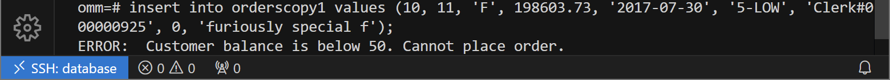

<div class="cover" style="page-break-after:always;font-family:方正公文仿宋;width:100%;height:100%;border:none;margin: 0 auto;text-align:center;">
    <div style="width:60%;margin: 0 auto;height:0;padding-bottom:10%;">
        </br>
        
    </div>
    </br></br></br></br></br>
    <div style="width:60%;margin: 0 auto;height:0;padding-bottom:40%;">
        
	</div>
    </br></br></br></br></br></br></br></br>
    <span style="font-family:华文黑体Bold;text-align:center;font-size:20pt;margin: 10pt auto;line-height:30pt;">数据库实验报告</span>
</br>
 		<span style="font-family:华文黑体Bold;text-align:center;font-size:16pt;margin: 10pt auto;line-height:30pt;">openGauss</span>
    </br>
    </br>
    <table style="border:none;text-align:center;width:72%;font-family:仿宋;font-size:14px; margin: 0 auto;">
    <tbody style="font-family:方正公文仿宋;font-size:12pt;">
    	<tr style="font-weight:normal;"> 
    		<td style="width:20%;text-align:right;">上课时间</td>
    		<td style="width:2%">：</td> 
    		<td style="width:40%;font-weight:normal;border-bottom: 1px solid;text-align:center;font-family:华文仿宋"> 周五3~5节</td>     </tr>
    	<tr style="font-weight:normal;"> 
    		<td style="width:20%;text-align:right;">授课教师</td>
    		<td style="width:2%">：</td> 
    		<td style="width:40%;font-weight:normal;border-bottom: 1px solid;text-align:center;font-family:华文仿宋">梁美玉</td>     </tr>
    	<tr style="font-weight:normal;"> 
    		<td style="width:20%;text-align:right;">姓　　名</td>
    		<td style="width:2%">：</td> 
    		<td style="width:40%;font-weight:normal;border-bottom: 1px solid;text-align:center;font-family:华文仿宋"> 臧泽元   蔡景旭   庄卜荣</td>     </tr>
    	<tr style="font-weight:normal;"> 
    		<td style="width:20%;text-align:right;">学　　号</td>
    		<td style="width:2%">：</td> 
    		<td style="width:40%;font-weight:normal;border-bottom: 1px solid;text-align:center;font-family:华文仿宋"> 2022210085 2022210053 2022210324</td>     </tr>
    	<tr style="font-weight:normal;"> 
    		<td style="width:20%;text-align:right;">班　　级</td>
    		<td style="width:%">：</td> 
    		<td style="width:40%;font-weight:normal;border-bottom: 1px solid;text-align:center;font-family:华文仿宋"> 2022217804 2022217803 2022217801</td>     </tr>
    	<tr style="font-weight:normal;"> 
    		<td style="width:20%;text-align:right;">日　　期</td>
    		<td style="width:2%">：</td> 
    		<td style="width:40%;font-weight:normal;border-bottom: 1px solid;text-align:center;font-family:华文仿宋">2024.11.30</td>     </tr>
    </tbody>              
    </table>
</div>


> 成员分工：
>
> - 臧泽元：环境搭建、任务1、任务4
> - 蔡景旭：任务3
> - 庄卜荣：任务2

## 0 环境搭建

实验 1-3 所用数据库部署于本地 docker 容器中，基于 [enmotech/enmotech-docker-opengauss: Ennotech openGauss Docker Image](https://github.com/enmotech/enmotech-docker-opengauss) 中给出的 openGauss 1.1.0 x86 镜像进行配置，容器内系统为 CentOS 7.6。拉取镜像创建容器的指令如下：

```shell
$ docker run --name opengauss --privileged=true -d -e GS_PASSWORD=Enmo@123 enmotech/opengauss:1.1.0
```

后续进入容器（`docker exec`）时，将容器的 22 端口映射到主机的 22222 端口以便 ssh 远程连接。

## 1 数据库建表及数据导入

### 1.1 创建关系表

#### 1.1.1 订单表 `ORDERS`

终端显示：

```shell
omm=# CREATE TABLE ORDERS ( O_ORDERKEY    INTEGER NOT NULL,
omm(# O_CUSTKEY    INTEGER NOT NULL,
omm(# O_ORDERSTATUS    CHAR(1) NOT NULL,
omm(# O_TOTALPRICE    DECIMAL(15,2) NOT NULL,
omm(# O_ORDERDATE    DATE NOT NULL,
omm(# O_ORDERPRIORITY    CHAR(15) NOT NULL,
omm(# O_CLERK    CHAR(15) NOT NULL,
omm(# O_SHIPPRIORITY    INTEGER NOT NULL,
omm(# O_COMMENT    VARCHAR(79) NOT NULL);
CREATE TABLE
```

末尾显示 `CREATE TABLE` 表示建表成功。

#### 1.1.2 区域表 `REGION`

```shell
omm=# CREATE TABLE REGION ( R_REGIONKEY    INTEGER NOT NULL,
omm(# R_NAME    CHAR(25) NOT NULL,
omm(# R_COMMENT    VARCHAR(152));
CREATE TABLE
```

#### 1.1.3 国家表 `NATION`

```shell
omm=# CREATE TABLE NATION ( N_NATIONKEY    INTEGER NOT NULL,
omm(# N_NAME    CHAR(25) NOT NULL,
omm(# N_REGIONKEY    INTEGER NOT NULL,
omm(# N_COMMENT    VARCHAR(152));
CREATE TABLE
```

#### 1.1.4 供应商表 `SUPPLIER`

```shell
omm=# CREATE TABLE SUPPLIER ( S_SUPPKEY    INTEGER NOT NULL,
omm(# S_NAME    CHAR(25) NOT NULL,
omm(# S_ADDRESS    VARCHAR(40) NOT NULL,
omm(# S_NATIONKEY    INTEGER NOT NULL,
omm(# S_PHONE    CHAR(15) NOT NULL,
omm(# S_ACCTBAL    DECIMAL(15,2) NOT NULL,
omm(# S_COMMENT    VARCHAR(101) NOT NULL);
CREATE TABLE
```

#### 1.1.5 零部件表 `PART`

```shell
omm=# CREATE TABLE PART ( P_PARTKEY    INTEGER NOT NULL,
omm(# P_NAME    VARCHAR(55) NOT NULL,
omm(# P_MFGR    CHAR(25) NOT NULL,
omm(# P_BRAND    CHAR(10) NOT NULL,
omm(# P_TYPE    VARCHAR(25) NOT NULL,
omm(# P_SIZE    INTEGER NOT NULL,
omm(# P_CONTAINER    CHAR(10) NOT NULL,
omm(# P_RETAILPRICE    DECIMAL(15,2) NOT NULL,
omm(# P_COMMENT    VARCHAR(23) NOT NULL);
CREATE TABLE
```

#### 1.3.6 零部件供应表 `PARTSUPP`

```shell
omm=# CREATE TABLE PARTSUPP ( PS_PARTKEY    INTEGER NOT NULL,
omm(# PS_SUPPKEY    INTEGER NOT NULL,
omm(# PS_AVAILQTY    INTEGER NOT NULL,
omm(# PS_SUPPLYCOST    DECIMAL(15,2) NOT NULL,
omm(# PS_COMMENT    VARCHAR(199) NOT NULL);
CREATE TABLE
```

#### 1.3.7 客户表 `CUSTOMER`

```shell
omm=# CREATE TABLE CUSTOMER ( C_CUSTKEY    INTEGER NOT NULL,
omm(# C_NAME    VARCHAR(25) NOT NULL,
omm(# C_ADDRESS    VARCHAR(40) NOT NULL,
omm(# C_NATIONKEY    INTEGER NOT NULL,
omm(# C_PHONE    CHAR(15) NOT NULL,
omm(# C_ACCTBAL    DECIMAL(15,2) NOT NULL,
omm(# C_MKTSEGMENT    CHAR(10) NOT NULL,
omm(# C_COMMENT    VARCHAR(117) NOT NULL);
CREATE TABLE
```

#### 1.3.8 订单明细表 `LINEITEM`

```shell
omm=# CREATE TABLE LINEITEM ( L_ORDERKEY    INTEGER NOT NULL,
omm(# L_PARTKEY    INTEGER NOT NULL,
omm(# L_SUPPKEY    INTEGER NOT NULL,
omm(# L_LINENUMBER    INTEGER NOT NULL,
omm(# L_QUANTITY    DECIMAL(15,2) NOT NULL,
omm(# L_EXTENDEDPRICE    DECIMAL(15,2) NOT NULL,
omm(# L_DISCOUNT    DECIMAL(15,2) NOT NULL,
omm(# L_TAX    DECIMAL(15,2) NOT NULL,
omm(# L_RETURNFLAG    CHAR(1) NOT NULL,
omm(# L_LINESTATUS    CHAR(1) NOT NULL,
omm(# L_SHIPDATE    DATE NOT NULL,
omm(# L_COMMITDATE    DATE NOT NULL,
omm(# L_RECEIPTDATE    DATE NOT NULL,
omm(# L_SHIPINSTRUCT    CHAR(25) NOT NULL,
omm(# L_SHIPMODE    CHAR(10) NOT NULL,
omm(# L_COMMENT    VARCHAR(44) NOT NULL);
CREATE TABLE
```

通过 `\d+` 命令可看到创建完的 8 个表：


### 1.2 数据导入

#### 1.2.1 上传文件

将 tpc-h 的 txt 格式数据文件用 SCP 上传到 openGauss 所在的容器上，首先在容器 `omm` 用户下创建目录 `tpc-h/data` 并授予全部权限：

```shell
[omm@cfde74516988 ~]$ pwd   
/home/omm
[omm@cfde74516988 ~]$ mkdir tpc-h   
[omm@cfde74516988 ~]$ cd tpc-h
[omm@cfde74516988 tpc-h]$ mkdir data
```

```shell
[root@cfde74516988 ~]# cd /home/omm
[root@cfde74516988 omm]# chmod 777 tpc-h
[root@cfde74516988 omm]# cd tpc-h
[root@cfde74516988 tpc-h]# chmod 777 data
```

然后退出 omm 用户回到 root，将 txt 格式的数据文件移到该文件夹里（第一次远程连接需要设置密钥）：


最后授予文件全部权限：

```shell
[root@cfde74516988 ~]# cd /home/omm/tpc-h/data
[root@cfde74516988 data]# chmod 777 *
[root@cfde74516988 data]# ls -l
total 208992
-rwxrwxrwx 1 root root   4835158 Nov 25 10:19 customer.txt
-rwxrwxrwx 1 root root 155651209 Nov 25 10:19 lineitem.txt
-rwxrwxrwx 1 root root      2356 Nov 25 10:19 nation.txt
-rwxrwxrwx 1 root root  25118002 Nov 25 10:19 orders.txt
-rwxrwxrwx 1 root root  23143960 Nov 25 10:19 partsupp.txt
-rwxrwxrwx 1 root root   4982186 Nov 25 10:19 part.txt
-rwxrwxrwx 1 root root       199 Nov 25 10:19 region.txt
-rwxrwxrwx 1 root root    250820 Nov 25 10:19 supplier.txt
```

#### 1.2.2 导入数据

以 omm 用户登录数据库主节点，并连接数据库，然后使用 `\copy` 命令导入数据：

```shell
omm=# copy region FROM '/home/omm/tpc-h/data/region.txt' with delimiter as '|';
COPY 5
omm=# copy nation FROM 'home/omm/tpc-h/data/nation.txt' with delimiter as '|';
ERROR:  could not open file "home/omm/tpc-h/data/nation.txt" for reading: No such file or directory
omm=# copy nation FROM '/home/omm/tpc-h/data/nation.txt' with delimiter as '|';
COPY 25
omm=# copy part FROM '/home/omm/tpc-h/data/part.txt' with delimiter as '|';
COPY 40000
omm=# copy supplier FROM '/home/omm/tpc-h/data/supplier.txt' with delimiter as '|';
COPY 2000
omm=# copy customer FROM '/home/omm/tpc-h/data/customer.txt' with delimiter as '|';
COPY 30000
omm=# copy lineitem FROM '/home/omm/tpc-h/data/lineitem.txt' with delimiter as '|'; 
COPY 1199969
omm=# copy partsupp FROM '/home/omm/tpc-h/data/partsupp.txt' with delimiter as '|';
COPY 160000
omm=# copy orders FROM '/home/omm/tpc-h/data/orders.txt' with delimiter as '|';
COPY 300000
```

通过 `\d+` 命令可看到表的大小有更新：


导入后为关系表添加约束：

```shell
omm=# ALTER TABLE REGION
omm-# ADD PRIMARY KEY (R_REGIONKEY);
NOTICE:  ALTER TABLE / ADD PRIMARY KEY will create implicit index "region_pkey" for table "region"
ALTER TABLE

omm=# ALTER TABLE NATION
omm-# ADD PRIMARY KEY (N_NATIONKEY);
NOTICE:  ALTER TABLE / ADD PRIMARY KEY will create implicit index "nation_pkey" for table "nation"
ALTER TABLE

omm=# ALTER TABLE NATION 
omm-# ADD FOREIGN KEY (N_REGIONKEY) references REGION;
ALTER TABLE

omm=# ALTER TABLE PART
omm-# ADD PRIMARY KEY (P_PARTKEY);
NOTICE:  ALTER TABLE / ADD PRIMARY KEY will create implicit index "part_pkey" for table "part"
ALTER TABLE

omm=# ALTER TABLE SUPPLIER
omm-# ADD PRIMARY KEY (S_SUPPKEY);
NOTICE:  ALTER TABLE / ADD PRIMARY KEY will create implicit index "supplier_pkey" for table "supplier"
ALTER TABLE

omm=# ALTER TABLE SUPPLIER
omm-# ADD FOREIGN KEY (S_NATIONKEY) references NATION;
ALTER TABLE

omm=# ALTER TABLE PARTSUPP
omm-# ADD PRIMARY KEY (PS_PARTKEY,PS_SUPPKEY);
NOTICE:  ALTER TABLE / ADD PRIMARY KEY will create implicit index "partsupp_pkey" for table "partsupp"
ALTER TABLE

omm=# ALTER TABLE CUSTOMER
omm-# ADD PRIMARY KEY (C_CUSTKEY);
NOTICE:  ALTER TABLE / ADD PRIMARY KEY will create implicit index "customer_pkey" for table "customer"
ALTER TABLE

omm=# ALTER TABLE CUSTOMER
omm-# ADD FOREIGN KEY (C_NATIONKEY) references NATION;
ALTER TABLE

omm=# ALTER TABLE LINEITEM
omm-# ADD PRIMARY KEY (L_ORDERKEY,L_LINENUMBER);
NOTICE:  ALTER TABLE / ADD PRIMARY KEY will create implicit index "lineitem_pkey" for table "lineitem"
ALTER TABLE

omm=# ALTER TABLE ORDERS
omm-# ADD PRIMARY KEY (O_ORDERKEY);
NOTICE:  ALTER TABLE / ADD PRIMARY KEY will create implicit index "orders_pkey" for table "orders"
ALTER TABLE

omm=# ALTER TABLE PARTSUPP
omm-# ADD FOREIGN KEY (PS_SUPPKEY) references SUPPLIER;
ALTER TABLE

omm=# ALTER TABLE PARTSUPP
omm-# ADD FOREIGN KEY (PS_PARTKEY) references PART;
ALTER TABLE

omm=# ALTER TABLE ORDERS
omm-# ADD FOREIGN KEY (O_CUSTKEY) references CUSTOMER;
ALTER TABLE

omm=# ALTER TABLE LINEITEM
omm-# ADD FOREIGN KEY (L_ORDERKEY) references ORDERS;
ALTER TABLE

omm=# ALTER TABLE LINEITEM
omm-# ADD FOREIGN KEY (L_PARTKEY,L_SUPPKEY) references PARTSUPP;
ALTER TABLE
```

用 `select` 语句查看关系表可以显示刚刚导入进来的数据：


## 2 数据查询与修改

### 2.1 单表查询

**查询1**：

从订单表 `ORDERS` 中，找出由收银员 `Clerk#000000951` 处理的满足下列条件的所有订单 `O_ORDERKEY`：

（1）订单总价位于 `[起始价格 5000, 结束价格 100000]`

（2）下单日期在 `开始日期 2019-01-02 00:00:00` 至 `结束日期 2020-08-31 00:00:00` 之间，

（3）订单状态 `O_ORDERSTATUS` 不为空

列出这些订单的订单 `key`（`O_ORDERKEY`）、客户 `key`、订单状态、订单总价、下单日期（重命名为 `O_DATE`）、订单优先级和发货优先级；

要求：对查询结果，按照订单优先级从高到低、发货优先级从高到低排序。

```sql
-- 查询订单信息
SELECT 
    O_ORDERKEY, 
    O_CUSTKEY, 
    O_ORDERSTATUS, 
    O_TOTALPRICE, 
    O_ORDERDATE AS O_DATE, 
    O_ORDERPRIORITY, 
    O_SHIPPRIORITY
FROM 
    ORDERS
WHERE 
    O_CLERK = 'Clerk#000000951'
    AND O_TOTALPRICE BETWEEN 5000 AND 100000
    AND O_ORDERDATE BETWEEN '2019-01-02' AND '2020-08-31'
    AND O_ORDERSTATUS IS NOT NULL
ORDER BY 
    O_ORDERPRIORITY DESC, 
    O_SHIPPRIORITY DESC;
```

```sql
omm=# SELECT O_ORDERKEY, O_CUSTKEY, O_ORDERSTATUS, O_TOTALPRICE, O_ORDERDATE AS O_DATE, O_ORDERPRIORITY, O_SHIPPRIORITY
FROM ORDERS
WHERE O_CLERK = 'Clerk#000000951';omm-# omm-#
 o_orderkey | o_custkey | o_orderstatus | o_totalprice |       o_date        | o_orderpriority | o_shippriority
------------+-----------+---------------+--------------+---------------------+-----------------+----------------
          1 |      7381 | O             |    181585.13 | 2019-01-02 00:00:00 | 5-LOW           |              0
        839 |      5578 | O             |    104005.14 | 2018-08-08 00:00:00 | 1-URGENT        |              0
       2338 |     27874 | O             |     22264.72 | 2020-09-15 00:00:00 | 2-HIGH          |              0
       4579 |     20828 | O             |    147919.32 | 2018-12-01 00:00:00 | 2-HIGH          |              0
       8452 |     27832 | F             |    147102.45 | 2015-07-31 00:00:00 | 4-NOT SPECIFIED |              0
       9185 |      2893 | F             |     92840.21 | 2017-06-16 00:00:00 | 2-HIGH          |              0
      12163 |      1733 | O             |    183726.95 | 2020-07-20 00:00:00 | 5-LOW           |              0
      13508 |     16033 | O             |     42756.76 | 2020-04-17 00:00:00 | 4-NOT SPECIFIED |              0
      14277 |     18920 | O             |    133599.91 | 2021-02-14 00:00:00 | 4-NOT SPECIFIED |              0
      15073 |      1468 | F             |    138584.35 | 2015-01-26 00:00:00 | 3-MEDIUM        |              0
      17636 |     15205 | F             |    137295.03 | 2017-02-05 00:00:00 | 5-LOW           |              0
      19200 |       854 | O             |    144151.90 | 2020-07-27 00:00:00 | 4-NOT SPECIFIED |              0
      19205 |     11662 | F             |    327627.84 | 2016-07-27 00:00:00 | 3-MEDIUM        |              0
      20547 |     16147 | F             |     38376.91 | 2016-08-27 00:00:00 | 2-HIGH          |              0
      21312 |      5638 | O             |     55741.75 | 2019-02-01 00:00:00 | 1-URGENT        |              0
      25639 |     25135 | F             |     46746.31 | 2017-10-12 00:00:00 | 3-MEDIUM        |              0
      26885 |     25732 | O             |    226010.66 | 2020-05-11 00:00:00 | 3-MEDIUM        |              0
      27364 |      4489 | O             |    201233.85 | 2018-05-21 00:00:00 | 3-MEDIUM        |              0
      40932 |     23078 | O             |    176808.89 | 2021-05-12 00:00:00 | 3-MEDIUM        |              0
      42817 |     21661 | O             |     44438.99 | 2020-08-31 00:00:00 | 5-LOW           |              0
      47142 |     19433 | O             |     73866.30 | 2019-03-24 00:00:00 | 1-URGENT        |              0
      60419 |     21305 | F             |    114536.40 | 2015-06-20 00:00:00 | 4-NOT SPECIFIED |              0
      60867 |     22738 | O             |     92114.35 | 2020-07-27 00:00:00 | 3-MEDIUM        |              0
      64612 |     20027 | F             |    307272.91 | 2016-12-26 00:00:00 | 4-NOT SPECIFIED |              0
      66470 |      1373 | F             |     68381.45 | 2016-05-10 00:00:00 | 3-MEDIUM        |              0
      66531 |     23941 | F             |    101155.27 | 2015-10-20 00:00:00 | 3-MEDIUM        |              0
      84197 |     28901 | O             |     79241.84 | 2019-05-22 00:00:00 | 5-LOW           |              0
      95623 |     20209 | O             |     99889.91 | 2020-12-10 00:00:00 | 2-HIGH          |              0
      96870 |     13928 | F             |    117595.25 | 2015-01-07 00:00:00 | 1-URGENT        |              0
     100611 |      6268 | O             |    119354.28 | 2019-02-14 00:00:00 | 5-LOW           |              0
     105920 |      4939 | F             |    113306.11 | 2016-06-20 00:00:00 | 2-HIGH          |              0
     112965 |       472 | F             |     15036.22 | 2016-08-11 00:00:00 | 3-MEDIUM        |              0
     114599 |     28057 | F             |     61960.06 | 2015-04-24 00:00:00 | 4-NOT SPECIFIED |              0
```

**查询2**：

从订单明细表 `LINEITEM` 中，找出满足下列条件的所有订单 `L_ORDERKEY`：

（1）数量位于 `[起始数量 30, 结束数量 50]`，

（2）退货标志为 `'N'` 的订单中，价格不小于 `最低价格 20000`

列出这些订单的 `L_ORDERKEY`、`L_SUPPKEY`、`L_EXTENDEDPRICE`；要求：对查询结果，按照价格从高到低排序，并且对查询结果使用 `DISTINCT` 去重。

比较对查询结果去重和不去重，在查询时间和查询结果上的差异。

```sql
-- 去重查询
EXPLAIN ANALYZE
SELECT DISTINCT L_ORDERKEY, L_SUPPKEY, L_EXTENDEDPRICE
FROM LINEITEM
WHERE L_QUANTITY BETWEEN 30 AND 50
  AND L_RETURNFLAG = 'N'
  AND L_EXTENDEDPRICE >= 96000
ORDER BY L_EXTENDEDPRICE DESC;

-- 不去重查询
EXPLAIN ANALYZE
SELECT L_ORDERKEY, L_SUPPKEY, L_EXTENDEDPRICE
FROM LINEITEM
WHERE L_QUANTITY BETWEEN 30 AND 50
  AND L_RETURNFLAG = 'N'
  AND L_EXTENDEDPRICE >= 96000
ORDER BY L_EXTENDEDPRICE DESC;
```

**去重**

**查询结果**

```sql
omm=# SELECT DISTINCT L_ORDERKEY, L_SUPPKEY, L_EXTENDEDPRICE
FROM LINEITEM
WHERE L_QUANTITY BETWEEN 30 AND 50
  AND L_RETURNFLAG = 'N'
  AND L_EXTENDEDPRICE >= 96000
ORDER BY L_EXTENDEDPRICE DESC;omm-# omm-# omm-# omm-# omm-#
 l_orderkey | l_suppkey | l_extendedprice
------------+-----------+-----------------
     549057 |      2000 |        96949.50
     272229 |       557 |        96899.50
     705441 |      1999 |        96899.50
     719041 |      1519 |        96899.50
    1028352 |      1036 |        96849.50
     814209 |      1999 |        96799.50
    1114084 |       517 |        96799.50
     111329 |      1553 |        96749.50
     456194 |        35 |        96749.50
     747776 |      1552 |        96749.50
     163712 |       516 |        96699.50
     323143 |      1516 |        96699.50
      10308 |       999 |        96649.50
     330503 |      1032 |        96649.50
     916000 |      1998 |        96649.50
     ........
          244676 |       506 |        96149.00
     428514 |      1984 |        96149.00
     868550 |      1538 |        96149.00
    1101380 |        23 |        96149.00
     293607 |       537 |        96099.50
     400421 |      1509 |        96099.50
     787011 |       537 |        96099.50
    1096550 |       533 |        96099.50
     265669 |      1538 |        96099.00
     368230 |       540 |        96099.00
     787937 |       505 |        96099.00
     892805 |       984 |        96099.00
     933921 |      1021 |        96099.00
     603969 |       991 |        96049.50
     177411 |       505 |        96049.00
     334182 |      1535 |        96049.00
     591331 |      1020 |        96049.00
     591716 |      1537 |        96049.00
     610368 |       502 |        96049.00
(70 rows)
     
```

**查询时间：223.757 ms**

```sql
omm=# EXPLAIN ANALYZE
SELECT DISTINCT L_ORDERKEY, L_SUPPKEY, L_EXTENDEDPRICE
FROM LINEITEM
WHERE L_QUANTITY BETWEEN 30 AND 50
  AND L_RETURNFLAG = 'N'
  AND L_EXTENDEDPRICE >= 96000
ORDER BY L_EXTENDEDPRICE DESC;omm-# omm-# omm-# omm-# omm-# omm-#
                                                                          QUERY PLAN
--------------------------------------------------------------------------------------------------------------------------------------------------------------
 Unique  (cost=48915.99..48916.25 rows=26 width=16) (actual time=223.653..223.662 rows=70 loops=1)
   ->  Sort  (cost=48915.99..48916.06 rows=26 width=16) (actual time=223.652..223.655 rows=70 loops=1)
         Sort Key: l_extendedprice DESC, l_orderkey, l_suppkey
         Sort Method: quicksort  Memory: 29kB
         ->  Seq Scan on lineitem  (cost=0.00..48915.38 rows=26 width=16) (actual time=5.454..223.591 rows=70 loops=1)
               Filter: ((l_quantity >= 30::numeric) AND (l_quantity <= 50::numeric) AND (l_extendedprice >= 96000::numeric) AND (l_returnflag = 'N'::bpchar))
               Rows Removed by Filter: 1199899
 Total runtime: 223.757 ms
```

**不去重**

**查询结果**

```sql
omm=# SELECT L_ORDERKEY, L_SUPPKEY, L_EXTENDEDPRICE
FROM LINEITEM
WHERE L_QUANTITY BETWEEN 30 AND 50
  AND L_RETURNFLAG = 'N'
  AND L_EXTENDEDPRICE >= 96000
ORDER BY L_EXTENDEDPRICE DESC;omm-# omm-# omm-# omm-# omm-#
 l_orderkey | l_suppkey | l_extendedprice
------------+-----------+-----------------
     549057 |      2000 |        96949.50
     272229 |       557 |        96899.50
     719041 |      1519 |        96899.50
     705441 |      1999 |        96899.50
    1028352 |      1036 |        96849.50
     814209 |      1999 |        96799.50
    1114084 |       517 |        96799.50
     456194 |        35 |        96749.50
     747776 |      1552 |        96749.50
     111329 |      1553 |        96749.50
     323143 |      1516 |        96699.50
  ........
       578660 |      1509 |        96199.50
       8134 |       988 |        96199.00
     809378 |      1022 |        96149.50
     965285 |      1535 |        96149.50
    1075681 |      1510 |        96149.50
    1101380 |        23 |        96149.00
     868550 |      1538 |        96149.00
     244676 |       506 |        96149.00
     428514 |      1984 |        96149.00
     400421 |      1509 |        96099.50
     787011 |       537 |        96099.50
     293607 |       537 |        96099.50
    1096550 |       533 |        96099.50
     933921 |      1021 |        96099.00
     892805 |       984 |        96099.00
     787937 |       505 |        96099.00
     265669 |      1538 |        96099.00
     368230 |       540 |        96099.00
     603969 |       991 |        96049.50
     610368 |       502 |        96049.00
     591716 |      1537 |        96049.00
     591331 |      1020 |        96049.00
     334182 |      1535 |        96049.00
     177411 |       505 |        96049.00
(70 rows)
```

**查询时间：223.187 ms**

```sql
omm=# EXPLAIN ANALYZE
SELECT L_ORDERKEY, L_SUPPKEY, L_EXTENDEDPRICE
FROM LINEITEM
WHERE L_QUANTITY BETWEEN 30 AND 50
  AND L_RETURNFLAG = 'N'
  AND L_EXTENDEDPRICE >= 96000
ORDER BY L_EXTENDEDPRICE DESC;omm-# omm-# omm-# omm-# omm-# omm-#
                                                                       QUERY PLAN
--------------------------------------------------------------------------------------------------------------------------------------------------------
 Sort  (cost=48915.99..48916.06 rows=26 width=16) (actual time=223.107..223.110 rows=70 loops=1)
   Sort Key: l_extendedprice DESC
   Sort Method: quicksort  Memory: 29kB
   ->  Seq Scan on lineitem  (cost=0.00..48915.38 rows=26 width=16) (actual time=5.467..223.043 rows=70 loops=1)
         Filter: ((l_quantity >= 30::numeric) AND (l_quantity <= 50::numeric) AND (l_extendedprice >= 96000::numeric) AND (l_returnflag = 'N'::bpchar))
         Rows Removed by Filter: 1199899
 Total runtime: 223.187 ms
(7 rows)
```

### 2.2 字符串操作

**查询3**：

从客户表 `CUSTOMER` 中，找出满足下列条件的客户：

（1）客户电话开头部分包含 `'10'`，或者客户市场领域中包含 `'BUILDING'`，并且

（2）客户电话结尾不为 `'8'`

```sql
SELECT C_CUSTKEY, C_NAME
FROM CUSTOMER
WHERE (C_PHONE LIKE '10%' OR C_MKTSEGMENT LIKE '%BUILDING%')
  AND C_PHONE NOT LIKE '%8';
```

**实验结果**

```sql
 c_custkey |       c_name
-----------+--------------------
         2 | Customer#000000002
         3 | Customer#000000003
         4 | Customer#000000004
         5 | Customer#000000005
         6 | Customer#000000006
         7 | Customer#000000007
         8 | Customer#000000008
         9 | Customer#000000009
        10 | Customer#000000010
.......
      1955 | Customer#000001955
      1956 | Customer#000001956
      1958 | Customer#000001958
      1959 | Customer#000001959
      1960 | Customer#000001960
      1962 | Customer#000001962
      1963 | Customer#000001963
      1964 | Customer#000001964
      1965 | Customer#000001965
      1966 | Customer#000001966
      1967 | Customer#000001967
.......
```

**查询4**：

从客户表 `CUSTOMER` 中，找出满足下列条件的客户姓名：

（1）客户 `key` 由 2 个字符组成

（2）客户地址至少包括 18 个字符，即地址字符串的长度不小于 18。

```sql
SELECT C_NAME
FROM CUSTOMER
WHERE C_CUSTKEY::TEXT LIKE '__'  -- 假设C_CUSTKEY为整数，需要转换为文本比较
  AND LENGTH(C_ADDRESS) >= 18;
```

**实验结果**

```sql
       c_name
--------------------
 Customer#000000010
 Customer#000000012
 Customer#000000013
 Customer#000000014
 Customer#000000015
 Customer#000000017
 Customer#000000018
 Customer#000000019
 Customer#000000020
 Customer#000000022
 Customer#000000023
 Customer#000000024
 .......
 Customer#000000084
 Customer#000000085
 Customer#000000087
 Customer#000000088
 Customer#000000089
 Customer#000000091
 Customer#000000092
 Customer#000000093
 Customer#000000094
 Customer#000000095
 Customer#000000096
 Customer#000000097
 Customer#000000098
 Customer#000000099
(64 rows)
```

### 2.3 集合操作

**查询5**：

使用集合并操作 `UNION`、`UNION ALL`，从订单明细表 `LINEITEM` 查询满足下列条件的订单 `L_ORDERKEY`：

（1）订单发货日期早于 `'2016-01-01'`，或者

（2）订单数量大于 `100`

对比 `UNION ALL`、`UNION` 操作在查询结果、执行时间上的差异。

```sql
-- 使用 UNION ALL
EXPLAIN ANALYZE
SELECT L_ORDERKEY
FROM LINEITEM
WHERE L_SHIPDATE < '2016-01-01'::DATE

UNION ALL

SELECT L_ORDERKEY
FROM LINEITEM
WHERE L_QUANTITY > 100;

-- 使用 UNION
EXPLAIN ANALYZE
SELECT L_ORDERKEY
FROM LINEITEM
WHERE L_SHIPDATE < '2016-01-01'::DATE

UNION

SELECT L_ORDERKEY
FROM LINEITEM
WHERE L_QUANTITY > 100;
```

**使用 UNION ALL**

**实验结果**

```sql
 l_orderkey
------------
          6
         37
         37
         37
        128
        129
        129
...........
       1504
       1504
       1505
       1505
       1506
       1506
       1506
       1506
       1506
       1537
       1537
...........
       5218
       5220
       5254
       5254
       5254
       5254
       5254
       5254
...........
```

**执行时间: 365.901 ms**

```sql
                                                          QUERY PLAN
------------------------------------------------------------------------------------------------------------------------------
 Result  (cost=0.00..81345.32 rows=151409 width=4) (actual time=0.057..361.636 rows=151587 loops=1)
   ->  Append  (cost=0.00..81345.32 rows=151409 width=4) (actual time=0.056..352.949 rows=151587 loops=1)
         ->  Seq Scan on lineitem  (cost=0.00..39915.61 rows=151408 width=4) (actual time=0.055..167.003 rows=151587 loops=1)
               Filter: (l_shipdate < '2016-01-01 00:00:00'::timestamp(0) without time zone)
               Rows Removed by Filter: 1048382
         ->  Seq Scan on lineitem  (cost=0.00..39915.61 rows=1 width=4) (actual time=178.241..178.241 rows=0 loops=1)
               Filter: (l_quantity > 100::numeric)
               Rows Removed by Filter: 1199969
 Total runtime: 365.901 ms
(9 rows)
```

**使用 UNION**

**实验结果**

```sql
 l_orderkey
------------
     865029
     370596
     310753
     363111
    1096454
     728802
...........
     834023
     733601
     344993
     970624
     104033
     738276
     821126
    1147808
     551749
    1083878
     361732
...........
```

**执行时间: 364.971 ms**

```sql
omm=# EXPLAIN ANALYZE
SELECT L_ORDERKEY
FROM LINEITEM
WHERE L_SHIPDATE < '2016-01-01'::DATE

UNION

SELECT L_ORDERKEY
FROM LINEITEM
WHERE L_QUANTITY > 100;omm-# omm-# omm-# omm-# omm-# omm-# omm-# omm-# omm-#
                                                          QUERY PLAN
------------------------------------------------------------------------------------------------------------------------------
 HashAggregate  (cost=81723.84..83237.93 rows=151409 width=4) (actual time=359.014..363.225 rows=41621 loops=1)
   Group By Key: public.lineitem.l_orderkey
   ->  Append  (cost=0.00..81345.32 rows=151409 width=4) (actual time=0.069..337.867 rows=151587 loops=1)
         ->  Seq Scan on lineitem  (cost=0.00..39915.61 rows=151408 width=4) (actual time=0.066..155.120 rows=151587 loops=1)
               Filter: (l_shipdate < '2016-01-01 00:00:00'::timestamp(0) without time zone)
               Rows Removed by Filter: 1048382
         ->  Seq Scan on lineitem  (cost=0.00..39915.61 rows=1 width=4) (actual time=174.747..174.747 rows=0 loops=1)
               Filter: (l_quantity > 100::numeric)
               Rows Removed by Filter: 1199969
 Total runtime: 364.971 ms
(10 rows)
```

**查询6**：

结合教材 3.4.1 节元组变量样例，使用集合操作 `EXCEPT`、`EXCEPT ALL`，从供应商表 `SUPPLIER` 中，查询账户余额最大的供应商。

对比使用 `EXCEPT`、`EXCEPT ALL`、聚集函数 `MAX`，完成此查询在执行时间、查询结果上的异同。

```sql
-- 更新统计信息
ANALYZE supplier;

-- 使用 EXCEPT
EXPLAIN ANALYZE
SELECT s_suppkey, s_name
FROM supplier
EXCEPT
(
    SELECT t1.s_suppkey, t1.s_name
    FROM supplier t1
    JOIN supplier t2 ON t1.s_acctbal < t2.s_acctbal
);

-- 使用 EXCEPT ALL
EXPLAIN ANALYZE
SELECT s_suppkey, s_name
FROM supplier
EXCEPT ALL
(
    SELECT t1.s_suppkey, t1.s_name
    FROM supplier t1
    JOIN supplier t2 ON t1.s_acctbal < t2.s_acctbal
);

-- 使用 MAX 聚集函数
EXPLAIN ANALYZE
SELECT s_suppkey, s_name
FROM supplier
WHERE s_acctbal = (
    SELECT MAX(s_acctbal)
    FROM supplier
);
```

**使用 EXCEPT**

**实验结果**

```sql
 s_suppkey |          s_name
-----------+---------------------------
       892 | Supplier#000000892
(1 row)
```

**执行时间: 1001.204 ms**

```sql
                                                                QUERY PLAN
------------------------------------------------------------------------------------------------------------------------------------------
 HashSetOp Except  (cost=0.00..80220.99 rows=2000 width=30) (actual time=1001.026..1001.039 rows=1 loops=1)
   ->  Append  (cost=0.00..73544.33 rows=1335333 width=30) (actual time=0.018..788.066 rows=2000997 loops=1)
         ->  Subquery Scan on "*SELECT* 1"  (cost=0.00..82.00 rows=2000 width=30) (actual time=0.017..1.341 rows=2000 loops=1)
               ->  Seq Scan on supplier  (cost=0.00..62.00 rows=2000 width=30) (actual time=0.014..0.802 rows=2000 loops=1)
         ->  Subquery Scan on "*SELECT* 2"  (cost=0.00..73462.33 rows=1333333 width=30) (actual time=0.034..700.892 rows=1998997 loops=1)
               ->  Nested Loop  (cost=0.00..60129.00 rows=1333333 width=30) (actual time=0.033..586.081 rows=1998997 loops=1)
                     Join Filter: (t1.s_acctbal < t2.s_acctbal)
                     Rows Removed by Join Filter: 2001003
                     ->  Seq Scan on supplier t1  (cost=0.00..62.00 rows=2000 width=36) (actual time=0.004..0.151 rows=2000 loops=1)
                     ->  Materialize  (cost=0.00..72.00 rows=2000 width=6) (actual time=0.065..111.885 rows=4000000 loops=2000)
                           ->  Seq Scan on supplier t2  (cost=0.00..62.00 rows=2000 width=6) (actual time=0.004..0.636 rows=2000 loops=1)
 Total runtime: 1001.204 ms
(12 rows)
```

**使用 EXCEPT ALL**

**实验结果**

```sql
 s_suppkey |          s_name
-----------+---------------------------
       892 | Supplier#000000892
(1 row)
```

**执行时间: 995.772 ms**

```sql
                                                                QUERY PLAN
------------------------------------------------------------------------------------------------------------------------------------------
 HashSetOp Except All  (cost=0.00..80220.99 rows=2000 width=30) (actual time=995.580..995.594 rows=1 loops=1)
   ->  Append  (cost=0.00..73544.33 rows=1335333 width=30) (actual time=0.020..783.643 rows=2000997 loops=1)
         ->  Subquery Scan on "*SELECT* 1"  (cost=0.00..82.00 rows=2000 width=30) (actual time=0.020..1.236 rows=2000 loops=1)
               ->  Seq Scan on supplier  (cost=0.00..62.00 rows=2000 width=30) (actual time=0.017..0.711 rows=2000 loops=1)
         ->  Subquery Scan on "*SELECT* 2"  (cost=0.00..73462.33 rows=1333333 width=30) (actual time=0.032..697.765 rows=1998997 loops=1)
               ->  Nested Loop  (cost=0.00..60129.00 rows=1333333 width=30) (actual time=0.032..583.712 rows=1998997 loops=1)
                     Join Filter: (t1.s_acctbal < t2.s_acctbal)
                     Rows Removed by Join Filter: 2001003
                     ->  Seq Scan on supplier t1  (cost=0.00..62.00 rows=2000 width=36) (actual time=0.004..0.189 rows=2000 loops=1)
                     ->  Materialize  (cost=0.00..72.00 rows=2000 width=6) (actual time=0.061..110.777 rows=4000000 loops=2000)
                           ->  Seq Scan on supplier t2  (cost=0.00..62.00 rows=2000 width=6) (actual time=0.004..0.594 rows=2000 loops=1)
 Total runtime: 995.772 ms
(12 rows)
```

**使用 MAX 聚集函数**

**实验结果**

```sql
 s_suppkey |          s_name
-----------+---------------------------
       892 | Supplier#000000892
(1 row)
```

**执行时间: 2.550 ms**

```sql
                                                      QUERY PLAN
-----------------------------------------------------------------------------------------------------------------------
 Seq Scan on supplier  (cost=67.01..134.01 rows=1 width=30) (actual time=1.894..2.413 rows=1 loops=1)
   Filter: (s_acctbal = $0)
   Rows Removed by Filter: 1999
   InitPlan 1 (returns $0)
     ->  Aggregate  (cost=67.00..67.01 rows=1 width=38) (actual time=1.416..1.416 rows=1 loops=1)
           ->  Seq Scan on supplier  (cost=0.00..62.00 rows=2000 width=6) (actual time=0.005..0.556 rows=2000 loops=1)
 Total runtime: 2.550 ms
(7 rows)
```

### 2.4 多表查询

**查询7**：

选取两张数据量比较小的表 `T1` 和 `T2`（如 `REGION`、`NATION`、`SUPPLIER`），执行如下无连接条件的笛卡尔积操作，观察数据库系统的反应和查询结果：****

```sql
SELECT *
FROM REGION, NATION;
```

**实验结果**

```sql
r_regionkey |          r_name           |          r_comment           | n_nationkey |          n_name           | n_regionkey |                                                     n_comment
-------------+---------------------------+------------------------------+-------------+---------------------------+-------------+--------------------------------------------------------------------------------------------------------------------
           0 | AFRICA                    | furiously special foxes hagg |           0 | ALGERIA                   |           0 | posits use carefully pending accounts. special deposits haggle. ironic, silent accounts are furio
           1 | AMERICA                   | furiously special foxes hagg |           0 | ALGERIA                   |           0 | posits use carefully pending accounts. special deposits haggle. ironic, silent accounts are furio
           2 | ASIA                      | furiously special foxes hagg |           0 | ALGERIA                   |           0 | posits use carefully pending accounts. special deposits haggle. ironic, silent accounts are furio
           3 | EUROPE                    | furiously special foxes hagg |           0 | ALGERIA                   |           0 | posits use carefully pending accounts. special deposits haggle. ironic, silent accounts are furio
           4 | MIDDLE EAST               | furiously special foxes hagg |           0 | ALGERIA                   |           0 | posits use carefully pending accounts. special deposits haggle. ironic, silent accounts are furio
           0 | AFRICA                    | furiously special foxes hagg |           1 | ARGENTINA                 |           1 | ly bold instructions haggle quickly across the blithely close dep
           1 | AMERICA                   | furiously special foxes hagg |           1 | ARGENTINA                 |           1 | ly bold instructions haggle quickly across the blithely close dep
           2 | ASIA                      | furiously special foxes hagg |           1 | ARGENTINA                 |           1 | ly bold instructions haggle quickly across the blithely close dep
           3 | EUROPE                    | furiously special foxes hagg |           1 | ARGENTINA                 |           1 | ly bold instructions haggle quickly across the blithely close dep
           4 | MIDDLE EAST               | furiously special foxes hagg |           1 | ARGENTINA                 |           1 | ly bold instructions haggle quickly across the blithely close dep
           ........
           3 | EUROPE                    | furiously special foxes hagg |          10 | IRAN                      |           4 | equests. packages are ironic, regular theodolites. carefully regular ideas sleep slyly final, ex
           4 | MIDDLE EAST               | furiously special foxes hagg |          10 | IRAN                      |           4 | equests. packages are ironic, regular theodolites. carefully regular ideas sleep slyly final, ex
           0 | AFRICA                    | furiously special foxes hagg |          11 | IRAQ                      |           4 | cording to the quickly regular platelets. carefully ironic pinto beans against the slyly unusual theodolites d
           1 | AMERICA                   | furiously special foxes hagg |          11 | IRAQ                      |           4 | cording to the quickly regular platelets. carefully ironic pinto beans against the slyly unusual theodolites d
           2 | ASIA                      | furiously special foxes hagg |          11 | IRAQ                      |           4 | cording to the quickly regular platelets. carefully ironic pinto beans against the slyly unusual theodolites d
           3 | EUROPE                    | furiously special foxes hagg |          11 | IRAQ                      |           4 | cording to the quickly regular platelets. carefully ironic pinto beans against the slyly unusual theodolites d
           ........
(125 row)
```

**查询8**：

使用多表连接操作，从订单表 `ORDERS`、供应商表 `SUPPLIER`、订单明细表 `LINEITEM` 中，查询实际到达日期小于预计到达日期的订单，列出这些订单的订单 `key`、订单总价、下单日期以及该供应商的姓名、地址和手机号。

```sql
SELECT O.O_ORDERKEY, O.O_TOTALPRICE, O.O_ORDERDATE, S.S_NAME, S.S_ADDRESS, S.S_PHONE
FROM ORDERS O
JOIN LINEITEM L ON O.O_ORDERKEY = L.L_ORDERKEY
JOIN SUPPLIER S ON L.L_SUPPKEY = S.S_SUPPKEY
WHERE L.L_RECEIPTDATE < L.L_COMMITDATE;
```

**实验结果**

```sql
 o_orderkey | o_totalprice |     o_orderdate     |          s_name           | s_address  |     s_phone
------------+--------------+---------------------+---------------------------+------------+-----------------
      59108 |    268538.27 | 2018-10-08 00:00:00 | Supplier#000001022        | 0000000000 | 24-859-889-7512
      66787 |    233043.61 | 2015-12-12 00:00:00 | Supplier#000001512        | 0000000000 | 33-670-389-3311
      85475 |    217043.30 | 2017-05-24 00:00:00 | Supplier#000000994        | 0000000000 | 14-183-331-6019
      96772 |    255936.60 | 2017-03-04 00:00:00 | Supplier#000001303        | 0000000000 | 22-688-457-2776
      98022 |    331558.89 | 2017-06-07 00:00:00 | Supplier#000001321        | 0000000000 | 32-708-579-1992
      ...........
(56424 row)
```

**查询9**：

使用多表连接操作，从供应商表 `SUPPLIER`、零部件表 `PART`、零部件供应表 `PARTSUPP` 中，查询供应零件品牌为 `'Brand#13'` 的供应商信息，列出零件供应数量与成本，以及供应商的姓名与手机号。

```sql
SELECT PS.PS_AVAILQTY, PS.PS_SUPPLYCOST, S.S_NAME, S.S_PHONE
FROM PARTSUPP PS
JOIN SUPPLIER S ON PS.PS_SUPPKEY = S.S_SUPPKEY
JOIN PART P ON PS.PS_PARTKEY = P.P_PARTKEY
WHERE P.P_BRAND = 'Brand#13';
```

**实验结果**

```sql
 ps_availqty | ps_supplycost |          s_name           |     s_phone
-------------+---------------+---------------------------+-----------------
           1 |        771.64 | Supplier#000000002        | 15-679-861-2259
           1 |        993.49 | Supplier#000000502        | 14-678-262-5636
           1 |        337.09 | Supplier#000001002        | 32-102-374-6308
           1 |        357.84 | Supplier#000001502        | 12-226-454-8297
           1 |        378.49 | Supplier#000000003        | 11-383-516-1199
           1 |        915.27 | Supplier#000000503        | 30-263-152-1630
           1 |        438.37 | Supplier#000001003        | 20-763-167-9528
           .........
(6424 row)
```

**查询10**：

利用订单明细表 `LINEITEM`，使用元组变量方式，查询所有比流水号为 `'1'`，订单号为 `'1'` 的折扣高的订单 `key` 和流水号，列出这些订单的零件、折扣，结果按照折扣的降序排列。

```sql
SELECT L1.L_ORDERKEY, L1.L_LINENUMBER, L1.L_PARTKEY, L1.L_DISCOUNT
FROM LINEITEM L1
WHERE L1.L_DISCOUNT > (
    SELECT L2.L_DISCOUNT
    FROM LINEITEM L2
    WHERE L2.L_ORDERKEY = '1' AND L2.L_LINENUMBER = '1'
)
ORDER BY L1.L_DISCOUNT DESC;
```

**实验结果**

```sql
l_orderkey | l_linenumber | l_partkey | l_discount
------------+--------------+-----------+------------
     940324 |            1 |     29535 |        .10
    1114981 |            1 |       914 |        .10
     831842 |            3 |     34597 |        .10
     172641 |            3 |      9552 |        .10
     411648 |            2 |      8455 |        .10
     179014 |            4 |     18310 |        .10
     683425 |            7 |     15672 |        .10
    1109477 |            4 |     31501 |        .10
    1109476 |            4 |      1137 |        .10
    .........
(493904 row)
```

### 2.5 聚集函数

**查询11**：

从订单明细表 `LINEITEM`、订单表 `ORDERS`、客户表 `CUSTOMER`、国家表 `NATION`，查询客户来自 `ALGERIA`，下单日期为 `'2015-01-01'` 到 `'2015-02-02'` 的订单下列信息：

（1）满足条件订单的最大数量、最小数量和平均数量。

（2）具有最大数量且满足上述条件的订单，列出该订单的发货日期、下单日期。

```sql
-- (1)
SELECT MAX(L.L_QUANTITY) AS MAX_QTY, MIN(L.L_QUANTITY) AS MIN_QTY, AVG(L.L_QUANTITY) AS AVG_QTY
FROM LINEITEM L
JOIN ORDERS O ON L.L_ORDERKEY = O.O_ORDERKEY
JOIN CUSTOMER C ON O.O_CUSTKEY = C.C_CUSTKEY
JOIN NATION N ON C.C_NATIONKEY = N.N_NATIONKEY
WHERE N.N_NAME = 'ALGERIA'
  AND O.O_ORDERDATE BETWEEN '2015-01-01'::DATE AND '2015-02-02'::DATE;

-- (2)
SELECT L.L_QUANTITY, L.L_SHIPDATE, O.O_ORDERDATE
FROM LINEITEM L
JOIN ORDERS O ON L.L_ORDERKEY = O.O_ORDERKEY
JOIN CUSTOMER C ON O.O_CUSTKEY = C.C_CUSTKEY
JOIN NATION N ON C.C_NATIONKEY = N.N_NATIONKEY
WHERE N.N_NAME = 'ALGERIA'
  AND O.O_ORDERDATE BETWEEN '2015-01-01'::DATE AND '2015-02-02'::DATE
ORDER BY L.L_QUANTITY DESC
LIMIT 1;
```

**实验结果-- (1)**

```sql
 max_qty | min_qty |       avg_qty
---------+---------+---------------------
   50.00 |    1.00 | 25.5653962492437992
(1 row)
```

**实验结果-- (2)**

```sql
 l_quantity |     l_shipdate      |     o_orderdate
------------+---------------------+---------------------
      50.00 | 2015-02-02 00:00:00 | 2015-01-05 00:00:00
(1 row)
```

**查询12**：

根据零部件表 `PART` 和零部件供应表 `PARTSUPP` 及供应商表 `SUPPLIER`，查询有多少零件厂商提供了品牌为 `Brand#13` 的零件，给出这些零件的类型、零售价和供应商数量，并将查询结果按照零售价降序排列。

```sql
SELECT P.P_TYPE, P.P_RETAILPRICE, COUNT(DISTINCT S.S_SUPPKEY) AS SUPPLIER_COUNT
FROM PART P
JOIN PARTSUPP PS ON P.P_PARTKEY = PS.PS_PARTKEY
JOIN SUPPLIER S ON PS.PS_SUPPKEY = S.S_SUPPKEY
WHERE P.P_BRAND = 'Brand#13'
GROUP BY P.P_TYPE, P.P_RETAILPRICE
ORDER BY P.P_RETAILPRICE DESC
```

**实验结果**

```sql
        p_type         | p_retailprice | supplier_count
-----------------------+---------------+----------------
 STANDARD ANODIZED TIN |       1932.99 |              8
 STANDARD ANODIZED TIN |       1930.99 |              4
 STANDARD ANODIZED TIN |       1929.99 |              4
 STANDARD ANODIZED TIN |       1923.99 |              8
 ............
 (1349 row)
```

**查询13**：

从零部件表 `PART` 和零部件供应表 `PARTSUPP` 中，查询所有零件大小在 `[7,14]` 之间的零件的平均零售价，给出零件 `key`，供应成本，平均零售价，结果按照零售价降序排列。

```sql
SELECT P.P_PARTKEY, PS.PS_SUPPLYCOST, AVG(P.P_RETAILPRICE) AS AVG_RETAILPRICE
FROM PART P
JOIN PARTSUPP PS ON P.P_PARTKEY = PS.PS_PARTKEY
WHERE P.P_SIZE BETWEEN 7 AND 14
GROUP BY P.P_PARTKEY, PS.PS_SUPPLYCOST
ORDER BY AVG_RETAILPRICE DESC;
```

**实验结果**

```sql
 p_partkey | ps_supplycost |    avg_retailprice
-----------+---------------+-----------------------
     39998 |        254.68 | 1937.9900000000000000
     39998 |        711.23 | 1937.9900000000000000
     39998 |        755.19 | 1937.9900000000000000
     39998 |        880.04 | 1937.9900000000000000
     35999 |        215.76 | 1934.9900000000000000
     35999 |        154.96 | 1934.9900000000000000
 ............
     22998 |        455.36 | 1920.9900000000000000
     24996 |        698.30 | 1920.9900000000000000
     21999 |         71.50 | 1920.9900000000000000
     22998 |        916.71 | 1920.9900000000000000
     22998 |         11.62 | 1920.9900000000000000
     24996 |        152.65 | 1920.9900000000000000
 ............
(26084 row)
```

### 2.6 嵌套查询

**查询14**：

从订单明细表 `LINEITEM`、订单表 `ORDERS`、客户表 `CUSTOMER` 中，使用 `IN` 运算符，查询明细折扣小于 `0.01` 的订单，列出这些订单的 `key` 和采购订单的客户姓名。

对比使用多表连接、非嵌套的查询在执行时间、查询结果上的异同。

```sql
-- 使用嵌套查询
EXPLAIN ANALYZE
SELECT O.O_ORDERKEY, C.C_NAME
FROM ORDERS O
JOIN CUSTOMER C ON O.O_CUSTKEY = C.C_CUSTKEY
WHERE O.O_ORDERKEY IN (
    SELECT L.L_ORDERKEY
    FROM LINEITEM L
    WHERE L.L_DISCOUNT < 0.01
);

-- 使用多表连接
EXPLAIN ANALYZE
SELECT DISTINCT O.O_ORDERKEY, C.C_NAME
FROM ORDERS O
JOIN CUSTOMER C ON O.O_CUSTKEY = C.C_CUSTKEY
JOIN LINEITEM L ON O.O_ORDERKEY = L.L_ORDERKEY
WHERE L.L_DISCOUNT < 0.01;
```

**使用嵌套查询**

**实验结果**

```sql
 o_orderkey |       c_name
------------+--------------------
          2 | Customer#000015601
         34 | Customer#000012202
         65 | Customer#000003251
         71 | Customer#000000676
         98 | Customer#000020896
        100 | Customer#000029401
        101 | Customer#000005600
        133 | Customer#000008800
        .......
       2215 | Customer#000007738
       2241 | Customer#000020257
       2273 | Customer#000026851
       2304 | Customer#000008986
       2305 | Customer#000008395
       2306 | Customer#000005342
        .......
       4994 | Customer#000008488
       4995 | Customer#000007742
       4996 | Customer#000026572
       4997 | Customer#000009260
       5025 | Customer#000023927
       5027 | Customer#000029248
       5029 | Customer#000002077
        .......
```

**执行时间: 403.720 ms**

```sql
                                                                QUERY PLAN
------------------------------------------------------------------------------------------------------------------------------------------
 Hash Join  (cost=99251.34..108238.79 rows=62217 width=23) (actual time=328.351..401.525 rows=70400 loops=1)
   Hash Cond: (o.o_custkey = c.c_custkey)
   ->  Hash Join  (cost=97857.34..105989.30 rows=62217 width=8) (actual time=316.412..376.821 rows=70400 loops=1)
         Hash Cond: (o.o_orderkey = l.l_orderkey)
         ->  Seq Scan on orders o  (cost=0.00..7286.00 rows=300000 width=8) (actual time=0.004..25.497 rows=300001 loops=1)
         ->  Hash  (cost=97737.39..97737.39 rows=9596 width=4) (actual time=316.189..316.189 rows=70400 loops=1)
                Buckets: 32768  Batches: 1  Memory Usage: 2475kB
               ->  HashAggregate  (cost=97641.43..97737.39 rows=9596 width=4) (actual time=303.742..310.659 rows=70400 loops=1)
                     Group By Key: l.l_orderkey
                     ->  Seq Scan on lineitem l  (cost=0.00..97408.30 rows=93252 width=4) (actual time=0.063..287.357 rows=81498 loops=1)
                           Filter: (l_discount < .01)
                           Rows Removed by Filter: 822355
   ->  Hash  (cost=1019.00..1019.00 rows=30000 width=23) (actual time=11.747..11.747 rows=30000 loops=1)
          Buckets: 32768  Batches: 1  Memory Usage: 1641kB
         ->  Seq Scan on customer c  (cost=0.00..1019.00 rows=30000 width=23) (actual time=0.010..6.179 rows=30000 loops=1)
 Total runtime: 403.720 ms
(16 rows)
```

**使用多表连接**

**实验结果**

```sql
 o_orderkey |       c_name
------------+--------------------
     674469 | Customer#000002546
     835143 | Customer#000003364
     964549 | Customer#000026950
    1049190 | Customer#000003877
     223141 | Customer#000025421
     ........
      49056 | Customer#000013006
     526529 | Customer#000022004
     599013 | Customer#000022811
     255523 | Customer#000009337
     703137 | Customer#000007178
     822976 | Customer#000026330
     ........
     393604 | Customer#000012704
     289568 | Customer#000015125
     231591 | Customer#000023413
    1067269 | Customer#000004435
     680103 | Customer#000025159
```

**执行时间: 452.057 ms**

```sql
                                                               QUERY PLAN
----------------------------------------------------------------------------------------------------------------------------------------
 HashAggregate  (cost=112868.99..113801.51 rows=93252 width=23) (actual time=440.946..448.941 rows=70400 loops=1)
   Group By Key: o.o_orderkey, c.c_name
   ->  Hash Join  (cost=12430.00..112402.73 rows=93252 width=23) (actual time=80.918..421.119 rows=81498 loops=1)
         Hash Cond: (o.o_custkey = c.c_custkey)
         ->  Hash Join  (cost=11036.00..109726.52 rows=93252 width=8) (actual time=69.279..390.006 rows=81498 loops=1)
               Hash Cond: (l.l_orderkey = o.o_orderkey)
               ->  Seq Scan on lineitem l  (cost=0.00..97408.30 rows=93252 width=4) (actual time=0.037..294.453 rows=81498 loops=1)
                     Filter: (l_discount < .01)
                     Rows Removed by Filter: 822355
               ->  Hash  (cost=7286.00..7286.00 rows=300000 width=8) (actual time=67.846..67.846 rows=300001 loops=1)
                      Buckets: 524288  Batches: 1  Memory Usage: 11719kB
                     ->  Seq Scan on orders o  (cost=0.00..7286.00 rows=300000 width=8) (actual time=0.008..37.125 rows=300001 loops=1)
         ->  Hash  (cost=1019.00..1019.00 rows=30000 width=23) (actual time=11.364..11.364 rows=30000 loops=1)
                Buckets: 32768  Batches: 1  Memory Usage: 1641kB
               ->  Seq Scan on customer c  (cost=0.00..1019.00 rows=30000 width=23) (actual time=0.011..6.277 rows=30000 loops=1)
 Total runtime: 452.057 ms
(16 rows)
```

**查询15-1**：

从订单明细表 `LINEITEM`，使用 `SOME` 运算符，查询满足下列条件的订单：该订单的数量大于发货日期在 `[开始日期 2018-10-10, 结束日期 2021-10-10]` 之间的部分（至少一个）订单的数量，列出这些订单的流水号、`key` 和税。

```sql
SELECT L_ORDERKEY, L_LINENUMBER, L_TAX
FROM LINEITEM
WHERE L_QUANTITY > SOME (
    SELECT L_QUANTITY
    FROM LINEITEM
    WHERE L_SHIPDATE BETWEEN '2021-1-9'::DATE AND '2021-1-10'::DATE
);
```

**实验结果**

```sql
 l_orderkey | l_linenumber | l_tax
------------+--------------+-------
     126017 |            3 |   .03
     126017 |            4 |   .06
     126017 |            5 |  0.00
     126017 |            6 |   .05
     126018 |            1 |   .07
     126049 |            1 |  0.00
     126080 |            1 |   .02
     ........
     126884 |            4 |   .07
     126884 |            5 |   .05
     126885 |            1 |   .08
     126914 |            1 |  0.00
     126914 |            2 |   .01
     ........
     127524 |            1 |   .04
     127524 |            2 |   .02
     127524 |            3 |   .08
     127524 |            4 |   .03
     127524 |            5 |   .03
     ........
```

**查询15-2**：

从订单表 `ORDERS`，使用 `SOME` 运算符，查询满足下列条件的订单：订单状态为 `'O'`，订单总价大于部分在 `2020` 年之后下单的订单。列出这些订单的 `key`、客户 `key`、收银员。

```sql
SELECT O_ORDERKEY, O_CUSTKEY, O_CLERK
FROM ORDERS
WHERE O_ORDERSTATUS = 'O'
  AND O_TOTALPRICE > SOME (
    SELECT O_TOTALPRICE
    FROM ORDERS
    WHERE O_ORDERDATE >= '2020-01-01'::DATE
  );
SELECT count(*)
FROM ORDERS
WHERE O_ORDERSTATUS = 'O'
  AND O_TOTALPRICE > SOME (
    SELECT O_TOTALPRICE
    FROM ORDERS
    WHERE O_ORDERDATE >= '2020-01-01'::DATE
  );
```

**实验结果**

```sql
 o_orderkey | o_custkey |     o_clerk
------------+-----------+-----------------
          1 |      7381 | Clerk#000000951
          2 |     15601 | Clerk#000000880
          4 |     27356 | Clerk#000000124
          7 |      7828 | Clerk#000000470
         32 |     26012 | Clerk#000000616
         34 |     12202 | Clerk#000000223
        .......
(146319 row)
```

**查询16-1**：

从订单明细表 `LINEITEM` 中，使用 `>= ALL` 运算符，查询满足下列条件的供应商：该供应商在 `2019` 年出货量大于等于同时段其他供应商的出货量，即 `2019` 年该供应商的出货量最高。

```sql
SELECT L.L_SUPPKEY
FROM LINEITEM L
WHERE L.L_SHIPDATE BETWEEN '2019-01-01'::DATE AND '2019-12-31'::DATE
GROUP BY L.L_SUPPKEY
HAVING SUM(L.L_QUANTITY) >= ALL (
    SELECT SUM(L2.L_QUANTITY)
    FROM LINEITEM L2
    WHERE L2.L_SHIPDATE BETWEEN '2019-01-01'::DATE AND '2019-12-31'::DATE
    GROUP BY L2.L_SUPPKEY
);
```

**实验结果**

```sql
 l_suppkey
-----------
       370
(1 row)
```

**查询16-2**：

供应商表 `SUPPLIER`，使用 `ALL` 运算符，查询账户余额大于等于其他供应商的供应商。列出该供应商的姓名、`key`、手机号。

```sql
SELECT S_SUPPKEY, S_NAME, S_PHONE
FROM SUPPLIER
WHERE S_ACCTBAL >= ALL (
    SELECT S_ACCTBAL
    FROM SUPPLIER
);
```

**实验结果**

```sql
 s_suppkey |          s_name           |     s_phone
-----------+---------------------------+-----------------
       892 | Supplier#000000892        | 18-893-665-3629
(1 row)
```

**查询17-1**：

从供应商表 `SUPPLIER`、国家表 `NATION`，使用 `EXISTS` 运算符，查询国家为日本，账户余额大于 `5000` 的供应商。

```sql
SELECT S.S_SUPPKEY, S.S_NAME, S.S_ACCTBAL
FROM SUPPLIER S
WHERE S.S_NATIONKEY = (
    SELECT N.N_NATIONKEY
    FROM NATION N
    WHERE N.N_NAME = 'JAPAN'
)
  AND S.S_ACCTBAL > 5000;
```

**实验结果**

```sql
 s_suppkey |          s_name           | s_acctbal
-----------+---------------------------+-----------
        43 | Supplier#000000043        |   7773.41
       143 | Supplier#000000143        |   9658.99
       163 | Supplier#000000163        |   7999.27
       173 | Supplier#000000173        |   9583.11
       175 | Supplier#000000175        |   9845.98
       215 | Supplier#000000215        |   6125.89
       .......
      1568 | Supplier#000001568        |   7834.92
      1570 | Supplier#000001570        |   7963.33
      1614 | Supplier#000001614        |   9896.02
      1631 | Supplier#000001631        |   7687.91
      1638 | Supplier#000001638        |   8611.17
      1661 | Supplier#000001661        |   6817.13
      1681 | Supplier#000001681        |   6144.37
      1741 | Supplier#000001741        |   5050.43
      1862 | Supplier#000001862        |   6697.54
      1875 | Supplier#000001875        |   9358.58
      1886 | Supplier#000001886        |   6449.94
(42 rows)
       
```

**查询17-2**：

从客户表 `CUSTOMER`、国家表 `NATION`、订单表 `ORDERS`、订单明细表 `LINEITEM`、供应商表 `SUPPLIER` 中，使用 `NOT EXISTS EXCEPT` 运算符，查询满足下列条件的供应商：该供应商不能供应所有的零件。

```sql
SELECT S.S_SUPPKEY, S.S_NAME
FROM SUPPLIER S
WHERE NOT EXISTS (
    SELECT P.P_PARTKEY
    FROM PART P
    EXCEPT
    SELECT PS.PS_PARTKEY
    FROM PARTSUPP PS
    WHERE PS.PS_SUPPKEY = S.S_SUPPKEY
);
```

**实验结果**

```sql
 n_nationkey |          n_name
-------------+---------------------------
           0 | ALGERIA
(1 row)
```

**查询18**：

从国家表 `NATION`、客户表 `CUSTOMER` 中，使用 `COUNT`，查询满足下列条件的国家：至少有 `3` 个客户来自这个国家，并列出该国家的国家 `key` 和国家名。

```sql
SELECT N.N_NATIONKEY, N.N_NAME
FROM NATION N
JOIN CUSTOMER C ON N.N_NATIONKEY = C.C_NATIONKEY
GROUP BY N.N_NATIONKEY, N.N_NAME
HAVING COUNT(C.C_CUSTKEY) >= 3;
```

**实验结果**

```sql
 n_nationkey |          n_name
-------------+---------------------------
           0 | ALGERIA
(1 row)
```

**查询19**：

从零部件表 `PART` 和零部件供应表 `PARTSUPP` 中，使用 `FROM` 子句中的子查询，查询满足下列条件的零件：零件由 `2` 个以上的供应商供应，且零件大小在 `20` 以上。

```sql
SELECT T.PS_PARTKEY
FROM (
    SELECT PS.PS_PARTKEY, P.P_SIZE, COUNT(DISTINCT PS.PS_SUPPKEY) AS SUPP_COUNT
    FROM PART P
    JOIN PARTSUPP PS ON P.P_PARTKEY = PS.PS_PARTKEY
    GROUP BY PS.PS_PARTKEY, P.P_SIZE
    HAVING COUNT(DISTINCT PS.PS_SUPPKEY) > 2
) T
WHERE T.P_SIZE >= 20;
```

**实验结果**

```sql
 ps_partkey
------------
          3
          7
          8
         10
         11
         12
.......
        24593
```

### 2.7 WITH 临时视图查询

**查询20**：

用 `WITH` 临时视图方式，实现查询19中的查询要求。

```sql
WITH TEMP AS (
    SELECT PS.PS_PARTKEY, P.P_SIZE, COUNT(DISTINCT PS.PS_SUPPKEY) AS SUPP_COUNT
    FROM PART P
    JOIN PARTSUPP PS ON P.P_PARTKEY = PS.PS_PARTKEY
    GROUP BY PS.PS_PARTKEY, P.P_SIZE
    HAVING COUNT(DISTINCT PS.PS_SUPPKEY) > 2
)
SELECT T.PS_PARTKEY
FROM TEMP T
WHERE T.P_SIZE >= 20;
```

**实验结果**

```sql
ps_partkey
------------
          3
          7
          8
         10
         11
         12
         14
.......
        211
        212
        214
        216
        217
        218
        219
.......
        24593
```

**查询21**：

从零部件供应表 `PARTSUPP` 中，用 `WITH` 临时视图方式，查询零件供应数量最多的供应商 `key` 和其供应的数量。

```sql
WITH SUP_MAX AS (
    SELECT PS.PS_SUPPKEY, SUM(PS.PS_AVAILQTY) AS TOTAL_QTY
    FROM PARTSUPP PS
    GROUP BY PS.PS_SUPPKEY
)
SELECT S.PS_SUPPKEY, S.TOTAL_QTY
FROM SUP_MAX S
WHERE S.TOTAL_QTY = (
    SELECT MAX(TOTAL_QTY)
    FROM SUP_MAX
);
```

**实验结果**

```sql
 ps_suppkey | total_qty
------------+-----------
         33 |        81
       1033 |        81
        533 |        81
       1533 |        81
(4 rows)
```

### 2.8 键/函数依赖分析

**查询22**：

在订单明细表 `LINEITEM` 中，检查订单 `key`、零件 `key`、供应商 `key`、流水号是否组成超键。

```sql
SELECT L_ORDERKEY, L_PARTKEY, L_SUPPKEY, L_LINENUMBER, COUNT(*) AS COUNT
FROM LINEITEM
GROUP BY L_ORDERKEY, L_PARTKEY, L_SUPPKEY, L_LINENUMBER
HAVING COUNT(*) > 1;
```

如果查询结果为空，说明上述字段组合能唯一标识一条记录，组成超键。

**实验结果**

```sql
 l_orderkey | l_partkey | l_suppkey | l_linenumber | count
------------+-----------+-----------+--------------+-------
(0 rows)
```

**查询23**：

在订单明细表 `LINEITEM` 中，利用 SQL 语句检查函数依赖 `L_PARTKEY → L_EXTENDEDPRICE` 是否成立；如果不成立，利用 SQL 语句找出导致函数依赖不成立的元组。

```sql
-- 检查函数依赖是否成立
SELECT L_PARTKEY
FROM LINEITEM
GROUP BY L_PARTKEY
HAVING COUNT(DISTINCT L_EXTENDEDPRICE) > 1;

-- 找出导致函数依赖不成立的元组(由于元组过长，使用三个属性代表元组）
SELECT All l_orderkey,l_partkey,l_suppkey
FROM LINEITEM
WHERE L_PARTKEY IN (
    SELECT L_PARTKEY
    FROM LINEITEM
    GROUP BY L_PARTKEY
    HAVING COUNT(DISTINCT L_EXTENDEDPRICE) > 1
);
```

**实验结果-- 检查函数依赖是否成立**

```sql
 l_partkey
-----------
         1
         2
         3
         4
         5
         6
         7
         8
         9
        10
        .....
        21
        22
        23
        24
        25
        26
        27
        28
        .....
```

**实验结果-- 找出导致函数依赖不成立的元组**

```sql
 l_orderkey | l_partkey | l_suppkey
------------+-----------+-----------
        896 |     15262 |       784
        967 |     14400 |       908
       1413 |      5129 |       636
       2628 |       535 |        36
       2693 |     11550 |      1551
       4419 |     31124 |      1640
       5282 |       529 |        30
      10279 |     12702 |       703
      10532 |      5928 |       933
.......
     114339 |     17364 |       381
     118784 |     17674 |      1199
     121123 |     32420 |       421
     121221 |     31825 |      1826
     122021 |      3647 |       650
     123781 |      6795 |       796
     124804 |      5180 |      1683
     124839 |     11660 |      1661
.......
     251875 |     19522 |      1523
     252865 |     25721 |       746
     254117 |      5266 |      1769
     254177 |     28791 |       334
     255299 |     34388 |       389
     255552 |     20069 |      1090
.......
```

### 2.9 关系表的插入/删除/更新

**查询24**：

向订单表 `ORDERS` 中插入一条订单数据。

```sql
-- 插入新订单
INSERT INTO ORDERS (O_ORDERKEY, O_CUSTKEY, O_ORDERSTATUS, O_TOTALPRICE, O_ORDERDATE, O_ORDERPRIORITY, O_CLERK, O_SHIPPRIORITY, O_COMMENT)
VALUES 
    ('1200001',      -- 订单号
     '20045',        -- 客户号
     'F',            -- 订单状态
     61365.24,       -- 订单总价
     '2017-03-19'::DATE, -- 下单日期
     '2-HIGH',       -- 订单优先级
     'Clerk#000000098', -- 收银员
     0,              -- 发货优先级
     'furiously special f'); -- 订单备注
```

**实验结果**

```sql
INSERT 0 1
```

**查询25**：

将零件 `32` 的全部供应商，作为零件 `20` 的供应商，加入到零部件供应表 `PARTSUPP` 中。

```sql
INSERT INTO PARTSUPP (PS_PARTKEY, PS_SUPPKEY, PS_AVAILQTY, PS_SUPPLYCOST, PS_COMMENT)
SELECT 20, PS_SUPPKEY, PS_AVAILQTY, PS_SUPPLYCOST, PS_COMMENT
FROM PARTSUPP
WHERE PS_PARTKEY = 32
  AND PS_SUPPKEY NOT IN (
    SELECT PS_SUPPKEY
    FROM PARTSUPP
    WHERE PS_PARTKEY = 20
  );
```

**实验结果**

```sql
INSERT 0 0
```

**查询26**：

在订单明细表 `LINEITEM` 中，删除已退货的订单记录（`L_RETURNFLAG = 'R'`）。

```sql
DELETE FROM LINEITEM
WHERE L_RETURNFLAG = 'R';
```

**实验结果**

```sql
DELETE 296116
```

**查询27**：

用订单明细表 `LINEITEM` 中在 `2019` 年之后交易中的预计到达日期，替换表中的实际到达日期。

```sql
UPDATE LINEITEM L
SET L_RECEIPTDATE = L_COMMITDATE
FROM ORDERS O
WHERE L.L_ORDERKEY = O.O_ORDERKEY
  AND O.O_ORDERDATE >= '2019-01-01'::DATE;
```

**实验结果**

```sql
UPDATE 470931
```

**查询28**：

针对订单明细表 `LINEITEM`、订单表 `ORDERS`，使用 `UPDATE`/`CASE` 语句做出如下修改：如果订单的订单优先级低于 `MEDIUM`，则其在订单明细表中的预计到达日期推后 `2` 天，否则推迟一天。

```sql
UPDATE LINEITEM L
SET L_COMMITDATE = L_COMMITDATE + INTERVAL '1 day' * (
    CASE
        WHEN O.O_ORDERPRIORITY < '3-MEDIUM' THEN 2
        ELSE 1
    END
)
FROM ORDERS O
WHERE L.L_ORDERKEY = O.O_ORDERKEY;
```

**实验结果**

```sql
UPDATE 1199969
```

**查询29**：

在订单表 `ORDERS` 中，利用 `RANK` 函数，按照订单总价对订单进行降序排序，并输出订单 `key` 和排名。

```sql
SELECT O_ORDERKEY, O_TOTALPRICE, RANK() OVER (ORDER BY O_TOTALPRICE DESC) AS "Rank"
FROM ORDERS;
```

**实验结果**

```sql
 o_orderkey | o_totalprice |  Rank
------------+--------------+--------
     209028 |    505770.15 |      1
     528388 |    497758.84 |      2
     993697 |    487758.42 |      3
    1111238 |    485577.76 |      4
     489319 |    484671.66 |      5
     366692 |    483521.14 |      6
     546785 |    481047.81 |      7
     326117 |    473020.26 |      8
     149509 |    471154.02 |      9
     185124 |    460604.60 |     10
     .......
    1024160 |    408809.93 |    193
      89859 |    408472.42 |    194
     135046 |    408452.16 |    195
     294343 |    408342.63 |    196
     885252 |    408223.13 |    197
     651718 |    408173.93 |    198
     189509 |    408153.63 |    199
     809125 |    408116.32 |    200
     .......
```

## 3 完整性约束实验

### 3.1 完整性约束的建立

完整性约束可以在建表的同时建立，此时使用如下的 **`create table`** 中定义完整性约束的语句；建表后运行 `select *` 语句，可查看新建的空表：

```mysql
CREATE TABLE LINEITEMcopy1( 
L_ORDERKEY integer NOT NULL, 
L_PARTKEY integer NOT NULL, 
L_SUPPKEY integer NOT NULL, 
L_LINENUMBER integer NOT NULL, 
L_QUANTITY DECIMAL(15,2) NOT NULL, 
L_EXTENDEDPRICE DECIMAL(15,2) NOT NULL, 
L_DISCOUNT DECIMAL(15,2) NOT NULL, 
L_TAX DECIMAL(15,2) NOT NULL, 
L_RETURNFLAG CHAR(1) NOT NULL, 
L_LINESTATUS CHAR(1) NOT NULL, 
L_SHIPDATE DATE NOT NULL, 
L_COMMITDATE DATE NOT NULL, 
L_RECEIPTDATE DATE NOT NULL, 
L_SHIPINSTRUCT CHAR(25) NOT NULL, 
L_SHIPMODE CHAR(10) NOT NULL, 
L_COMMENT VARCHAR(44) NOT NULL, 
PRIMARY KEY (L_ORDERKEY, L_LINENUMBER), 
FOREIGN KEY (L_PARTKEY) REFERENCES PART(P_PARTKEY), 
FOREIGN KEY (L_SUPPKEY) REFERENCES SUPPLIER(S_SUPPKEY) 
);
```


对于已经建立的表，可以使用 **`alter table`** 语句为其添加新的完整性约束；如下，先建立一个不含完整性约束的表 `LINEITEMcopy2` ：

```mysql
CREATE TABLE LINEITEMcopy2( 
L_ORDERKEY integer NOT NULL, 
L_PARTKEY integer NOT NULL, 
L_SUPPKEY integer NOT NULL, 
L_LINENUMBER integer NOT NULL, 
L_QUANTITY DECIMAL(15,2) NOT NULL, 
L_EXTENDEDPRICE DECIMAL(15,2) NOT NULL, 
L_DISCOUNT DECIMAL(15,2) NOT NULL, 
L_TAX DECIMAL(15,2) NOT NULL, 
L_RETURNFLAG CHAR(1) NOT NULL, 
L_LINESTATUS CHAR(1) NOT NULL, 
L_SHIPDATE DATE NOT NULL, 
L_COMMITDATE DATE NOT NULL, 
L_RECEIPTDATE DATE NOT NULL, 
L_SHIPINSTRUCT CHAR(25) NOT NULL, 
L_SHIPMODE CHAR(10) NOT NULL, 
L_COMMENT VARCHAR(44) NOT NULL 
); 
```


再添加完整性约束，终端返回添加成功的信息：

```mysql
alter table LINEITEMcopy2 add constraint LINEITEMcopy2_PK primary key (L_ORDERKEY, L_LINENUMBER);
alter table LINEITEMcopy2 add constraint LINEITEMcopy2_UK unique (L_ORDERKEY, L_LINENUMBER, L_PARTKEY);
alter table LINEITEMcopy2 alter column L_EXTENDEDPRICE set not null;
```


向表内加入内容，用于后续实验：

```mysql
insert into lineitemcopy1 select * from lineitem;
```


### 3.2 主键/候选键/空值/`check`/默认值约束验证

下面使用表 `lineitemcopy1` 验证主键、空值、默认值和 `check` 约束；先验证对于已经存在的数据， `(l_orderkey, l_linenumber)` 是主键，`l_quantity` 非空且大于等于 `0`，之后分别使用它们验证主键、空值和 `check` 约束；默认值约束也使用 `l_quantity` 验证，为其设置默认值 `0`.

```mysql
Select count(*) 
From lineitemcopy1 
Group by (l_orderkey, l_linenumber) 
Having count(*)>1;
```


这验证了 `(l_orderkey, l_linenumber)` 是主键.

```mysql
select l_orderkey, l_linenumber 
from lineitemcopy1 
where l_quantity is null;
```


这验证了 `l_quantity` 非空.

```
select l_orderkey, l_linenumber 
from lineitemcopy1 
where l_quantity<0;
```


这验证了 `l_quantity` 大于等于 `0`.

#### 3.2.1 主键约束的验证：

主键约束保证主键唯一和主键非空，先验证主键非空，使用 `update` 将某一存在的主键值设为空值，出现报错：

```mysql
UPDATE lineitemcopy1 
SET l_orderkey=null, l_linenumber=null 
WHERE l_orderkey=1 and l_linenumber=5; 
```


再验证主键唯一，使用 `update` 更改某一主键的值，使其与另一主键的值相等，出现报错：

```mysql
UPDATE lineitemcopy1 
SET l_linenumber=2 
WHERE l_orderkey=1 and l_linenumber=1;
```


#### 3.2.2 空值约束的验证

插入符合主键约束但 `l_quantity` 为空的元组，出现报错：

```mysql
INSERT INTO lineitemcopy1 values(999, 0, 0, 999, null, 0, 0, 0, 'a', 'b', '2020-01-01'::date, '2020-01-12'::date, '2020-01-15'::date, 'name3', 'name4', 'name5');
```


#### 3.2.3 `check` 约束的验证

为 `l_quantity` 添加 `check` 约束：

```mysql
alter table lineitemcopy1 
add constraint larger_than_zero check(l_quantity>=0);
```

之后插入满足主键约束和空值约束，但不满足 `check` 约束的元组，出现报错：

```mysql
INSERT INTO lineitemcopy1 values(999, 0, 0, 999, -1, 0, 0, 0, 'a', 'b', '2020-01-01'::date, '2020-01-12'::date, '2020-01-15'::date, 'name3', 'name4', 'name5');
```


#### 3.2.4 默认值约束的验证

为 `l_quantity` 添加默认值约束，默认取值为`0`：

```mysql
alter table lineitemcopy1 
alter l_quantity set default 0;
```

插入满足主键约束，但未说明 `l_quantity` 取值的元组（此处需指明属性顺序），从查询结果中可见，`l_quantity` 取值为 `0`（第五个属性）：

```mysql
INSERT INTO lineitemcopy1(l_orderkey, l_partkey, l_suppkey, l_linenumber, l_extendedprice, l_discount, l_tax, l_returnflag, l_linestatus,     l_shipdate, l_commitdate, l_receiptdate, l_shipinstruct, l_shipmode, l_comment) values(999, 31038, 1554, 1000, 0, 0, 0, 'a', 'b', '2020-01-01'::date, '2020-01-12'::date, '2020-01-15'::date, 'name3', 'name4', 'name5');
```


### 3.3 外键/参照完整性约束验证

使用表 `customercopy1` 和 `orderscopy1` 进行这部分实验，如下是建表过程：

```mysql
CREATE TABLE customercopy1( 
c_custkey integer, 
c_name varchar(25), 
c_address varchar(40), 
c_nationkey integer, 
c_phone char(15), 
c_acctbal decimal(15,2), 
c_mktsegment char(10), 
c_comment varchar(117), 
PRIMARY KEY (c_custkey), 
FOREIGN KEY (c_nationkey) REFERENCES nation(n_nationkey) 
);

INSERT INTO customercopy1 
SELECT * 
FROM customer;
```


```mysql
CREATE TABLE orderscopy1( 
o_orderkey integer, 
o_custkey integer, 
o_orderstatus char(1), 
o_totalprice decimal(15,2), 
o_orderdate date, 
o_orderpriority char(15), 
o_clerk char(15), 
o_shippriority integer, 
o_comment varchar(79), 
PRIMARY KEY (o_orderkey), 
);

INSERT INTO orderscopy1 
SELECT * 
FROM orders;
```


#### 3.3.1 参照完整性约束验证

先验证已存在的元组满足参照完整性约束，即证明表`orderscopy1`在属性`o_custkey`上的取值一定存在于表`customercopy1`的`c_custkey`列中：

```mysql
select count(O_CUSTKEY)
from orderscopy1
where O_CUSTKEY not in (
select C_CUSTKEY
from customercopy1
);
```


这说明没有取值不满足上述条件，即验证了参照完整性.

#### 3.3.2 级联外键关联下数据访问

使用如下语句定义级联外键关联：

```mysql
alter table orderscopy1 
add constraint FK_O_CUSTKEY 
foreign key(O_CUSTKEY) references customercopy1(C_CUSTKEY) 
on delete cascade 
on update cascade;
```

级联外键关联会在被参照关系表被改动时改动参照关系表，而改动参照关系表在两种外键关联下产生的作用相同，当参照关系表的改动满足外键关联时：

```mysql
insert into orderscopy1 values(1200002, 0, 'O', 181580, '2019-01-02'::date, '5-LOW', 'Clerk#000000406', 0, 'special f');
```


当改动不满足外键关联时：

```mysql
insert into orderscopy1 values(1200002, 25519, 'O', 181580, '2019-01-02'::date, '5-LOW', 'Clerk#000000406', 0, 'special f');
```


两种外键关联都只关心关系表中产生外键关联的属性值，当属性值没有产生外键关联（不是关联属性值，或是被参照关系表中的关联属性值，但没有被参照），它相关的改动在两种外键关联下产生的作用相同；如下是被参照关系表中新增关联属性值，因为是新增的，所以肯定没有被参照：

```mysql
insert into customercopy1 values(30001, 'Customer#000030001', 'a', 0, '10-396-325-3144', 100, 'b', 'x');
```


如下是改动被参照关系表中没有被参照的关联属性值：

```mysql
UPDATE customercopy1 
SET C_CUSTKEY=31001 
WHERE C_CUSTKEY=12;
```


如下是删除被参照关系表中没有被参照的关联属性值：

```mysql
delete from customercopy1 
where C_CUSTKEY=31001;
```


对被参照关系表中被参照的关联属性值进行改动在两种外键关联下产生的效果有所不同，先记录改动前参照关系表 `orderscopy1` 的情况：

```mysql
select * 
from orderscopy1 
where O_CUSTKEY=8890;
```


改动 `customercopy1` 中被参照的关联属性值 `C_CUSTKEY=8890`：

```mysql
UPDATE customercopy1 
SET C_CUSTKEY=30005 
WHERE C_CUSTKEY=8890;
```

这在非级联外键关联下出现报错：


在级联外键关联下，该操作合法，并造成表 `orderscopy1` 的级联改动：

```mysql
select count(*) 
from orderscopy1 
where O_CUSTKEY=8890;

select count(*) 
from orderscopy1 
where O_CUSTKEY=30005;
```


可见，表 `orderscopy1` 中外键属性值 `O_CUSTKEY=8890` 被改动为 `O_CUSTKEY=30005`.

重置两表，删除 `customercopy1` 中被参照的关联属性值 `C_CUSTKEY=8890`：

```mysql
delete from customercopy1 
where C_CUSTKEY=8890;
```

非级联外键关联下出现报错：


级联外键关联下不报错，运行以下查询：

```mysql
select count(*) 
from orderscopy1 
where O_CUSTKEY=8890;
```


可见 `O_CUSTKEY=8890` 的元组被级联删除.

### 3.4 函数依赖分析验证

验证函数依赖可使用映射基数 `l..m`，使用如下语句计算 `l` 和 `m` 的值（分别计算出 `P_BRAND` 和 `P_MFGR` 的映射基数）：

```mysql
select min(a), max(a) 
from( 
select P_BRAND, count(DISTINCT P_MFGR) as a 
from part 
group by P_BRAND 
);

select min(a), max(a)  
from( 
select P_MFGR, count(DISTINCT P_BRAND) as a 
from part 
group by P_MFGR 
);
```


这说明存在函数依赖 `P_BRAND → P_MFGR`.

### 3.5 触发器约束

选择实验3：开发一个触发器，实现：当客户账户余额小于`50`时，不允许向订单表中插入来自该客户的新订单.

使用“判断+插入”替换原有的直接插入，使用“`instead of`”触发器；OpenGauss上的触发器会调用触发函数实现功能；先定义触发函数：

```mysql
CREATE OR REPLACE FUNCTION judge_insert()
RETURNS TRIGGER AS $$
BEGIN
    IF (SELECT C_ACCTBAL FROM customercopy1 WHERE C_CUSTKEY=new.O_CUSTKEY) < 50 THEN
    	-- 如果余额小于50,则抛出错误,后续不会继续插入
        RAISE EXCEPTION 'Customer balance is below 50. Cannot place order.';
    END IF;
    -- return后会继续插入
    RETURN NEW;
END;
$$ LANGUAGE plpgsql;
```

再定义触发器：

```mysql
CREATE TRIGGER trig_judge_insert
BEFORE INSERT ON orderscopy1
FOR EACH ROW
EXECUTE FUNCTION judge_insert();
```

下面构造测试用例，搜索发现，`o_custkey=11`的客户欠了不少：


于是构造如下的测试用例，按照预期，这一行应无法插入：

```mysql
insert into orderscopy1 values (10, 11, 'F', 198603.73, '2017-07-30', '5-LOW', 'Clerk#000000925', 0, 'furiously special f');
```



与预期相符.

如果`o_custkey=10`，应该可以插入：


这也与预期相符，因此该设计可行.

## 4 数据库接口实验

由于本地容器涉及较多端口映射操作，访问不便，故任务 4 基于华为云数据库和 JDBC 接口进行实验。

DBeaver 配置及建表在此处不再赘述，数据导入时所用的 `txt` 转 `csv` python 程序如下：

```python
import csv

tables = ['customer', 'lineitem', 'nation', 'orders', 'part', 'partsupp', 'region', 'supplier']

for t in tables:
    with open(t+'.csv', 'w', newline='') as f:
        f_csv = csv.writer(f)
        for line in open(t+'.txt', 'r'):
            new_line = line.strip().split('|')
            f_csv.writerow(new_line)
    print(t+' finished!')

```

### 4.1 JDBC 配置

采用 JDK 1.8 环境以及 IDEA 作为 IDE，创建项目文件夹，层次如下：


打开[此链接](https://opengauss.obs.cn-south-1.myhuaweicloud.com/3.1.0/x86_openEuler/openGauss-3.1.0-JDBC.tar.gz)获取与 DBeaver 相同的 openGauss JDBC 驱动，解压后将 `postgresql.jar` 文件移动至上图所示 `lib` 文件夹后，右键点击选择 `Add as Library`。


### 4.2 执行 java 程序访问数据库

从 `src` 文件夹将默认生成的 `Main.java` 删除，新建文件名为 `Database.java`：

```java
import java.sql.*;
public class Database{
    static final String JDBC_DRIVER = "org.postgresql.Driver";
    static final String DB_URL = "jdbc:postgresql://110.41.123.152:8000/finance";
    // 数据库的用户名与密码，需要根据自己的设置
    static final String USER = "fuser202405";
    static final String PASS = "fuser202405@bupt";
    public static void main(String[] args) {
        System.out.println("java版本号："+ System.getProperty("java.version"));
        Connection conn = null;
        Statement stmt = null;
        try{
// 注册 JDBC 驱动
            Class.forName(JDBC_DRIVER);
// 打开链接
            System.out.println("连接数据库...");
            conn = DriverManager.getConnection(DB_URL,USER,PASS);
// 执行查询
            System.out.println(" 实例化Statement对象...");
            stmt = conn.createStatement();
            String sql;
            sql = "select * from nation";
            ResultSet rs = stmt.executeQuery(sql);
            System.out.print("nationkey name regionkey comment\n" );
// 展开结果集数据库
            while(rs.next()){
// 通过字段检索
                int nationkey = rs.getInt("n_nationkey");
                String name = rs.getString("n_name");
                int regionkey = rs.getInt("n_regionkey");
                String comment = rs.getString("n_comment");
                System.out.printf(" %-5d %-15s %-5d %s\n",nationkey ,name.trim(), regionkey, comment);
            }
// 完成后关闭
            rs.close();
            stmt.close();
            conn.close();
        }catch(SQLException se){
// 处理 JDBC 错误
            se.printStackTrace();
        }catch(Exception e){
// 处理 Class.forName 错误
            e.printStackTrace();
        }finally{
// 关闭资源
            try{
                if(stmt!=null) stmt.close();
            }catch(SQLException se2){
            }
            try{
                if(conn!=null) conn.close();
            }catch(SQLException se){
                se.printStackTrace();
            }
        }
    }
}
```

需要注意数据库名称为 `finance`。

运行程序，返回如下结果：


### 4.3 对数据库进行其他操作

**（1）增加**。添加一条 `n_nationkey` 为 25，`n_name` 为 South Korea，`n_regionkey` 为 3 的数据到数据库中。并根据 `n_nationkey` 查询是否插入成功。 

所对应 SQL 语句为：

```sql
insert into nation (n_nationkey, n_name, n_regionkey) values (25, 'South Korea', 3);
```

执行查询部分代码修改为：

```java
// 执行查询
            System.out.println(" 实例化Statement对象...");
            stmt = conn.createStatement();
            String sql;
            sql = "insert into nation (n_nationkey, n_name, n_regionkey) values (25, 'South Korea', 3)";
            stmt.execute(sql);
            sql = "select * from nation where n_nationkey = 25";
            ResultSet rs = stmt.executeQuery(sql);
            System.out.print("nationkey name regionkey comment\n" );
```

得到输出：

```shell
nationkey name regionkey comment
 25    South Korea     3     null
```

表明插入成功。

**（2）更新**，将（1）中插入的数据中的 `n_regionkey` 更新为 2。并根据 `n_nationkey` 查询是否更新成功。 

```java
// 执行查询
            System.out.println(" 实例化Statement对象...");
            stmt = conn.createStatement();
            String sql;
            sql = "update nation set n_regionkey = 2 where n_nationkey = 25";
            stmt.execute(sql);
            sql = "select * from nation where n_nationkey = 25";
            ResultSet rs = stmt.executeQuery(sql);
            System.out.print("nationkey name regionkey comment\n" );
```

得到输出：

```shell
nationkey name regionkey comment
 25    South Korea     2     null
```

表明更新成功。

**（3）删除**，删除（1）插入的信息。根据 `n_nationkey` 查询是否删除成功。 

```java
// 执行查询
            System.out.println(" 实例化Statement对象...");
            stmt = conn.createStatement();
            String sql;
            sql = "delete from nation where n_nationkey = 25";
            stmt.execute(sql);
            sql = "select * from nation where n_nationkey = 25";
            ResultSet rs = stmt.executeQuery(sql);
            System.out.print("nationkey name regionkey comment\n" );
```

得到输出：

```shell
nationkey name regionkey comment

```

表明已不存在编号为 25 的项目，删除成功。
